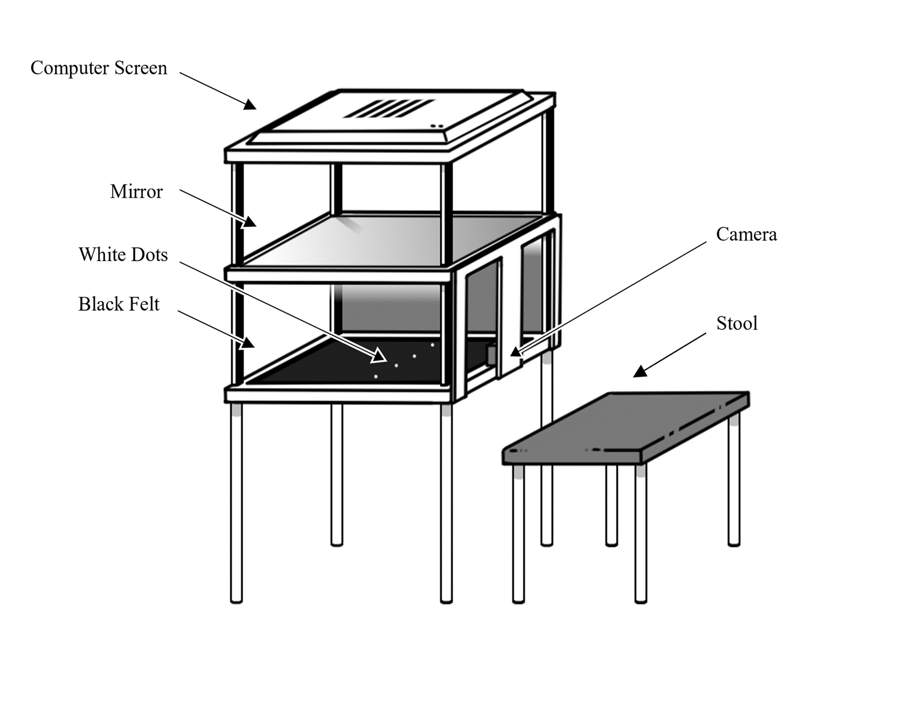

\fancyhead[LH]{The Effect of Non-Naturalistic Auditory Input on Conscious and Unconscious Experiences of Resizing Illusions}

\vspace{10mm}
\begin{center}
Kirralise J. Hansford$^{1}$, Kirsten J. McKenzie$^{2}$, Daniel H. Baker$^{1}$, and Catherine Preston$^{1}$
\vspace{30mm}

$^{1}$ Department of Psychology, University of York
\vspace{5mm}

$^{2}$ School of Psychology, University of Lincoln
\vspace{50mm}

\end{center}

\pagebreak

# Abstract {.unnumbered}

Background: Bodily resizing illusions typically use visual and/or tactile inputs to produce a vivid experience of one’s body changing size. Naturalistic auditory input (input that reflects the natural sounds of a stimulus) has also been used and can increase illusory experience during the rubber hand illusion, whilst non-naturalistic auditory input can influence estimations of finger length. 
Aims: To utilise non-naturalistic auditory input during a hand-based resizing illusions using augmented reality, to assess whether the addition of auditory input would increase both subjective and objective experience of hand-based resizing illusions. 
Methods: 44 Participants underwent three conditions: no stretching, stretching without tactile feedback, and stretching with tactile feedback. Half of the participants had auditory input throughout conditions, whilst the other half did not. After each condition, participants were given one of three objective tasks: right-hand (stimulated) dot touch task, left-hand (non-stimulated) dot touch task and a ruler judgement task. Dot tasks involved participants touching a virtual dot, whereas the ruler task concerned estimations of the tip of their finger on a ruler, whilst the hand was hidden from view. Finally, participants completed a subjective questionnaire capturing illusion strength. 
Results: The addition of auditory input increased subjective experience of the stretching illusion for manipulations without tactile feedback but not for those with tactile feedback. No facilitatory effects of audio were found for objective data.  
Conclusions: Adding auditory input to illusory finger stretching increased subjective illusory experience without the need for tactile feedback, but did not affect objective measures of illusory experience. 


\vspace{5mm}
*Keywords*: Multisensory Integration, Resizing Illusions, Non-Naturalistic Auditory Input, Consciousness


```{r setup, include=FALSE}

processdata <- 0        # takes about 5 hours to run from scratch

packagelist <- c('R.matlab','ggpubr','tidyverse','ez','lmerTest','ggplot2','MuMIn', 'emmeans','kableExtra','gridExtra','pwr','reshape2','rstatix','ggpubr','osfr')
missingpackages <- packagelist[!packagelist %in% installed.packages()[,1]]
if (length(missingpackages)>0){install.packages(missingpackages)}
toinstall <- packagelist[which(!packagelist %in% (.packages()))]
invisible(lapply(toinstall,library,character.only=TRUE))

knitr::opts_chunk$set(echo = TRUE)

if (!dir.exists('local')){dir.create('local')}

if (!file.exists('local/Final Dataset(r)_Outliers Removed.csv')){
  osfproject <- osf_retrieve_node("b9s48")
  osffiles <- osf_ls_files(osfproject)
  fid <- which(osffiles$name=='Final Dataset(r)_Outliers Removed.csv')
  osf_download(osffiles[fid,], path='local/',progress=TRUE)
}

#load in the subjective data
subjective_data <- read.csv("local/Final Dataset(r)_Outliers Removed.csv")

includedsubjects <- subjective_data[seq(1,132,3),1]
groupassignments <- factor(subjective_data[seq(1,132,3),4])
audiogroup <- which(groupassignments=='Audio')
nonaudiogroup <- which(groupassignments=='No Audio')

```

## 1. Introduction {.unnumbered}

Resizing illusions can be delivered through either augmented reality or magnifying optics and typically utilise visual and tactile inputs to manipulate the size of a body part, making it appear either longer or shorter. These illusions, through changing the way a body part is perceived, exploit principles of multisensory integration to elicit modulations in the perceived size and shape of the body part [@preston2011a; @preston2020a; @stanton2018a]. In addition to visual and tactile combinations, the combination of visual and proprioceptive inputs has also been found to elicit resizing illusions [@banakou2013a, @kilteni2012a]. Furthermore, visuotactile inputs have been compared to unimodal visual inputs for resizing illusions, with findings showing greater subjective embodiment during visuotactile resizing illusions compared to the unimodal visual resizing illusion, highlighting the role of multisensory integration for subjective embodiment during resizing illusions [@hansford2023a]. 

Much research has focussed on the combination of visuotactile inputs for multisensory integration, but there is also evidence to support a heightening role of auditory input for visual manipulations. Studies have investigated the addition of auditory inputs to visual detection tasks, finding that the addition of auditory stimuli enhanced overall efficiency in difficult detection tasks [@frassinetti2002a]. It has also been found as an inverse effect, wherein the addition of visual cues to an auditory task can improve the detection of a low-intensity sound [@lovelace2003a]. There is also evidence supporting audio cues modulating tactile perception, which comes from a study by @zampini2004a, which found that increasing the overall volume and / or the amplitude of high frequency sounds, combined with the tactile input of biting a potato chip, increased the reported crispness of the chip. The role of auditory input on multisensory interactions has also been found to influence body representations regarding perceptions of body size and length [@tajadura-jim2012a], along with altering perceived material properties [@senna2014a] and weight [@tajadura-jim2015a] of the body. Looking specifically at visual, tactile, and auditory inputs in the rubber hand illusion, the illusion which theory underpins the subjective embodiment of resizing illusions, @omera2014a found with the use of proprioceptive drift tasks, that the addition of auditory inputs consistent with the visual and tactile inputs of stroking the hand, here they used the sound of sandpaper scratching the skin, heightened the illusory experience more than when white noise was added to the illusion. This is supported by @radziun2018a, who also looked at the addition of ecologically relevant auditory inputs to the rubber hand illusion, here they used the sound of a surface being stroked with a paintbrush and used subjective questionnaires along with proprioceptive drift tasks. They found that synchronous auditory cues made the illusion stronger compared to when using asynchronous auditory cues, in line with O’Mera’s findings. 

The addition of auditory input in the studies mentioned thus far all include naturalistic auditory input, that being experimental auditory input that is consistent with the real-life auditory input that we are used to encountering in everyday life. However, @tajadura-jim2017a, looked at the influence of non-naturalistic auditory inputs, to see if this still resulted in changed to body perception. Here, they used changes in pitch, due to their associations with a change in height or size [@hubbard2018a] whilst not typically being associated with bodily movement. They found that when participants pulled their right index finger with their left hand with an accompanying rising pitch sound (700 – 1200Hz), they estimated the length of their index finger to be longer than when this pulling was accompanied with either a descending (700 – 200Hz) or constant (700Hz) tone and coined this the “Auditory Pinocchio” effect.  

Given previous finding that the addition of naturalistic auditory input in the rubber hand illusion [@omera2014a] and non-naturalistic auditory input in resizing manipulations [@tajadura-jim2017a], it is plausible that the addition of non-naturalistic auditory input when using augmented reality to induce resizing illusions, could heighten the experience of the illusory effects. Measuring the experience of illusory effects often consists of questionnaires given to participants after they have experienced an illusory condition to gain a subjective measure of their experience. However, more objective evidence can also be taken from behavioural measures of proprioceptive drift, which is described as the change in proprioceptively perceived position of the participant's hidden receptive body part [@davies2013a]. Previous studies assessing proprioceptive drift during the rubber hand illusion have found differences regarding the influence on body schema. Body schema is a representation of the body based on bottom-up sensory inputs that are needed for action, whereas body image refers to a top-down representation that is needed for perception [@paillard1999a]. @kammers2009a investigated body schema and body image using the rubber hand illusion with a reaching proprioceptive drift task (action movement), where participants were asked to reach with one hand to point to the tip of the index finger of the other hand in a single movement to assess body schema, and were asked to verbally report when the experimenters moving finger represented the felt location of their own finger (perceptual task), to assess body image. They found that only the perceptual judgements regarding limb ownership were sensitive to distortion in the rubber hand illusion, finding that action movements, therefore body schema, were not affected. Whereas @newport2010a used augmented reality and a dot touch proprioceptive drift task with supernumerary limbs to assess body schema using the rubber hand illusion and found that distortions in body schema were apparent, evidenced through pointing errors in the dot touch task that were consistent with the remapped limb position. The terms “subjective” and “objective” in relation to data regarding bodily experience can be used to refer to several concepts, for the purpose of the current study, the term “subjective” is in reference to data collected from self-report questionnaire, whereas the term “objective” is taken to refer to data collected from proprioceptive drift and ruler judgement tasks, such as those used by @davies2013a, @kammers2009a and @newport2010a.  This is due to self-report tasks indexing personal, subjective, experience of resizing illusions, whereas proprioceptive drift and ruler judgement tasks index more impartial, objective, data regarding the effects of resizing illusions on one’s percept of their bodily experience. 

Given previous research showing the additive effects of including several different sensory inputs for overall experience, and the recent evidence of the addition that auditory inputs can have on illusory experience, compared to unimodal stimulation alone, we hypothesise that adding a non-naturalistic auditory input to augmented reality resizing illusions that is consistent with the visual and tactile manipulations of stretching a finger, will (1) heighten conscious subjective illusory experience, measured via a subjective illusory experience questionnaire, for (1a) visuo-tactile and (1b) unimodal-visual manipulations. In addition, we hypothesise (2) that the addition of auditory input will heighten unconscious objective illusory experience, measured using a dot touch proprioceptive drift task that indexes body schema for (2a) visuo-tactile and (2b) unimodal-visual manipulations. We also hypothesise that the addition of auditory input will heighten unconscious objective illusory experience measured using a ruler judgement task that indexes body image for (3a) visuo-tactile and (3b) unimodal-visual manipulations. The inclusion of 2 different proprioceptive drift tasks, a dot touch task and a ruler judgement task, is to address the previous discordance of findings from @kammers2009a and @newport2010a, relating to body image and body schema. 

## 2. Method {.unnumbered}

## 2.1 Pre-registration {.unnumbered}
Pre-registration of this study can be found at the following OSF link: https://osf.io/6x4ce 

## 2.2 Participant Sample {.unnumbered}

```{r poweranalyses, include=FALSE}

#subjective analysis power analysis
SubjectivePA <- pwr.t.test(d=1.02,power=0.8,sig.level=0.05,type="two.sample",alternative="greater")
#objecitve dot touch power analysis
ObjectivePA <- pwr.anova.test(k=2,f=.64,sig.level=.05,power=.8)

```

## 2.2.1 Power Analysis and Sample Size {.unnumbered}

A priori power analysis using subjective illusion data and objective dot touch data from a pilot study showed a minimum sample size of `r round(SubjectivePA$n[1])*2`participants is required for hypothesis 1a regarding visuo-auditory / visuotactile-auditory manipulations (d = `r (SubjectivePA$d[1])`, power = `r (SubjectivePA$power[1])`, alpha = `r (SubjectivePA$sig.level[1])`), and a sample of `r round(ObjectivePA$n[1])*2` participants is required for hypothesis 2 regarding the objective dot touch task (f = `r (ObjectivePA$f[1])`, power = `r (ObjectivePA$power[1])`, alpha = `r (ObjectivePA$sig.level[1])`). Due to the inherent ambiguity of power analysis, and to account for the additional ruler judgment task, the upper sample size of 26 participants will be doubled to a sample size of 52 participants, 26 in each group. A further 4 participant’s data were removed from the ruler judgement analysis as they reported a ruler rating that was outside of the given ruler range. 

## 2.2.2 Participants {.unnumbered}

52 participants (84.6% Female. 11.5% Male, 3.8% Non-Binary; Mean age = 19.3 years, age range = 18 – 24 years) completed the experiment, with exclusion criteria being prior knowledge or expectations about the research, a history of neurological or psychiatric disorders, operations or procedures that could damage peripheral nerve pathways in the hands, a history of chronic pain conditions, history of drug or alcohol abuse, history of sleep disorders, history of epilepsy, having visual abnormalities that cannot be corrected optically (i.e. with glasses), or being under 18 years of age. From these 52 participants, 8 scored above 50 (indicating experience of the illusion) on the subjective experience questionnaire item regarding feeling stretching of the finger within the baseline condition where no stretching took place, therefore these 8 participants were removed from the analysis, resulting in 44 participants, 23 in the No-Audio group, and 21 in the Audio group.

## 2.3 Materials {.unnumbered}

The resizing illusions were delivered using an augmented-reality system (see Figure 1) that consisted of an area for the hand to be placed which contained a black felt base, LED lights mounted on either side and a 1920 x 1080 camera situated in the middle of the area, away from the participant’s view. Above this area, there was a mirror placed below a 1920 x 1200 resolution screen, so that the footage from the camera was reflected by the mirror such that the participant could view live footage of their occluded hand. The manipulation of the live feed from the camera was implemented using MATLAB r2017a, wherein the participant’s finger would stretch by 60 pixels during illusions lasting 2.4 seconds. This stretching would be accompanied during the visuotactile / visuotactile-auditory conditions by the experimenter gently pulling on the participant’s right index finger to induce immersive multisensory illusions. In the audio group, the stretching manipulations in the visuotactile-auditory and the visual-auditory conditions was accompanied by a 308Hz – 629Hz sound, whilst the baseline conditions, where no stretching took place, were accompanied by a 440Hz sound. After each condition, the participants hands were occluded from view and the dot touch or ruler judgement tasks were presented (detailed in section 2.3), until the experimenter pressed a button to indicate the start of the next trial. Blue boxes were superimposed on the screen so that participants knew where to reposition their hands to after each task. Subjective illusion experience data were collected via Qualtrics (Qualtrics, Provo, UT) on a Samsung Galaxy Tab A6 tablet. This was given to participants towards end of the experiment, wherein each manipulation was presented again, without the subsequent tasks, and participants were asked to recall the trial they had just experienced and previous trials that were similar, and then give a response on a visual analogue scale of 0 to 100, with 0 being strongly disagree, 50 being neutral, and 100 being strongly agree with statements made. The questionnaire consisted of six statements, two relating to illusory experience: “It felt like my finger was really stretching” / “It felt like the hand I saw was part of my body”, two relating to disownership: “It felt like the hand I saw no longer belonged to me” / “It felt like the hand I saw was no longer part of my body”, and two were control statements: “It felt as if my hand had disappeared” / “It felt as if I might have had more than one right hand”. The questionnaire was delivered 3 times, once after baseline manipulations, once after visuotactile / visuotactile-auditory manipulations, and finally once after unimodal visual / visual-auditory manipulations. 

```{r figure1, fig.cap="Schematic of Augmented Reality System.", echo=FALSE}



```

## 2.4 Procedure {.unnumbered}

Participants were randomly assigned to either the auditory group or the non-auditory group. Participants were then seated at the augmented-reality system and were instructed to place both of their hands, with their index fingers outstretched, onto the felt. There were two white dots on the felt to guide where their hands should be placed, and arm rests were given for comfort. Participants were instructed to view the image of their hands in the mirror (whilst their real hands were hidden from view) throughout the experiment. They viewed their hands whilst receiving baseline conditions where no manipulations were given (a 440Hz sound was played in the auditory condition), stretching conditions where they saw the index finger on their right-hand stretch (unimodal visual / visual-auditory conditions with accompanying 308Hz – 629Hz sound), and stretching conditions where as they saw their index finger on their right hand stretch a researcher gently pulled on the end of their finger (visuotactile / visuotactile-auditory conditions with accompanying 308Hz – 629Hz sound). After viewing the conditional manipulation to their right hand, participants completed either a left-hand dot touch task, a right-hand dot touch task, or a ruler judgement task. The dot touch tasks consisted of a magenta dot appearing in front of either their right or left hand, and participants being asked to move their index finger in one smooth motion to touch the dot, and then return their finger to the indicated pre-trial position. The ruler judgement task consisted of a ruler appearing to the right of the participants right hand, which changed in position and scale to avoid trial order bias, and participants were asked where they believed the tip of their right index finger was on that ruler. Participants completed 6 repetitions of 9 distinct conditions: 1, Baseline with left dot touch; 2, Unimodal visual / visual-auditory stretching with left dot touch; 3,Visuotactile / visuotactile-auditory stretching with left dot touch; 4, Baseline with right dot touch; 5, Unimodal visual / visual-auditory stretching with right dot touch; 6,Visuotactile / visuotactile-auditory stretching with right dot touch; 7, Baseline with ruler judgement task; 8, Unimodal visual / visual-auditory stretching with ruler judgement task; 9,Visuotactile / visuotactile-auditory stretching with ruler judgement task. (Video of a participant undergoing visuotactile stretching can be seen in supplementary material). Conditions were randomised via MATLAB r2017a, and the experimenter was unaware which condition would be presented on a given trial. The experimenter was informed of whether to gently pull the index finger or to apply no manipulation via the presentation of a small blue box on the screen out of the participants view. 6 repetitions of the 9 conditions were presented, followed by a break for the participant to stretch their hand and rest, and then the baseline, visuotactile / visuotactile-auditory and the unimodal visual / visual-auditory conditions were presented once in a random order, without any dot touch or ruler judgement tasks, after which the participant completed the subjective illusory experience questionnaire.

## 3. Results {.unnumbered}

```{r analyseraw, include=FALSE}

if (processdata==1){
if (!dir.exists('local/rawdata')){dir.create('local/rawdata')}

osfproject <- osf_retrieve_node("b9s48")

osffiles <- osf_ls_files(osfproject)
if (!file.exists('local/rulerratings.csv')){
  fid <- which(osffiles$name=='rulerratings.csv')
  osf_download(osffiles[fid,], path='local/',progress=TRUE)
}
ratings <- read.csv('local/rulerratings.csv',header=FALSE)

osffiles <- osf_ls_files(osfproject,path='Raw Data',n_max=100)
for (n in 1:nrow(osffiles)){
if (!file.exists(paste0('local/rawdata/',osffiles[n,1]))){
  osf_download(osffiles[n,], path='local/rawdata/',progress=TRUE)
}}


sublist <- c(402:440,442:454)

threshold <- 0.8
allout <- array(0,dim=c(length(sublist),9,6))

for (s in 1:length(sublist)){
  subjID <- sublist[s]
  
  print(subjID)
  
  temp <- readMat(paste0('local/rawdata/',subjID,'trialorder.mat'))
  
  subjind <- which(ratings[,1]==subjID)
  
  triallist <- unlist(temp$trialorder[[1]])
  
  output <- matrix(0,nrow=9,ncol=6)
  condcount <- (1:9)*0
  rulercount <- 0
  
  for (trial in 1:length(triallist)){
    
    cond <- triallist[trial]
    condcount[cond] <- condcount[cond] + 1
 
    # mirror reverse the image because the camera is pointing at a mirror!
    thisim <- temp$allimages[trial,,1920:1,]
    
    if (triallist[trial]<7){
      if (triallist[trial]<4){print(paste(subjID,'Right dot touch'))}
      if (triallist[trial]>3){print(paste(subjID,'Left dot touch'))}
      
      xy <- round(c(3*1920/4,350) + (c(-1,1)*temp$xydots[trial,]))
      
      # remove the magenta dot
      A <- thisim[,,1]==255
      B <- thisim[,,2]==0
      C <- thisim[,,3]==255
      abc <- A*B*C
      ind <- which(abc>0,arr.ind=TRUE)
      thisim[ind[,1],ind[,2],] <- 0
      
      meanmap <- apply(thisim/255,1:2,mean)
      meanmap[1:100,] <- 0
      ind <- which(meanmap>threshold,arr.ind=TRUE)  # find pixels above the threshold
      fingertip <- min(ind[,1])  # find the y value closest to the top of the image
      
      output[cond,condcount[cond]] <- fingertip - xy[2]   # store error     
      
    }

    if (triallist[trial]>6){
      print(paste(subjID,'Ruler task'))
      
      rulercount <- rulercount + 1
      subjectrating <- ratings[subjind,rulercount+1]
      
      meanmap <- apply(thisim/255,1:2,mean)
      meanmap[1:100,] <- 0
      ind <- which(meanmap>threshold,arr.ind=TRUE)  # find pixels above the threshold
      fingertip <- min(ind[,1])  # find the y value closest to the top of the image
      
      thisscale <- temp$rulerscales[trial]
      thispos <- temp$rulerxy[trial]
      
      rulermin <- (1200/2) + 50 - thispos
      rulermax <- (1200/2) - 350 - thispos
      
      truepos <- thisscale + ((rulermin - fingertip)/50)
      
      output[cond,condcount[cond]] <- subjectrating - truepos    
      
      # adjusts the ratings to flag as an out of range trial
      if (subjectrating>(thisscale + 8)){ratings[subjind,rulercount+1] <- 999}
      if (subjectrating<thisscale){ratings[subjind,rulercount+1] <- 999}

    }   
  }

  allout[s,,] <- output
  
}
save(file='local/allprocessed.RData',list=c('ratings','allout'))
}

if (processdata==0){
  if (!file.exists('local/allprocessed.RData')){
  osfproject <- osf_retrieve_node("b9s48")
  osffiles <- osf_ls_files(osfproject)
  fid <- which(osffiles$name=='allprocessed.RData')
  osf_download(osffiles[fid,], path='local/',progress=TRUE)
  }
  load('local/allprocessed.RData')
}

```


```{r processing data, include=FALSE}

# Reorganisation of data

meansettings <- apply(allout,1:2,mean)
includedindices <- which(ratings[,1] %in% includedsubjects)
allsettings <- meansettings[includedindices,]

normsettings <- allsettings
for (n in 1:3){
normsettings[,(n*3)-2] <- normsettings[,(n*3)-2] - allsettings[,(n*3)-2]
normsettings[,(n*3)-1] <- normsettings[,(n*3)-1] - allsettings[,(n*3)-2]
normsettings[,(n*3)] <- normsettings[,(n*3)] - allsettings[,(n*3)-2]
}

#set column names
colnames(allsettings) <- c("RightDotBaseline", "RightDotV/VA", "RightDotVT/VTA", 
                           "LeftDotBaseline", "LeftDotV/VA", "LeftDotVT/VTA", 
                           "RulerBaseline", "RulerV/VA", "RulerVT/VTA")

colnames(normsettings) <- c("RightDotBaseline", "RightDotV/VA", "RightDotVT/VTA", 
                            "LeftDotBaseline", "LeftDotV/VA", "LeftDotVT/VTA", 
                            "RulerBaseline", "RulerV/VA", "RulerVT/VTA")

#Extract the needed columns
allsettingsright <- allsettings[,c(1:3)]
allsettingsleft <- allsettings[,c(4:6)]
allsettingsruler <- allsettings[,c(7:9)]

normsettingsright <- normsettings[,c(2:3)]
normsettingsleft <- normsettings[,c(5:6)]
normsettingsruler <- normsettings[,c(8:9)]

#Create group labels
Group <- c("No Audio", "Audio", "Audio", "No Audio", "No Audio", 
           "Audio", "Audio", "Audio", "Audio", "No Audio", "Audio", 
           "Audio", "No Audio", "No Audio", "Audio", "No Audio", 
           "Audio", "No Audio", "No Audio", "Audio", "No Audio",
           "No Audio", "Audio", "Audio", "Audio", "Audio", "No Audio",
           "Audio", "No Audio", "Audio", "No Audio", "Audio", "Audio",
           "No Audio", "No Audio", "No Audio", "Audio", "No Audio",
           "No Audio", "No Audio", "No Audio", "No Audio", "Audio", 
           "No Audio")

#create PID
PID <- c(1:44)

#Bind Group and PID Columns
allsettingsright <- cbind(allsettingsright, Group, PID)
allsettingsleft <- cbind(allsettingsleft, Group, PID)
allsettingsruler <- cbind(allsettingsruler, Group, PID)

normsettingsright <- cbind(normsettingsright, Group, PID)
normsettingsleft <- cbind(normsettingsleft, Group, PID)
normsettingsruler <- cbind(normsettingsruler, Group, PID)

#Make data as dataframes
allsettingsrightdf <- as.data.frame(allsettingsright)
allsettingsleftdf <- as.data.frame(allsettingsleft)
allsettingsrulerdf <- as.data.frame(allsettingsruler)

normsettingsrightdf <- as.data.frame(normsettingsright)
normsettingsleftdf <- as.data.frame(normsettingsleft)
normsettingsrulerdf <- as.data.frame(normsettingsruler)

#set PID as factors
allsettingsrightdf$PID <- factor(allsettingsrightdf$PID)
allsettingsleftdf$PID <- factor(allsettingsleftdf$PID)
allsettingsrulerdf$PID <- factor(allsettingsrulerdf$PID)

normsettingsrightdf$PID <- factor(normsettingsrightdf$PID)
normsettingsleftdf$PID <- factor(normsettingsleftdf$PID)
normsettingsrulerdf$PID <- factor(normsettingsrulerdf$PID)

#Format all dataframes for analysis
allsettingsright_formatted <- melt(allsettingsrightdf,
                                   # ID variables - all the variables to keep but not split apart on
                                   id.vars=c("Group", "PID"),
                                   # The source columns
                                   measure.vars=c("RightDotBaseline", "RightDotV/VA", "RightDotVT/VTA" ),
                                   # Name of the destination column that will identify the original
                                   # column that the measurement came from
                                   variable.name="condition",
                                   value.name="score")


# Sort by subject first, then by condition
allsettingsright_formatted <- allsettingsright_formatted[ order(allsettingsright_formatted$PID,
                                                                allsettingsright_formatted$condition), ]

allsettingsleft_formatted <- melt(allsettingsleftdf,
                                   # ID variables - all the variables to keep but not split apart on
                                   id.vars=c("Group", "PID"),
                                   # The source columns
                                   measure.vars=c("LeftDotBaseline", "LeftDotV/VA", "LeftDotVT/VTA" ),
                                   # Name of the destination column that will identify the original
                                   # column that the measurement came from
                                   variable.name="condition",
                                   value.name="score")

allsettingsleft_formatted <- allsettingsleft_formatted[ order(allsettingsleft_formatted$PID,
                                                                allsettingsleft_formatted$condition), ]

allsettingsruler_formatted <- melt(allsettingsrulerdf,
                                   # ID variables - all the variables to keep but not split apart on
                                   id.vars=c("Group", "PID"),
                                   # The source columns
                                   measure.vars=c("RulerBaseline", "RulerV/VA", "RulerVT/VTA" ),
                                   # Name of the destination column that will identify the original
                                   # column that the measurement came from
                                   variable.name="condition",
                                   value.name="score")

allsettingsruler_formatted <- allsettingsruler_formatted[ order(allsettingsruler_formatted$PID,
                                                                allsettingsruler_formatted$condition), ]

normsettingsright_formatted <- melt(normsettingsrightdf,
                                   # ID variables - all the variables to keep but not split apart on
                                   id.vars=c("Group", "PID"),
                                   # The source columns
                                   measure.vars=c("RightDotV/VA", "RightDotVT/VTA" ),
                                   # Name of the destination column that will identify the original
                                   # column that the measurement came from
                                   variable.name="condition",
                                   value.name="score")

normsettingsright_formatted <- normsettingsright_formatted[ order(normsettingsright_formatted$PID,
                                                                normsettingsright_formatted$condition), ]

normsettingsleft_formatted <- melt(normsettingsleftdf,
                                    # ID variables - all the variables to keep but not split apart on
                                    id.vars=c("Group", "PID"),
                                    # The source columns
                                    measure.vars=c("LeftDotV/VA", "LeftDotVT/VTA" ),
                                    # Name of the destination column that will identify the original
                                    # column that the measurement came from
                                    variable.name="condition",
                                    value.name="score")

normsettingsleft_formatted <- normsettingsleft_formatted[ order(normsettingsleft_formatted$PID,
                                                                  normsettingsleft_formatted$condition), ]

normsettingsruler_formatted <- melt(normsettingsrulerdf,
                                    # ID variables - all the variables to keep but not split apart on
                                    id.vars=c("Group", "PID"),
                                    # The source columns
                                    measure.vars=c("RulerV/VA", "RulerVT/VTA" ),
                                    # Name of the destination column that will identify the original
                                    # column that the measurement came from
                                    variable.name="condition",
                                    value.name="score")

normsettingsruler_formatted <- normsettingsruler_formatted[ order(normsettingsruler_formatted$PID,
                                                                  normsettingsruler_formatted$condition), ]

##Analysis

#convert PID, Group and Condition within subjective data to factors
subjective_data_factors = subjective_data %>%
  convert_as_factor(PID, Group, Condition)

```


```{r analysis, include=FALSE}
## Subjective Analyses ##

### --- ###
#Subjective Illusion Score Analysis
lmeresults1 <- lmer(Illusion.1.Score ~ Condition + Group + Condition*Group + (1 |PID), data=subjective_data_factors)
lmeanova1 <- anova(lmeresults1)
lmeranova1 <- ranova(lmeresults1) #random effects


r2_1 <- r.squaredGLMM(lmeresults1) 
r2_1

#plot data
Illusion1plot <- ggboxplot(subjective_data_factors, x = "Condition", y = "Illusion.1.Score", 
                           color = "Group", palette = c("#00AFBB", "#FC4E07"), 
                           add = "jitter" )+ ylab("Subjective Illusion Score") + xlab("Condition")


ggsave('figures/Illusion1.pdf', Illusion1plot, width = 7, height = 5, dpi = 300)
            
#Q-Q Plots
lmeresults1residuals <- resid(lmeresults1) # extract the residuals
qqnorm(lmeresults1residuals) # create the plot
qqline(lmeresults1residuals) # add the diagonal line

# Run Shapiro-Wilk tests
shapiro.test(subjective_data_factors$Illusion.1.Score)

#sort subjective data into new dataframes for posthoc pairwise analyses
filtered.data_Baseline <- data.frame(subjective_data_factors[c(1,4,7,10,13,16,19,22,25,28,31,34,37,40,43,46,49,52,55,58,61,64,67,70,73,76,79,82,85,88,91,94,97,100,103,106,109,112,115,118,121,124,127,130),c(1:13)])
filtered.data_V_VA <- data.frame(subjective_data_factors[c(2,5,8,11,14,17,20,23,26,29,32,35,38,41,44,47,50,53,56,59,62,65,68,71,74,77,80,83,86,89,92,95,98,101,104,107,110,113,116,119,122,125,128,131),c(1:13)])
filtered.data_VT_VTA <- data.frame(subjective_data_factors[c(3,6,9,12,15,18,21,24,27,30,33,36,39,42,45,48,51,54,57,60,63,66,69,72,75,78,81,84,87,90,93,96,99,102,105,108,111,114,117,120,123,126,129,132),c(1:13)])

#perform the Holm post-hoc method
ttest1 <- pairwise.t.test(filtered.data_Baseline$Illusion.1.Score, filtered.data_Baseline$Group, p.adj="holm")
ttest2 <- pairwise.t.test(filtered.data_V_VA$Illusion.1.Score, filtered.data_V_VA$Group, p.adj='holm')
ttest3 <- pairwise.t.test(filtered.data_VT_VTA$Illusion.1.Score, filtered.data_VT_VTA$Group, p.adj='holm')

#Get means for V/VA condition
means1 <- group_by(filtered.data_V_VA, Group) %>%
  summarise(
    count = n(),
    mean = mean(Illusion.1.Score, na.rm = TRUE),
    sd = sd(Illusion.1.Score, na.rm = TRUE)
  )

#Shapiro-Wilk test for filtered data
shapiro.test(filtered.data_Baseline$Illusion.1.Score)
shapiro.test(filtered.data_V_VA$Illusion.1.Score)
shapiro.test(filtered.data_VT_VTA$Illusion.1.Score)

### --- ###
#Subjective Illusion Score Analysis 2
lmeresults2 <- lmer(Illusion.2.Score ~ Condition + Group + Condition*Group + (1 |PID), data=subjective_data_factors)
anova(lmeresults2)

r2_2 <- r.squaredGLMM(lmeresults2)
r2_2 

#Plot Data
Illusion2plot <- ggboxplot(subjective_data_factors, x = "Condition", y = "Illusion.2.Score", color = "Group",palette = c("#00AFBB", "#FC4E07"), add = "jitter" )

ggsave('figures/Illusion2.pdf', Illusion2plot, width = 5, height = 5, dpi = 300)

#Get means for each condition
meansBL <- group_by(filtered.data_Baseline, Group) %>%
  summarise(
    count = n(),
    mean = mean(Illusion.2.Score, na.rm = TRUE),
    sd = sd(Illusion.2.Score, na.rm = TRUE)
  )
meansVVA <- group_by(filtered.data_V_VA, Group) %>%
  summarise(
    count = n(),
    mean = mean(Illusion.2.Score, na.rm = TRUE),
    sd = sd(Illusion.2.Score, na.rm = TRUE)
  )
meansVTVTA <- group_by(filtered.data_VT_VTA, Group) %>%
  summarise(
    count = n(),
    mean = mean(Illusion.2.Score, na.rm = TRUE),
    sd = sd(Illusion.2.Score, na.rm = TRUE)
  )

lmeresults2residuals <- resid(lmeresults2) # extract the residuals
qqnorm(lmeresults2residuals) # create the plot
qqline(lmeresults2residuals) # add the diagonal line

#Shapiro-Wilk Test
shapiro.test(subjective_data_factors$Illusion.2.Score)

### --- ###
#Subjective Disownership Score Analysis
lmeresults3 <- lmer(Disownership.Average ~ Condition + Group + Condition*Group + (1 |PID), data=subjective_data_factors)
anova(lmeresults3)

r2_3 <- r.squaredGLMM(lmeresults3)
r2_3

#plot data
Disownershipplot <- ggboxplot(subjective_data_factors, x = "Condition", y = "Disownership.Average", color = "Group", palette = c("#00AFBB", "#FC4E07"), add = "jitter" )

ggsave('figures/disownershipaverage.pdf', Disownershipplot, width = 5, height = 5, dpi = 300)

#Get means for each condition
meansBLD <- group_by(filtered.data_Baseline, Group) %>%
  summarise(
    count = n(),
    mean = mean(Disownership.Average, na.rm = TRUE),
    sd = sd(Disownership.Average, na.rm = TRUE)
  )
meansVVAD <- group_by(filtered.data_V_VA, Group) %>%
  summarise(
    count = n(),
    mean = mean(Disownership.Average, na.rm = TRUE),
    sd = sd(Disownership.Average, na.rm = TRUE)
  )
meansVTVTAD <- group_by(filtered.data_VT_VTA, Group) %>%
  summarise(
    count = n(),
    mean = mean(Disownership.Average, na.rm = TRUE),
    sd = sd(Disownership.Average, na.rm = TRUE)
  )

#Q-Q Plots
lmeresults3residuals <- resid(lmeresults3) # extract the residuals
qqnorm(lmeresults3residuals) # create the plot
qqline(lmeresults3residuals) # add the diagonal line

#Shapiro-Wilk Test
shapiro.test(subjective_data_factors$Disownership.Average)

#Post Hoc Tests
pairwise.t.test(filtered.data_Baseline$Disownership.Average, filtered.data_Baseline$Group, p.adj="holm")
pairwise.t.test(filtered.data_V_VA$Disownership.Average, filtered.data_V_VA$Group, p.adj='holm')
pairwise.t.test(filtered.data_VT_VTA$Disownership.Average, filtered.data_VT_VTA$Group, p.adj='holm')

#Shapiro-Wilk Test
shapiro.test(filtered.data_Baseline$Disownership.Average)
shapiro.test(filtered.data_V_VA$Disownership.Average)
shapiro.test(filtered.data_VT_VTA$Disownership.Average)

### --- ###
#Subjecitve Data Control Analysis
lmeresults4 <- lmer(Control.Average ~ Condition + Group + Condition*Group + (1 |PID), data=subjective_data_factors)
anova(lmeresults4)

r2_4 <- r.squaredGLMM(lmeresults4)
r2_4

#plot data
Controlplot <- ggboxplot(subjective_data_factors, x = "Condition", y = "Control.Average", color = "Group",palette = c("#00AFBB", "#FC4E07"), add = "jitter" )

ggsave('figures/controlaverage.pdf', Controlplot, width = 5, height = 5, dpi = 300)

#Get means for each condition
meansBLC <- group_by(filtered.data_Baseline, Group) %>%
  summarise(
    count = n(),
    mean = mean(Control.Average, na.rm = TRUE),
    sd = sd(Control.Average, na.rm = TRUE)
  )
meansVVAC <- group_by(filtered.data_V_VA, Group) %>%
  summarise(
    count = n(),
    mean = mean(Control.Average, na.rm = TRUE),
    sd = sd(Control.Average, na.rm = TRUE)
  )
meansVTVTAC <- group_by(filtered.data_VT_VTA, Group) %>%
  summarise(
    count = n(),
    mean = mean(Control.Average, na.rm = TRUE),
    sd = sd(Control.Average, na.rm = TRUE)
  )

#Q-Q Plots
lmeresults4residuals <- resid(lmeresults4) # extract the residuals
qqnorm(lmeresults4residuals) # create the plot
qqline(lmeresults4residuals) # add the diagonal line

#Shapiro-Wilk Test
shapiro.test(subjective_data_factors$Control.Average)

## Objective analyses ##

### --- ###
#Objective Positive Control Right Dot

#set score to numeric
allsettingsright_formatted$score = as.numeric(as.character(allsettingsright_formatted$score))

#invert direction of score
allsettingsright_formatted$score <- allsettingsright_formatted$score*(-1)

#divide score (pixels) by 28 to give cm's
allsettingsright_formatted$score <- allsettingsright_formatted$score/28

#analysis from formatted data
lmeresults5 <- lmer(score ~ condition + Group + condition*Group + (1 |PID), data=allsettingsright_formatted)
lmeanova5 <- anova(lmeresults5)
lmeranova5 <- ranova(lmeresults5)

r2_5 <- r.squaredGLMM(lmeresults5)
r2_5


#Plot Data
PCrightdotplot <- ggboxplot(allsettingsright_formatted, x = "condition", y = "score", 
                            color = "Group", palette = c("#00AFBB", "#FC4E07"), 
                            add = "jitter")+ ylab("Dot Touch Accuracy (cm)") + xlab("Condition")

PCrightdotplot <- ggpar(PCrightdotplot, ylim = c(-4, 2))

ggsave('figures/PCrightdot.pdf', PCrightdotplot, width = 5, height = 5, dpi = 300)

#Q-Q Plots
lmeresults5residuals <- resid(lmeresults5) # extract the residuals
qqnorm(lmeresults5residuals) # create the plot
qqline(lmeresults5residuals) # add the diagonal line

#Shapiro-Wilk Test
shapiro.test(allsettingsright_formatted$score)

# POST HOC TEST
posthoc5 <- summary(emmeans(lmeresults5, list(pairwise ~ condition), adjust = "tukey"))

### --- ###
#Objective Positive Control Left Dot

#set score to numeric
allsettingsleft_formatted$score = as.numeric(as.character(allsettingsleft_formatted$score))

#invert direction of score
allsettingsleft_formatted$score <- allsettingsleft_formatted$score*(-1)

#divide score (pixels) by 28 to give cm's
allsettingsleft_formatted$score <- allsettingsleft_formatted$score/28

#analysis from formatted data
lmeresults6 <- lmer(score ~ condition + Group + condition*Group + (1 |PID), data=allsettingsleft_formatted)
lmeanova6 <- anova(lmeresults6)
lmeranova6 <- ranova(lmeresults6)

r2_6 <- r.squaredGLMM(lmeresults6)
r2_6

#Plot Data
PCleftdotplot <- ggboxplot(allsettingsleft_formatted, x = "condition", y = "score", 
                           color = "Group", palette = c("#00AFBB", "#FC4E07"), 
                           add = "jitter" )+ ylab("Dot Touch Accuracy (cm)") + xlab("Condition")

PCleftdotplot <- ggpar(PCleftdotplot, ylim = c(-4, 2))

ggsave('figures/PCleftdot.pdf', PCleftdotplot, width = 5, height = 5, dpi = 300)
#Q-Q Plots
lmeresults6residuals <- resid(lmeresults6) # extract the residuals
qqnorm(lmeresults6residuals) # create the plot
qqline(lmeresults6residuals) # add the diagonal line

#Shapiro-Wilk Test
shapiro.test(allsettingsleft_formatted$score)

#Post Hoc Test
posthoc6 <- summary(emmeans(lmeresults6, list(pairwise ~ condition), adjust = "tukey"))

### --- ###
#Objective Positive Control Ruler

#set score to numeric
allsettingsruler_formatted$score = as.numeric(as.character(allsettingsruler_formatted$score))

#times score (pixels) by 1.8 to give cm's
allsettingsruler_formatted$score <- allsettingsruler_formatted$score*(1.8)

#remove outliers
allsettingsruler_formatted$score[allsettingsruler_formatted$score < quantile(allsettingsruler_formatted$score, 0.25) 
                           - 1.5*IQR(allsettingsruler_formatted$score) | 
                             allsettingsruler_formatted$score > quantile(allsettingsruler_formatted$score, 0.75) 
                           + 1.5*IQR(allsettingsruler_formatted$score)] <- NA 

#analysis from formatted data
lmeresults7 <- lmer(score ~ condition + Group + condition*Group + (1 |PID), data=allsettingsruler_formatted)
lmeanova7 <- anova(lmeresults7)
lmeranova7 <- ranova(lmeresults7)

r2_7 <- r.squaredGLMM(lmeresults7)
r2_7

#Plot Data
PCrulerplot <- ggboxplot(allsettingsruler_formatted, x = "condition", y = "score", 
                         color = "Group", palette = c("#00AFBB", "#FC4E07"), 
                         add = "jitter" )+ ylab("Percieved Length (cm)") + xlab("Condition")

PCrulerplot <- ggpar(PCrulerplot, ylim = c(-5, 5))


ggsave('figures/PCruler.pdf', PCrulerplot, width = 5, height = 5, dpi = 300)


#Q-Q Plots
lmeresults7residuals <- resid(lmeresults7) # extract the residuals
qqnorm(lmeresults7residuals) # create the plot
qqline(lmeresults7residuals) # add the diagonal line

#Shapiro-Wilk Test
shapiro.test(allsettingsruler_formatted$score)

#Post Hoc Test
posthoc7 <- summary(emmeans(lmeresults7, list(pairwise ~ condition), adjust = "tukey"))

### --- ###
#Objective Right Dot

#set score to numeric
normsettingsright_formatted$score = as.numeric(as.character(normsettingsright_formatted$score))

#invert direction of score
normsettingsright_formatted$score <- normsettingsright_formatted$score*(-1)

#divide score (pixels) by 28 to give cm's
normsettingsright_formatted$score <- normsettingsright_formatted$score/28

#analysis from formatted data
lmeresults8 <- lmer(score ~ condition + Group + condition*Group + (1 |PID), data=normsettingsright_formatted)
lmeanova8 <- anova(lmeresults8)
lmeranova8 <- ranova(lmeresults8)

r2_8 <- r.squaredGLMM(lmeresults8)
r2_8

#Plot Data
normrightdotplot <- ggboxplot(normsettingsright_formatted, x = "condition", y = "score", 
                              color = "Group", palette = c("#00AFBB", "#FC4E07"), 
                              add = "jitter")+ ylab("Dot Touch Accuracy (cm)") + xlab("Condition")
normrightdotplot <- ggpar(normrightdotplot, ylim = c(-2, 2))


#ggsave('figures/normrightdot.pdf', normrightdotplot, width = 5, height = 5, dpi = 300)
#Q-Q Plots
lmeresults8residuals <- resid(lmeresults8) # extract the residuals
qqnorm(lmeresults8residuals) # create the plot
qqline(lmeresults8residuals) # add the diagonal line

#Shapiro-Wilk Test
shapiro.test(normsettingsright_formatted$score)

### --- ###
#Objective Left Dot

#set score to numeric
normsettingsleft_formatted$score = as.numeric(as.character(normsettingsleft_formatted$score))

#invert direction of score
normsettingsleft_formatted$score <- normsettingsleft_formatted$score*(-1)

#divide score (pixels) by 28 to give cm's
normsettingsleft_formatted$score <- normsettingsleft_formatted$score/28

#analysis from formatted data
lmeresults9 <- lmer(score ~ condition + Group + condition*Group + (1 |PID), data=normsettingsleft_formatted)
lmeanova9 <- anova(lmeresults9)
lmeranova9 <- ranova(lmeresults9)

r2_9 <- r.squaredGLMM(lmeresults9)
r2_9

#Plot Data
normleftdotplot <- ggboxplot(normsettingsleft_formatted, x = "condition", y = "score", 
                             color = "Group", palette = c("#00AFBB", "#FC4E07"), 
                             add = "jitter" )+ ylab("Dot Touch Accuracy (cm)") + xlab("Condition")
normleftdotplot <- ggpar(normleftdotplot, ylim = c(-2, 2))

#ggsave('figures/normleftdot.pdf', normleftdotplot, width = 5, height = 5, dpi = 300)

#Q-Q Plots
lmeresults9residuals <- resid(lmeresults9) # extract the residuals
qqnorm(lmeresults9residuals) # create the plot
qqline(lmeresults9residuals) # add the diagonal line

#Shapiro-Wilk Test
shapiro.test(normsettingsleft_formatted$score)

#Get Means and SDs
means9 <- group_by(normsettingsleft_formatted, condition) %>%
  summarise(
    count = n(),
    mean = mean(score, na.rm = TRUE),
    sd = sd(score, na.rm = TRUE)
  )

normplots <- grid.arrange(normrightdotplot, normleftdotplot, ncol=2)

ggsave('figures/normplots.pdf', normplots, width = 9, height = 5, dpi = 300)
### --- ###
#Objective Ruler

#set score to numeric
normsettingsruler_formatted$score = as.numeric(as.character(normsettingsruler_formatted$score))

#times score (pixels) by 1.8 to give cm's
normsettingsruler_formatted$score <- normsettingsruler_formatted$score*(1.8)

#remove outliers
normsettingsruler_formatted$score[normsettingsruler_formatted$score < quantile(normsettingsruler_formatted$score, 0.25) 
                           - 1.5*IQR(normsettingsruler_formatted$score) | 
                             normsettingsruler_formatted$score > quantile(normsettingsruler_formatted$score, 0.75) 
                           + 1.5*IQR(normsettingsruler_formatted$score)] <- NA 

#analysis from formatted data
lmeresults10 <- lmer(score ~ condition + Group + condition*Group + (1 |PID), data=normsettingsruler_formatted)
lmeanova10 <- anova(lmeresults10)
lmeranova10 <- ranova(lmeresults10)

r2_10 <- r.squaredGLMM(lmeresults10)
r2_10

#Plot Data
normrulerplot <- ggboxplot(normsettingsruler_formatted, x = "condition", y = "score", 
                           color = "Group", palette = c("#00AFBB", "#FC4E07"), 
                           add = "jitter" )+ ylab("Relative Percieved Length (cm)") + xlab("Condition")


ggsave('figures/normruler.pdf', normrulerplot, width = 5, height = 5, dpi = 300)

#Q-Q Plots
lmeresults10residuals <- resid(lmeresults10) # extract the residuals
qqnorm(lmeresults10residuals) # create the plot
qqline(lmeresults10residuals) # add the diagonal line

#Shapiro-Wilk Test
shapiro.test(normsettingsruler_formatted$score)

```

Positive control analyses were first run on the objective data to check that we were able to see an effect of the illusion with the dot touch and ruler judgement tasks. A random intercepts linear mixed effects model with fixed effects being group and condition, and a random effect of participant, was used to assess if the V/VA and VT/VTA conditions showed a significant difference in objective performance on dot touch and ruler judgement data compared to the baseline condition. First regarding the right dot touch data, we found a significant effect of condition *F*(`r round(lmeanova5$NumDF[1], digits = 2)`, `r round(lmeanova5$DenDF[1], digits = 2)`) = `r round(lmeanova5$"F value"[1], digits = 2)`, *p* = `r format.pval(lmeanova5$"Pr(>F)"[1], digits = 1, eps = 0.001, nsmall = 3)`, with the random effects term making a significant contribution to the fit of the model (*p* = `r format.pval(lmeranova5$"Pr(>Chisq)"[2], digits = 1, eps = 0.001, nsmall = 3)`), with the marginal R² value being `r round(r2_5[1]*100, digits = 2)`% and the conditional R² value being `r round(r2_5[2]*100, digits = 2)`%. Post hoc Tukey’s Test for multiple pairwise comparisons found that participants placed their finger significantly lower than the dot in the V/VA condition (*p* = `r format.pval(posthoc5$"pairwise differences of condition"$p.value[1], digits = 1, eps = 0.001, nsmall = 3)`, 95% C.I. = [`r round(posthoc5$"emmeans of condition"$lower.CL[2], digits = 2)`, `r round(posthoc5$"emmeans of condition"$upper.CL[2], digits = 2)`], M = `r round(posthoc5$"emmeans of condition"$emmean[2], digits = 2)`) and the VT/VTA condition (*p* = `r format.pval(posthoc5$"pairwise differences of condition"$p.value[2], digits = 1, eps = 0.001, nsmall = 3)`, 95% C.I. = [`r round(posthoc5$"emmeans of condition"$lower.CL[3], digits = 2)`, `r round(posthoc5$"emmeans of condition"$upper.CL[3], digits = 2)`], M = `r round(posthoc5$"emmeans of condition"$emmean[3], digits = 2)`) compared to the baseline condition (95% C.I. = [`r round(posthoc5$"emmeans of condition"$lower.CL[1], digits = 2)`, `r round(posthoc5$"emmeans of condition"$upper.CL[1], digits = 2)`], M = `r round(posthoc5$"emmeans of condition"$emmean[1], digits = 2)`), indicating an effect of the finger stretching manipulation being indexed by this objective measure. Secondly, regarding the left dot touch data, we found a significant effect of condition *F*(`r round(lmeanova6$NumDF[1], digits = 2)`, `r round(lmeanova6$DenDF[1], digits = 2)`) = `r round(lmeanova6$"F value"[1], digits = 2)`, *p* = `r format.pval(lmeanova6$"Pr(>F)"[1], digits = 1, eps = 0.001, nsmall = 3)`, with the random effects term making a significant contribution to the fit of the model (*p* = `r format.pval(lmeranova6$"Pr(>Chisq)"[2], digits = 1, eps = 0.001, nsmall = 3)`), with the marginal R² value being `r round(r2_6[1]*100, digits = 2)`% and the conditional R² value being `r round(r2_6[2]*100, digits = 2)`%. Post hoc Tukey’s Test for multiple pairwise comparisons found that participants placed their finger significantly lower than the dot in the V/VA condition (*p* = `r format.pval(posthoc6$"pairwise differences of condition"$p.value[1], digits = 1, eps = 0.001, nsmall = 3)`, 95% C.I. = [`r round(posthoc6$"emmeans of condition"$lower.CL[2], digits = 2)`, `r round(posthoc6$"emmeans of condition"$upper.CL[2], digits = 2)`], M = `r round(posthoc6$"emmeans of condition"$emmean[2], digits = 2)`) and the VT/VTA condition (*p* = `r format.pval(posthoc6$"pairwise differences of condition"$p.value[2], digits = 1, eps = 0.001, nsmall = 3)`, 95% C.I. = [`r round(posthoc6$"emmeans of condition"$lower.CL[3], digits = 2)`, `r round(posthoc6$"emmeans of condition"$upper.CL[3], digits = 2)`], M = `r round(posthoc6$"emmeans of condition"$emmean[3], digits = 2)`) compared to the baseline condition (95% C.I. = [`r round(posthoc6$"emmeans of condition"$lower.CL[1], digits = 2)`, `r round(posthoc6$"emmeans of condition"$upper.CL[1], digits = 2)`], M = `r round(posthoc6$"emmeans of condition"$emmean[1], digits = 2)`). Finally, regarding the ruler judgement data, we found a significant effect of condition *F*(`r round(lmeanova7$NumDF[1], digits = 2)`, `r round(lmeanova7$DenDF[1], digits = 2)`) = `r round(lmeanova7$"F value"[1], digits = 2)`, *p* = `r format.pval(lmeanova7$"Pr(>F)"[1], digits = 1, eps = 0.001, nsmall = 3)`, with the random effects term making a significant contribution to the fit of the model (*p* = `r format.pval(lmeranova7$"Pr(>Chisq)"[2], digits = 1, eps = 0.001, nsmall = 3)`), with the marginal R² value being `r round(r2_7[1]*100, digits = 2)`% and the conditional R² value being `r round(r2_7[2]*100, digits = 2)`%. Post hoc Tukey’s Test for multiple pairwise comparisons found that participants judged their finger to be significantly longer in the V/VA condition (*p* = `r format.pval(posthoc7$"pairwise differences of condition"$p.value[2], digits = 1, eps = 0.001, nsmall = 3)`, 95% C.I. = [`r round(posthoc7$"emmeans of condition"$lower.CL[2], digits = 2)`, `r round(posthoc7$"emmeans of condition"$upper.CL[2], digits = 2)`], M = `r round(posthoc7$"emmeans of condition"$emmean[2], digits = 2)`) and the VT/VTA condition (*p* = `r format.pval(posthoc7$"pairwise differences of condition"$p.value[2], digits = 1, eps = 0.001, nsmall = 3)`, 95% C.I. = [`r round(posthoc7$"emmeans of condition"$lower.CL[3], digits = 2)`, `r round(posthoc7$"emmeans of condition"$upper.CL[3], digits = 2)`], M = `r round(posthoc7$"emmeans of condition"$emmean[3], digits = 2)`) compared to the baseline condition (95% C.I. = [`r round(posthoc7$"emmeans of condition"$lower.CL[1], digits = 2)`, `r round(posthoc7$"emmeans of condition"$upper.CL[1], digits = 2)`], M = `r round(posthoc7$"emmeans of condition"$emmean[1], digits = 2)`), indicating the effectiveness of the experimental conditions to make the participants experience a longer finger. Positive control data plots can be seen in supplementary materials (S1-S3).

Hypothesis 1 predicted that adding a non-naturalistic auditory input to augmented reality resizing illusions that is consistent with the visual and tactile manipulations of stretching a finger, would heighten conscious subjective illusory experience, measured via a subjective illusory experience questionnaire, for (1a) visuo-tactile and (1b) unimodal-visual manipulations. A random intercepts linear mixed effects model with fixed effects being group and condition, and a random effect of participant, was used to assess if there was an effect of group (Audio Vs Non-Audio) on subjective illusory experience score in the V/VA and VT/VTA conditions. Analysis showed a statistically significant interaction between condition and group  *F*(`r round(lmeanova1$NumDF[3], digits = 2)`, `r round(lmeanova1$DenDF[3], digits = 2)`) = `r round(lmeanova1$"F value"[3], digits = 2)`, *p* = `r format.pval(lmeanova1$"Pr(>F)"[3], digits = 1, eps = 0.001, nsmall = 3)`. Simple main effects analysis showed that both condition (*p* = `r format.pval(lmeanova1$"Pr(>F)"[1], digits = 1, eps = 0.001, nsmall = 3)`) and group (*p* = `r format.pval(lmeanova1$"Pr(>F)"[2], digits = 1, eps = 0.001, nsmall = 3)`) had a significant effect on subjective illusory experience score. The random effects term did not make a significant contribution to the fit of the model (*p* = `r format.pval(lmeranova1$"Pr(>Chisq)"[2], digits = 1, eps = 0.001, nsmall = 3)`), and the marginal R² value was `r round(r2_1[1]*100, digits = 2)`% with the conditional R² value being `r round(r2_1[2]*100, digits = 2)`%. Post hoc pairwise t tests with holm correction for multiple comparisons found that participants experienced a significantly stronger illusion in the VA condition (M=`r round(means1$mean[1])`, SD=`r round(means1$sd[1])`) compared to the V condition (M=`r round(means1$mean[2])`, SD=`r round(means1$sd[2])`) (*p* = `r format.pval(ttest2$"p.value"[1], digits = 1, eps = 0.001, nsmall = 3)`) and found no difference in illusion strength when comparing the VT/VTA conditions (*p* = `r format.pval(ttest3$"p.value"[1], digits = 1, eps = 0.001, nsmall = 3)`), indicating that the effect of non-naturalistic auditory input significantly effected subjective illusory experience in the traditional unimodal visual condition. 

```{r figure2, fig.cap="Subjective Illusory Experience Score for Baseline, V/VA and VT/VTA conditions. Group indicated by colour, with red showing the no audio group and blue showing the audio group.", echo=FALSE}

knitr::include_graphics('figures/Illusion1.pdf')

```

Regarding hypothesis 2, that the addition of auditory input would heighten unconscious objective illusory experience, measured using a dot touch proprioceptive drift task as an index of body schema for (2a) visuo-tactile and (2b) unimodal-visual manipulations. Again, a random intercepts linear mixed effects model with fixed effects being group and condition, and a random effect of participant, was used to assess if there was an effect of group (Audio Vs Non-Audio) on objective dot touch data in the V/VA and VT/VTA conditions. Analysis on right dot touch data showed no significant interaction between condition and group *F*(`r round(lmeanova8$NumDF[3], digits = 2)`, `r round(lmeanova8$DenDF[3], digits = 2)`) = `r round(lmeanova8$"F value"[3], digits = 2)`, *p* = `r format.pval(lmeanova8$"Pr(>F)"[3], digits = 1, eps = 0.001, nsmall = 3)` and simple main effects showed no effect of condition (*p* = `r format.pval(lmeanova8$"Pr(>F)"[1], digits = 1, eps = 0.001, nsmall = 3)`) or group (*p* = `r format.pval(lmeanova8$"Pr(>F)"[2], digits = 1, eps = 0.001, nsmall = 3)`). The random effects term did not make a significant contribution to the fit of the model (*p* = `r format.pval(lmeranova8$"Pr(>Chisq)"[2], digits = 1, eps = 0.001, nsmall = 3)`), and the marginal R² value was `r round(r2_8[1]*100, digits = 2)`% with the conditional R² value being `r round(r2_8[2]*100, digits = 2)`%. Analysis on left dot touch data showed no significant interaction between condition and group *F*(`r round(lmeanova9$NumDF[3], digits = 2)`, `r round(lmeanova8$DenDF[3], digits = 2)`) = `r round(lmeanova9$"F value"[3], digits = 2)`, *p* = `r format.pval(lmeanova9$"Pr(>F)"[3], digits = 1, eps = 0.001, nsmall = 3)` whilst simple main effects showed no effect of group (*p* = `r format.pval(lmeanova9$"Pr(>F)"[2], digits = 1, eps = 0.001, nsmall = 3)`) but did show an effect of condition (*p* = `r format.pval(lmeanova9$"Pr(>F)"[1], digits = 1, eps = 0.001, nsmall = 3)`), with participants placing their finger significantly lower in the V/VA condition (M =`r round(means9$mean[1], digits = 2)`, SD =`r round(means9$sd[1], digits = 2)`) compared to the VT/VTA condition (M =`r round(means9$mean[2], digits = 2)`, SD =`r round(means9$sd[2], digits = 2)`). The random effects term made a significant contribution to the fit of the model (*p* = `r format.pval(lmeranova9$"Pr(>Chisq)"[2], digits = 1, eps = 0.001, nsmall = 3)`), and the marginal R² value was `r round(r2_9[1]*100, digits = 2)`% with the conditional R² value being `r round(r2_9[2]*100, digits = 2)`%.

```{r figure3, fig.cap="Objective Dot Touch Data in relative centimetres for V/VA and VT/VTA conditions for both left and right hand data. Group indicated by colour, with red showing the no audio group and blue showing the audio group.", echo=FALSE}

knitr::include_graphics('figures/normplots.pdf')

```

Finally, regarding hypothesis 3, that the addition of auditory input would heighten unconscious objective illusory experience measured using a ruler judgement task that indexes body image for (3a) visuo-tactile and (3b) unimodal-visual manipulations. Again, a random intercepts linear mixed effects model with fixed effects being group and condition, and a random effect of participant, was used to assess if there was an effect of group (Audio Vs Non-Audio) on objective ruler judgement data in the V/VA and VT/VTA conditions. Analysis showed no significant interaction between condition and group *F*(`r round(lmeanova10$NumDF[3], digits = 2)`, `r round(lmeanova10$DenDF[3], digits = 2)`) = `r round(lmeanova10$"F value"[3], digits = 3)`, *p* = `r format.pval(lmeanova10$"Pr(>F)"[3], digits = 1, eps = 0.001, nsmall = 3)` and simple main effects showed no effect of condition (*p* = `r format.pval(lmeanova10$"Pr(>F)"[1], digits = 1, eps = 0.001, nsmall = 3)`) or group (*p* = `r format.pval(lmeanova10$"Pr(>F)"[2], digits = 1, eps = 0.001, nsmall = 3)`). The random effects term did make a significant contribution to the fit of the model (*p* = `r format.pval(lmeranova10$"Pr(>Chisq)"[2], digits = 1, eps = 0.001, nsmall = 3)`), and the marginal R² value was `r round(r2_10[1]*100, digits = 2)`% with the conditional R² value being `r round(r2_10[2]*100, digits = 2)`%.

```{r figure4, fig.cap="Objective Ruler Judgement data in relative centimeters for V/VA and VT/VTA conditions. Group indicated by colour, with red showing the no audio group and blue showing the audio group.", echo=FALSE}

knitr::include_graphics('figures/normruler.pdf')

```

## 4. Discussion {.unnumbered}

This study sought to understand what impact the addition of non-naturalistic auditory input would have on traditional visuo-tactile and unimodal-visual hand-based resizing illusions. Findings showed that the addition of non-naturalistic auditory input that was consistent with the resizing illusion increased subjective experience of the illusion in the traditional unimodal-visual condition, with participants experiencing a significantly stronger illusion in the visual-auditory condition compared to the visual-only condition, supporting our first hypothesis. However, we found no facilitatory effects of auditory input for subjective experience of the visuo-tactile condition or for either of the objective tasks, opposing our remaining hypotheses, highlighting a potential discordance between conscious subjective experience of resizing illusions compared to more unconscious objective experiences. 

The subjective findings showed that participants in the audio group rated the experience of their illusion to be greater in the visual condition compared to the non-audio group, showing the expected effect of multisensory integration heightening the experience of a stimulus. There was, however, no difference between the audio group and the non-audio group in the visuo-tactile condition, likely due to ceiling effects, where the addition of auditory input in addition to tactile input, did not increase subjective experience of the illusion. The combination of visual and tactile inputs in the VT condition resulted in a higher median subjective illusion score than in either the visual or the visual-auditory conditions, highlighting that the combination of two different senses produces differing levels of subjective experience of the illusion, with visuo-tactile surpassing that of visual-auditory manipulations. 

Regarding objective findings, positive control analyses showed that there was a significant difference between baseline and experimental conditions for left and right dot touch tasks, with participants accurately placing their finger on the dot in the baseline condition for the right dot task, and then touching around a centimetre too close to their bodies in both experimental conditions. For the left dot touch data, participants were less accurate in their finger placement on the baseline trial, but still placed their finger significantly closer to their bodies on both experimental conditions, indicating a perceived elongation of their finger in both right and left dot touch tasks. Additionally, in the ruler judgement task, participants reported the tip of their finger to be significantly further away in both experimental conditions compared to the baseline condition, indicating an experience of their finger being longer in experimental conditions compare to the baseline non-illusion condition. These findings indicate success of the positive control analyses, showing that these objective tasks can highlight the differences between baseline and experimental conditions.

Referring to the confirmatory analyses regarding the dot touch data, findings showed no significant effect of group or condition for the right dot touch task, and there was no effect of group for the left dot touch task, however there was an effect of condition, with participants placing their finger significantly closer to their bodies in the V/VA condition compared to the VT/VTA condition. Ruler judgement data also showed no significant effect of condition or group, indicating that the addition of non-naturalistic auditory input showed no facilitatory effects for either objective task. The finding of a significant effect of condition for the left dot touch data could be described through a transference effect of stretching from the manipulated hand (right) to the non-manipulated hand (left). @petkova2011a found whilst using a full body illusion and fMRI, evidence for a spread of ownership across connected body parts. Therefore, the resizing of the right hand could likely spread to the left unmanipulated hand, meaning participants felt as though this hand had also been resized, which is supported by the positive control analyses for the left dot touch task finding a significant effect of the illusion in the experimental conditions without manipulation to this hand. It is possible that the tactile inputs in the VT/VTA illusion could provide a grounding effect, wherein the participant’s hand is grounded to the spatial location within the augmented reality system, which does not occur for visual only or visual audio manipulations. This spatial grounding in conjunction with the transference effects mentioned previously, could explain why we see a significant difference between experimental conditions in the left dot touch task. This is however speculative, and further research would be needed to assess the replicability of this effect. 

The rational for including two objective tasks in the present study came from previous discordance in the literature with @kammers2009a finding an impact on body image, but not body schema, in the rubber hand illusion, whereas @newport2010a found distortions in body schema using the rubber hand illusion and supernumerary limbs. Here, we see evidence for an impact of resizing illusions on body schema and body image as evidenced through the positive control analyses, showing that resizing illusions affect one’s percept of their body (body image) in addition to the control of their body in an external environment (body schema). The rubber hand illusion differs from the resizing illusion used here, in that the present manipulation does not attempt to relocate one’s hand, but rather attempts to change the representation of the hand to be longer. Therefore, it could be that when changing an existing part of one’s body, both body image and body schema are affected, whilst when attempting to create a new sensation of one’s body in a different location, impact on body schema is dependent on the experimental manipulations being used. 

The increasing pitch tone that was used as the non-naturalistic auditory input in the current study was chosen as it closely reflected that used by @tajadura-jim2017a, who previously found increases in estimations of finger length when accompanied by an increasing pitch tone compared to a decreasing or constant tone. However, in the current experiment, we cannot claim that the effect found of an increase in subjective experience of the resizing illusion when this non-naturalistic auditory input is added, is unique to a rising pitch tone. It is possible that other auditory inputs, such as naturalistic inputs, perhaps of the bones in the finger creaking as it is stretched, akin to the auditory inputs heard during chiropractor treatments, or an unrelated auditory input, such as a constant tone during the resizing conditions, could elicit similar effects of increases in subjective experience. It is also possible that the increasing pitch tone that was used in the current study could be manipulated to be presented in steps rather than a constant tone, to assess if the same effects of increasing illusory experience are seen in different presentations of a rising pitch tone. The findings from the current study enhance our understanding of the role that auditory input can play in resizing illusions, however further research into the efficacy of alternate auditory inputs is needed to consolidate current findings. 

Resizing illusions have been found to reduce pain in chronic pain conditions affecting the hands [@preston2011a], back [@diers2013a] and knees [@stanton2018a]. Findings from the present study enhance our understanding of the conditions under which these manipulations affect personal experience of the illusions. Previously it has been found that around 30% of participants experience an effective unimodal visual condition for resizing illusions [@hansford2023a]. Here, we show that experience of the illusion in the traditional unimodal visual presentation can be increased through the addition of non-naturalistic auditory input. Therefore, it is possible that when using resizing illusions for the treatment of chronic pain, it could be beneficial to include non-naturalistic auditory input to give patients an increased experience of the illusion. The traditional unimodal visual condition has been mentioned as the most accessible version of resizing illusions [hansford2023a] as it has the potential to be delivered via a mobile phone application without the need for a researcher to add the tactile inputs to the illusion. The addition of auditory inputs also requires no researcher presence, and therefore arises as a way of incorporating the principles of multisensory integration into traditional unimodal visual applications of the illusion, which could have implications for increased analgesic effect of these illusions in a chronic pain sample. Future research is however needed to assess if the addition of auditory input has a similar enhancing effect of the illusion in chronic pain patients as has been seen here in a healthy sample. 

## 5. Conclusions {.unnumbered}

We found that the addition of non-naturalistic auditory input can enhance subjective experience of resizing illusions, however we found no facilitatory effects of the auditory input for objective measures of illusion strength. We address previous discordance in the literature surrounding the impact of hand-based illusions on body image and body schema, showing that in a resizing hand-based illusion, the manipulation affects both concepts of the bodily self. Additionally, this study highlights the potential for non-naturalistic auditory input to be included in resizing illusions used for the treatment of chronic pain, whilst inviting further research to assess the impact of non-naturalistic auditory input in chronic pain patient samples, in addition to researching the uniqueness of a rising pitch tone as the presentation of the non-naturalistic auditory input, to assess if this alone causes an increase in subjective illusory experience. Finally, we highlight the difference between conscious subjective experience of resizing illusions and unconscious objective measures, enhancing our understanding of the mechanisms behind the experience of these bodily manipulations. 

## Acknowledgements {.unnumbered}

The authors would like to acknowledge B.P.A. Quinn, for creation of the schematic in Figure 1, and the Pain Relief Foundation studentship and BBSRC grant BB/V007580/1, for funding this work. 

## References {.unnumbered}
