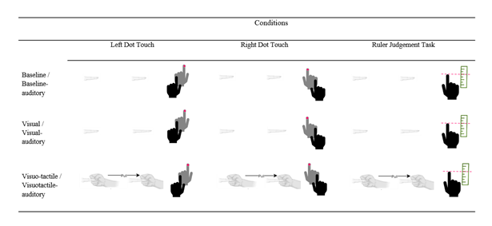

\vspace{10mm}
\begin{center}
Kirralise J. Hansford$^{1}$, Daniel H. Baker$^{1}$, Kirsten J. McKenzie$^{2}$ and Catherine E.J. Preston$^{1}$
\vspace{30mm}

$^{1}$ Department of Psychology, University of York
\vspace{5mm}

$^{2}$ School of Psychology, University of Lincoln
\vspace{50mm}

\end{center}

\pagebreak

# Abstract {.unnumbered}

Bodily resizing illusions typically use visual and/or tactile inputs to produce a vivid experience of one’s body changing size. Naturalistic auditory input (input that reflects the natural sounds of a stimulus) has been used to increase illusory experience during the rubber hand illusion, whilst non-naturalistic auditory input can influence estimations of finger length. We aimed to use non-naturalistic auditory input during a hand-based resizing illusion using augmented reality, to assess whether the addition of auditory input would increase both subjective illusion strength and measures of performance-based tasks. 44 participants completed three conditions: no finger stretching, finger stretching without tactile feedback, and finger stretching with tactile feedback. Half the participants had auditory input throughout all conditions, while the other half did not. After each condition, participants were given one of three performance tasks: stimulated (right) hand dot touch task, non-stimulated (left) hand dot touch task and a ruler judgement task. Dot tasks involved participants reaching for the location of a virtual dot, whereas the ruler task concerned estimates of the participant’s own finger on a ruler whilst the hand was hidden from view. After all trials, participants completed a questionnaire capturing subjective illusion strength. The addition of auditory input increased subjective illusion strength for manipulations without tactile feedback but not those with tactile feedback. No facilitatory effects of audio were found for any performance task. We conclude that adding auditory input to illusory finger stretching increased subjective illusory experience in the absence of tactile feedback but did not affect performance-based measures.


\vspace{5mm}
*Keywords*: Multisensory Integration, Resizing Illusions, Proprioceptive Drift, Audition. 


```{r setup, include=FALSE}

processdata <- 0        # takes about 6.5 hours to run from scratch

packagelist <- c('R.matlab','ggpubr','tidyverse','ez','ggplot2','kableExtra','gridExtra','pwr','reshape2','rstatix','osfr','jpeg','grid','plotrix','lavaan', 'cowplot', 'rmarkdown', 'readr', 'caTools', 'bitops') 

missingpackages <- packagelist[!packagelist %in% installed.packages()[,1]]
if (length(missingpackages)>0){install.packages(missingpackages)}
toinstall <- packagelist[which(!packagelist %in% (.packages()))]
invisible(lapply(toinstall,library,character.only=TRUE))

knitr::opts_chunk$set(echo = TRUE)

threshold <- 0.7   # this is the threshold for the image analysis
outputimages <- 0  # outputs finger images for checking

if (!dir.exists('local')){dir.create('local')}

if (!file.exists('local/Final Dataset(r).csv')){
  osfproject <- osf_retrieve_node("b9s48")
  osffiles <- osf_ls_files(osfproject)
  fid <- which(osffiles$name=='Final Dataset(r).csv')
  osf_download(osffiles[fid,], path='local/',progress=TRUE)
}

if (!file.exists('local/Final Dataset(r)_Outliers Removed.csv')){
  osfproject <- osf_retrieve_node("b9s48")
  osffiles <- osf_ls_files(osfproject)
  fid <- which(osffiles$name=='Final Dataset(r)_Outliers Removed.csv')
  osf_download(osffiles[fid,], path='local/',progress=TRUE)
}

#load in the subjective data - full
subjective_data <- read.csv("local/Final Dataset(r).csv")

#load in the subjective data - outliers removed
subjective_data_OR <- read.csv("local/Final Dataset(r)_Outliers Removed.csv")

includedsubjects <- subjective_data[seq(1,156,3),1]
groupassignments <- factor(subjective_data[seq(1,156,3),4])
audiogroup <- which(groupassignments=='Audio')
nonaudiogroup <- which(groupassignments=='No Audio')

includedsubjects_OR <- subjective_data_OR[seq(1,132,3),1]
groupassignments_OR <- factor(subjective_data_OR[seq(1,132,3),4])
audiogroup_OR <- which(groupassignments=='Audio')
nonaudiogroup_OR <- which(groupassignments=='No Audio')

```

## 1. Introduction {.unnumbered}

Resizing illusions can be delivered through either augmented reality or magnifying optics and typically use combined visual and tactile inputs to manipulate the size of a body part, making it appear either larger or smaller. These illusions, through changing the way a body part is perceived, exploit principles of multisensory integration to elicit modulations in the perceived size and shape of the body part [@preston2011a; @preston2020a; @stanton2018a]. In addition to visual and tactile illusions, the combination of visual and proprioceptive, or visual and motor inputs, has also been found to elicit body resizing illusions. Research demonstrates that proprioceptively aligning a child avatar body with a participant’s adult body can elicit a strong illusion of having a smaller child-sized body [@banakou2013a]. Further research also similarly shows that synchronous movements of an avatar with an elongated arm influences participants’ judgements of arm length [@kilteni2012a]. Furthermore, tasks using combined visuotactile inputs have been compared to those employing unimodal visual inputs for finger stretching illusions, with participants reporting greater subjective embodiment of the illusion during the combined visuotactile stimulation than during the unimodal visual illusions [@hansford2023a]. Such findings serve to highlight the importance of multisensory integration for subjective embodiment during illusory changes in finger length. 

Multisensory processing helps us to perceive a stimulus as a single coherent experience, despite being comprised of a combination of several different sensory inputs. This process is thought to be important for experiencing our body as our own, as has been demonstrated during the rubber hand illusion, whereby the simultaneous visual and tactile stimulation of a fake hand, at the same time and location as inputs applied to a participant’s own visually-occluded hand, can manipulate our understanding of what we experience to be part of our own body [@botvinick1998a]. Theories explaining body ownership and multisensory body illusions focus primarily on tactile and proprioceptive inputs [@tsakiris2010a; @botvinick1998a] as these senses are thought to be unique to bodily experience. Sensory inputs such as vision, which is understood to be weighted heavily in multisensory integration during bodily illusions [@makin2008a], and audition, which is thought to be a more external sense, are experienced both in relation to our own body and to objects in the external world. However, more recent Bayesian accounts of body ownership suggest that the addition of other senses may also facilitate feelings of embodiment and vividness of body illusions [@kilteni2015a]. Studies have claimed additive effects of additional senses in multisensory integration concerning non-body events, finding that the addition of auditory stimuli enhanced overall efficiency in difficult visual detection tasks [@frassinetti2002a]. This has also been demonstrated as an inverse effect, showing that visual cues can aid the detection of low-intensity sounds [@lovelace2003a]. Additionally, there is evidence supporting the modulation of tactile perception via audio cues; a study by @zampini2004a found that increasing the overall volume and / or the amplitude of high frequency sounds, combined with the tactile input of biting a potato chip, increased the reported crispness of the chip. 

Research examining multisensory integration relating to the body and body illusions have also begun to explore the importance of other senses; notably, the role of auditory input in multisensory interactions, which have been found to influence perceptions of body size and length [@tajadura-jim2012a], as well as altering perceived material properties [@senna2014a] and the weight [@tajadura-jim2015a] of the body. Looking specifically at visual, tactile, and auditory inputs within the rubber hand illusion (which is used as an experimental test for embodiment experienced in resizing illusions), @omera2014a used proprioceptive drift tasks, which measure localisation bias after proprioceptive manipulations, and found that adding auditory inputs consistent with the visual and tactile inputs related to stroking the hand (in this instance the sound of sandpaper scratching the skin) heightened the illusory experience more than when white noise was added to the illusion. This is further supported by the findings of @radziun2018a, who also looked at the addition of ecologically relevant auditory inputs to the rubber hand illusion. Their study used the sound of a surface being stroked with a paintbrush, subjective questionnaires, and proprioceptive drift tasks to demonstrate that synchronous auditory cues made the illusion stronger, compared to asynchronous auditory cues. 

The addition of auditory input in the studies mentioned above involved naturalistic auditory input, i.e., experimental auditory input that was consistent with realistic auditory stimuli, such as we are used to encountering in everyday life. However, @tajadura-jim2017a, looked at the influence of non-naturalistic auditory inputs, to see if this still resulted in changes to body perception. Here, they used changes in pitch, due to their associations with a change in height or size [@hubbard2018a], and which are not typically associated with bodily movement. They found that when participants pulled their own right index finger with their left hand, with an accompanying rising pitch sound (700 – 1200Hz), they estimated the length of their index finger to be longer than when this pulling was accompanied with either a descending (700 – 200Hz) or constant (700Hz) tone and coined this the “Auditory Pinocchio” effect (although they did not attempt to stretch participants’ noses).  

Given these previous findings involving naturalistic auditory input in the rubber hand illusion [@omera2014a] and non-naturalistic auditory input in auditory-tactile resizing manipulations [@tajadura-jim2017a], it is plausible that the addition of non-naturalistic auditory input, when using augmented reality to induce visual and visual-tactile resizing illusions, could heighten the strength of the illusory experience. This prediction refers again to the notion that the inclusion of more senses provides a more holistic and vivid experience of an event [@kilteni2015a].

Measuring the experience of illusory effects often consists of questionnaires given to participants after they have experienced an illusory condition to gain a subjective measure of their experience. However, more performance-based evidence can also be taken from behavioural measures of proprioceptive drift, which is defined as the change in proprioceptively perceived position of the participants hidden body part [@davies2013a]. Previous studies assessing proprioceptive drift during the rubber hand illusion have found differences regarding the influence of the illusion on body schema. Body schema are representations of the body based on bottom-up sensory inputs that are needed for action, and are thought to be distinct from body image, which refers to a top-down body representation that is needed for perception [@paillard1999a]. @kammers2009a investigated the relationship between body schema and body image using the rubber hand illusion with a reaching proprioceptive drift task (action task), wherein participants were asked to reach with one hand to point to the tip of the index finger of the other hand in a single movement, to assess body schema. Participants were also asked to verbally report when the experimenter’s moving finger represented the felt location of their own finger (perceptual task), to assess body image. @kammers2009a, found that only the perceptual judgements regarding limb ownership were sensitive to distortion in the rubber hand illusion, concluding that action movements, and therefore body schema, were not affected. In contrast, @newport2010a used augmented reality and a dot touch proprioceptive drift task with supernumerary limbs to assess body schema using a virtual version of the rubber hand illusion, and found that distortions in body schema were apparent, evidenced through pointing errors in the dot touch task that were consistent with the remapped limb position. 

A point to note within this previous research is that the terms “subjective” and “performance task” can be used to refer to several concepts in relation to data regarding bodily experience. For the purposes of the current study, the term “subjective self-reports” is used to refer to data collected from self-report questionnaires, whereas the term “performance task” is taken to refer to data collected from proprioceptive plasticity and ruler judgement tasks, such as those used by @davies2013a, @kammers2009a and @newport2010a. Previous studies concerning the rubber hand illusion typically use proprioceptive drift to assess performance based illusory experience, however in the current study, we are looking more broadly at proprioceptive plasticity. Proprioceptive plasticity refers to the changeable nature of proprioception that can be influenced by body illusions, but that is not specific to drift from one body part to another such as in the rubber hand illusion. Proprioceptive plasticity acts as a more general term regarding changes to proprioception. This is due to self-report tasks indexing personal, subjective, experience of resizing illusions, whereas proprioceptive drift and ruler judgement tasks index aspects which some researchers consider as more impartial, performance based, data regarding the effects of resizing illusions on one’s percept of their bodily experience. 

Given previous research showing the additive effects of including several different sensory inputs for overall experience, and the recent evidence of the effects that additional auditory inputs can have on illusory experience when compared to unimodal stimulation alone, we hypothesise that through using a between subjects design wherein one group has non-naturalistic auditory input (one that is consistent with the visual and tactile manipulations of stretching a finger) during augmented-reality resizing illusions, whilst the other group has no auditory input (1) illusion strength, measured via a subjective illusory experience questionnaire, will be heightened for (1a) visual and (1b) visuo-tactile manipulations within the audio group. In addition, we hypothesise (2) that the addition of auditory input will lead to stronger illusions as indexed by performance tasks, in line with experience of a longer finger, as measured using a dot touch proprioceptive plasticity task that indexes body schema for (2a) visual and (2b) visuo-tactile manipulations. We also hypothesise that the addition of auditory input will increase judgements of finger length, measured using a ruler judgement task that indexes body image for (3a) visual and (3b) visuo-tactile manipulations. Our inclusion of two different proprioceptive plasticity tasks; a dot touch task and a ruler judgement task, aims to address the apparent discordance between the findings of @kammers2009a and @newport2010a, relating to the effects of resizing illusions upon body image and body schema. 


## 2. Method {.unnumbered}

## 2.1 Pre-registration {.unnumbered}
Pre-registration of this study can be found at the following OSF link: https://osf.io/6x4ce 

## 2.2 Ethical Approval {.unnumbered}
This study was granted ethical approval from the University of York.

## 2.3 Participant Sample {.unnumbered}

```{r poweranalyses, include=FALSE}

#subjective analysis power analysis
SubjectivePA <- pwr.t.test(d=1.02,power=0.8,sig.level=0.05,type="two.sample",alternative="greater")
#objecitve dot touch power analysis
ObjectivePA <- pwr.anova.test(k=2,f=.64,sig.level=.05,power=.8)

```

## 2.3.1 Power Analysis and Sample Size {.unnumbered}

A priori power analysis using subjective illusion data and performance task dot touch data from a pilot study (N = 10, https://osf.io/pb3ku ) showed a minimum sample size of `r round(SubjectivePA$n[1])*2` participants is required for hypothesis 1a regarding visuo-auditory / visuotactile-auditory manipulations (Cohen's d = `r (SubjectivePA$d[1])`, power = `r (SubjectivePA$power[1])`, alpha = `r (SubjectivePA$sig.level[1])`, between subjects design), and a sample of `r round(ObjectivePA$n[1])*2` participants is required for hypothesis 2 regarding the dot touch task (f = `r (ObjectivePA$f[1])`, power = `r (ObjectivePA$power[1])`, alpha = `r (ObjectivePA$sig.level[1])`, between subjects design). Due to the inherent ambiguity of sample size estimations from power analysis, and to account for the additional ruler judgment task, the upper sample size of 26 participants will be doubled to a sample size of 52 participants.

## 2.3.2 Participants {.unnumbered}

52 participants (44 Female. 6 Male, 2 Non-Binary; Mean age = 19.3 years, age range = 18 – 24 years, sample population = students at the University of York) gave informed consent, were split ramdonly into either the audio group or the no-audio group, and completed the experiment. Exclusion criteria were detailed on the participant information sheet and included: prior knowledge or expectations about the research, a history of neurological or psychiatric disorders, any operations or procedures that could damage peripheral nerve pathways in the hands, a history of chronic pain conditions, history of drug or alcohol abuse, history of sleep disorders, history of epilepsy, having visual abnormalities that cannot be corrected optically (i.e. with glasses), or being under 18 years of age. From these 52 participants, 8 scored above 50 (indicating experience of the illusion) on the subjective experience questionnaire item regarding feeling stretching of the finger within the baseline condition where no stretching took place, therefore these 8 participants were removed from subsequent analyses, resulting in `r n_distinct(subjective_data$PID)` participants being included in the final sample; 23 in the No-Audio group, and 21 in the Audio group. Analysis of all participant's data was completed in line with the preregistration for transparency and can be seen in supplementary material S8 - S10.

## 2.4 Materials {.unnumbered}

The resizing illusions were delivered using an augmented-reality system (see Figure 1) that consisted of an area for the hands to be placed which contained a black felt base, LED lights mounted on either side and a 1920 x 1080 camera situated in the middle of the area, away from the participant’s view. Above this area, there was a mirror placed below a 1920 x 1200 resolution screen, so that the footage from the camera was reflected by the mirror such that the participant could view live footage of their own occluded hands. The manipulation of the live feed from the camera was implemented using MATLAB r2017a, wherein the participant’s finger would stretch by 60 pixels (2.1 cm) during illusions lasting 2.4 seconds. This stretching was accompanied during the visuotactile / visuotactile-auditory conditions by the experimenter gently pulling on the participant’s right index finger to provide tactile input and induce immersive multisensory illusions. In the audio group, the stretching manipulations in the visuotactile-auditory and the visual-auditory conditions were accompanied by a pure tone that increased linearly in frequency from 308Hz – 629Hz, trials wherein no stretching took place were accompanied by a 440Hz tone. Auditory input was delivered by two speakers located beneath the augmented reality system. This positioning of the speakers was to ensure that the location of the sound was aligned with the location of the resizing manipulations (based on feedback from the pilot study that suggested auditory input delivered further from the augmented reality system created a disconnect between the different sensory inputs). After each condition, the participants’ hands were occluded from view and the dot touch or ruler judgement tasks were presented (detailed in section 2.3), until the experimenter pressed a button to indicate the start of the next trial. A blue rectangle was superimposed on the screen so that participants knew where to reposition their hands to after each task. Subjective illusion experience data were collected via Qualtrics (Qualtrics, Provo, UT) on a Samsung Galaxy Tab A6 tablet. This was given to participants after all experimental trials were presented, when each manipulation was presented again, without the subsequent tasks, and participants were asked to recall the trial they had just experienced and previous trials that were similar, and then give a response on a visual analogue scale of 0 to 100, with 0 being strongly disagree, 50 being neutral, and 100 being strongly agree, with written statements. The questionnaire consisted of six statements, two relating to illusory experience: “It felt like my finger was really stretching” / “It felt like the hand I saw was part of my body”, two relating to disownership: “It felt like the hand I saw no longer belonged to me” / “It felt like the hand I saw was no longer part of my body”, and two were control statements: “It felt as if my hand had disappeared” / “It felt as if I might have had more than one right hand”. The questionnaire was delivered 3 times, once after baseline manipulations, once after visuotactile / visuotactile-auditory manipulations, and finally once after unimodal visual /  visual-auditory manipulations. 


```{r figure1, fig.cap="Schematic of Augmented Reality System.", fig.align='center', echo=FALSE}

knitr::include_graphics('figures/Augmented Reality Infographic.png')

```

## 2.5 Procedure {.unnumbered}

Participants were assigned to either the auditory group or the non-auditory group based on a randomised MATLAB output of the total number of participants split randomly and evenly into two groups. They were then seated at the augmented-reality system and were instructed to place both of their hands onto the felt lining, with their index fingers outstretched. There were four white dots on the felt to guide where their hands should be placed, creating 2 hand spaces (one between each pair of dots), and arm rests were provided for comfort. Participants were instructed to view the image of their hands in the mirror (whilst their real hands were hidden from view) throughout the experiment. They viewed their hands whilst receiving baseline conditions in which no manipulations were applied (with a 440Hz tone played for auditory group), stretching conditions in which they saw the index finger on their right-hand visually stretch (unimodal visual / visual-auditory conditions with accompanying 308Hz – 629Hz sound for the auditory group), and stretching conditions in which as they saw their index finger on their right hand stretch as a researcher gently pulled on the end of their finger simultaneously (visuotactile / visuotactile-auditory conditions with accompanying 308Hz – 629Hz sound for the auditory group).

After viewing the manipulation of their right hand, participants completed either a left-hand dot touch task, a right-hand dot touch task, or a ruler judgement task. The dot touch tasks consisted of the participant’s hands being occluded from view before a magenta dot appeared in front of either their right or left hand, and participants were then asked to move their index finger in one smooth ballistic pointing movement to touch the dot. When the participant had completed this movement, they were asked to leave their finger in place for a few seconds whilst the experimenter pressed a button to record an image of the hand position through the camera. The participant then returned their hand to the indicated pre-trial position. The ruler judgement task consisted of the participant’s hands again being occluded from view before a 14 cm ruler, with 8 marks spaced 2cm's apart, was displayed to the right of the participant’s right hand. The ruler changed in position and scale to avoid trial order bias. The start-point of the scale ranged from 10 to 60 cm, and the vertical position of the ruler was jittered using a normal distribution with a mean of 0 and standard deviation of 40 pixels. Participants were asked to verbally indicate the location on the ruler that corresponded with where they felt the tip of their right (stimulated) index finger was. 

Participants completed 6 repetitions of 9 distinct conditions which can be seen in Table 1. A video of a participant undergoing visuotactile stretching can be seen in supplementary material. Conditions were randomised via MATLAB r2017a, and the experimenter was unaware which condition would be presented on a given trial. The experimenter was informed whether to gently pull the index finger or to apply no manipulation via the presentation of a small blue rectangle on the screen, out of the participant’s view. 6 repetitions of the 9 conditions were presented, followed by a break for the participant to remove their hands from the box and rest, and then the baseline, visuotactile / visuotactile-auditory and the unimodal visual / visual-auditory conditions were presented once in a random order, without any dot touch or ruler judgement tasks, after which the participant completed the subjective illusory experience questionnaire.


``` {r table1, fig.cap="9 Distinct conditions with associated tasks shown as infographics. The no-audio group experienced the condition without audio, whilst the audio group had auditory input during the resizing illusions (increasing pitch tone) and the baseline trials (constant tone). Performance-based tasks can be seen to the right of each condition under the respective column headers.", fig.align='center', echo=FALSE}
#Add table infographic



```

## 2.6 Analysis {.unnumbered}

Questionnaire data were exported from Qualtrics to a .csv file before being loaded into RStudio for analysis. 

For the dot touch and ruler judgement data, during each trial a still image was taken of the location of the participant’s hands within the augmented reality system. Preprocessing was done algorithmically using image intensity data to estimate finger position; details of this can be seen in the code available on OSF at the following link: https://osf.io/b9s48/. For the dot touch data, the images were used to determine how far away the participant’s finger was from the magenta dot, which was stored as an error rating for each trial and then averaged across the same trial types for each participant. This was completed for both left and right dot touch tasks. The ruler judgement data analysis consisted of using the still images with the superimposed ruler and the ruler ratings given verbally by the participant during the experimental task to check that the rating given was within the range of the ruler. If this was not true, as was the case with 4 participants, then their data for those trials were removed before statistical analysis. For all included trials, the differences between the given ruler ratings and the actual tips of the fingers on the still images were used to generate error values, which were then used for statistical analysis. 

For statistical analysis of all data, a factorial ANOVA with a within-subjects factor of condition and a between-subjects factor of group, were used for hypothesis testing in line with the pre-registration.  
All data and code for analysis are available on the OSF page, which also contains resources to computationally reproduce this manuscript, including all analyses, figures, and statistical outputs, from the raw data.


## 3. Results {.unnumbered}

```{r analyseraw, include=FALSE}

if (processdata==1){
if (!dir.exists('local/rawdata')){dir.create('local/rawdata')}
if (!dir.exists('local/fingerimages')){dir.create('local/fingerimages')}

osfproject <- osf_retrieve_node("b9s48")

osffiles <- osf_ls_files(osfproject)
if (!file.exists('local/rulerratings.csv')){
  fid <- which(osffiles$name=='rulerratings.csv')
  osf_download(osffiles[fid,], path='local/',progress=TRUE)
}
ratings <- read.csv('local/rulerratings.csv',header=FALSE)

osffiles <- osf_ls_files(osfproject,path='Raw Data',n_max=100)
for (n in 1:nrow(osffiles)){
if (!file.exists(paste0('local/rawdata/',osffiles[n,1]))){
  osf_download(osffiles[n,], path='local/rawdata/',progress=TRUE)
}}


sublist <- c(402:440,442:454)

allout <- array(0,dim=c(length(sublist),12,6))

for (s in 1:length(sublist)){
  subjID <- sublist[s]
  
  print(subjID)
  
  temp <- readMat(paste0('local/rawdata/',subjID,'trialorder.mat'))
  
  subjind <- which(ratings[,1]==subjID)
  
  triallist <- unlist(temp$trialorder[[1]])
  
  output <- matrix(0,nrow=12,ncol=6)
  condcount <- (1:9)*0
  rulercount <- 0
  
  for (trial in 1:length(triallist)){
    
    cond <- triallist[trial]
    condcount[cond] <- condcount[cond] + 1
 
    # mirror reverse the image because the camera is pointing at a mirror!
    thisim <- temp$allimages[trial,,1920:1,]
    imwithdot <- thisim
    
    if (triallist[trial]<7){
      if (triallist[trial]<4){print(paste(subjID,'Right dot touch'))}
      if (triallist[trial]>3){print(paste(subjID,'Left dot touch'))}
      
      xy <- round(c(3*1920/4,350) + (c(-1,1)*temp$xydots[trial,]))
      
      # remove the magenta dot
      A <- thisim[,,1]==255
      B <- thisim[,,2]==0
      C <- thisim[,,3]==255
      abc <- A*B*C
      ind <- which(abc>0,arr.ind=TRUE)
      thisim[ind[,1],ind[,2],] <- 0
      
      meanmap <- apply(thisim/255,1:2,mean)
      meanmap[1:100,] <- 0
      ind <- which(meanmap>threshold,arr.ind=TRUE)  # find pixels above the threshold
      fingertip <- min(ind[,1])  # find the y value closest to the top of the image
      
      output[cond,condcount[cond]] <- fingertip - xy[2]   # store error     
      
    }

    if (triallist[trial]>6){
      print(paste(subjID,'Ruler task'))
      
      rulercount <- rulercount + 1
      subjectrating <- ratings[subjind,rulercount+1]
      
      meanmap <- apply(thisim/255,1:2,mean)
      meanmap[1:100,] <- 0
      ind <- which(meanmap>threshold,arr.ind=TRUE)  # find pixels above the threshold
      fingertip <- min(ind[,1])  # find the y value closest to the top of the image
      
      thisscale <- temp$rulerscales[trial]
      thispos <- temp$rulerxy[trial]
      
      rulermin <- (1200/2) + 50 - thispos
      rulermax <- (1200/2) - 350 - thispos
      
      truepos <- thisscale + ((rulermin - fingertip)/50)
      
      output[cond,condcount[cond]] <- subjectrating - truepos    
      
      # adjusts the ratings to flag as an out of range trial
      output[cond+3,condcount[cond]] <- 1
      if (subjectrating>(thisscale + 8)){output[cond+3,condcount[cond]] <- 0}
      if (subjectrating<thisscale){output[cond+3,condcount[cond]] <- 0}

    } 
    
          if (outputimages==1){

    imwithdot[fingertip,,1] <- 0
    imwithdot[fingertip,,2] <- 255
    imwithdot[fingertip,,3] <- 0

    if (triallist[trial]>6){
    imwithdot[rulermin,,1] <- 0
    imwithdot[rulermin,,2] <- 255
    imwithdot[rulermin,,3] <- 255
    
    imwithdot[rulermax,,1] <- 255
    imwithdot[rulermax,,2] <- 0
    imwithdot[rulermax,,3] <- 0
    }
    writeJPEG(imwithdot/255,paste0('local/fingerimages/P',subjID,'im',((cond-1)*6) + condcount[cond],'.jpg'))

          }
    
  }

  allout[s,,] <- output
  
}
save(file='local/allprocessed.RData',list=c('ratings','allout'))
}

if (processdata==0){
  if (!file.exists('local/allprocessed.RData')){
  osfproject <- osf_retrieve_node("b9s48")
  osffiles <- osf_ls_files(osfproject)
  fid <- which(osffiles$name=='allprocessed.RData')
  osf_download(osffiles[fid,], path='local/',progress=TRUE)
  }
  load('local/allprocessed.RData')
}

```

```{r processdata, include=FALSE}

# Reorganisation of data

allout[,7:9,] <- allout[,7:9,]/allout[,10:12,]

allout[which(is.infinite(allout))] <- NA

allout <- allout[,1:9,]

meansettings <- apply(allout,1:2,mean,na.rm=TRUE)
includedindices <- which(ratings[,1] %in% includedsubjects)
includedindices_OR <- which(ratings[,1] %in% includedsubjects_OR)
allsettings <- meansettings[includedindices,]
allsettings_OR <- meansettings[includedindices_OR,]

normsettings <- allsettings
for (n in 1:3){
normsettings[,(n*3)-2] <- normsettings[,(n*3)-2] - allsettings[,(n*3)-2]
normsettings[,(n*3)-1] <- normsettings[,(n*3)-1] - allsettings[,(n*3)-2]
normsettings[,(n*3)] <- normsettings[,(n*3)] - allsettings[,(n*3)-2]
}

normsettings_OR <- allsettings_OR
for (n in 1:3){
normsettings_OR[,(n*3)-2] <- normsettings_OR[,(n*3)-2] - allsettings_OR[,(n*3)-2]
normsettings_OR[,(n*3)-1] <- normsettings_OR[,(n*3)-1] - allsettings_OR[,(n*3)-2]
normsettings_OR[,(n*3)] <- normsettings_OR[,(n*3)] - allsettings_OR[,(n*3)-2]
}

#set column names
colnames(allsettings) <- c("RightDotBaseline", "RightDotV/VA", "RightDotVT/VTA", 
                           "LeftDotBaseline", "LeftDotV/VA", "LeftDotVT/VTA", 
                           "RulerBaseline", "RulerV/VA", "RulerVT/VTA")

colnames(normsettings) <- c("RightDotBaseline", "RightDotV/VA", "RightDotVT/VTA", 
                            "LeftDotBaseline", "LeftDotV/VA", "LeftDotVT/VTA", 
                            "RulerBaseline", "RulerV/VA", "RulerVT/VTA")

colnames(allsettings_OR) <- c("RightDotBaseline", "RightDotV/VA", "RightDotVT/VTA", 
                           "LeftDotBaseline", "LeftDotV/VA", "LeftDotVT/VTA", 
                           "RulerBaseline", "RulerV/VA", "RulerVT/VTA")

colnames(normsettings_OR) <- c("RightDotBaseline", "RightDotV/VA", "RightDotVT/VTA", 
                            "LeftDotBaseline", "LeftDotV/VA", "LeftDotVT/VTA", 
                            "RulerBaseline", "RulerV/VA", "RulerVT/VTA")

#Extract the needed columns
allsettingsright <- allsettings[,c(1:3)]
allsettingsleft <- allsettings[,c(4:6)]
allsettingsruler <- allsettings[,c(7:9)]

normsettingsright <- normsettings[,c(2:3)]
normsettingsleft <- normsettings[,c(5:6)]
normsettingsruler <- normsettings[,c(8:9)]

allsettingsright_OR <- allsettings_OR[,c(1:3)]
allsettingsleft_OR <- allsettings_OR[,c(4:6)]
allsettingsruler_OR <- allsettings_OR[,c(7:9)]

normsettingsright_OR <- normsettings_OR[,c(2:3)]
normsettingsleft_OR <- normsettings_OR[,c(5:6)]
normsettingsruler_OR <- normsettings_OR[,c(8:9)]

#Create group labels
Group <- c("Audio", "No Audio", "Audio", "Audio","No Audio", "No Audio", "No Audio", "No Audio", 
           "Audio", "Audio", "Audio", "Audio", "Audio", "No Audio", "Audio", 
           "Audio", "No Audio", "No Audio", "No Audio", "Audio", "No Audio", 
           "Audio", "No Audio", "No Audio", "Audio", "Audio", "Audio", "No Audio",
           "No Audio", "Audio", "Audio", "Audio", "Audio", "No Audio",
           "Audio", "No Audio", "Audio", "No Audio", "Audio", "Audio",
           "No Audio", "No Audio", "No Audio", "No Audio", "Audio", "No Audio",
           "No Audio", "No Audio", "No Audio", "No Audio", "Audio", 
           "No Audio")

Group_OR <- c("No Audio", "Audio", "Audio", "No Audio", "No Audio", 
           "Audio", "Audio", "Audio", "Audio", "No Audio", "Audio", 
           "Audio", "No Audio", "No Audio", "Audio", "No Audio", 
           "Audio", "No Audio", "No Audio", "Audio", "No Audio",
           "No Audio", "Audio", "Audio", "Audio", "Audio", "No Audio",
           "Audio", "No Audio", "Audio", "No Audio", "Audio", "Audio",
           "No Audio", "No Audio", "No Audio", "Audio", "No Audio",
           "No Audio", "No Audio", "No Audio", "No Audio", "Audio", 
           "No Audio")

#create PID
PID <- c(1:52)
PID_OR <- c(1:44)

#Bind Group and PID Columns
allsettingsright <- cbind(allsettingsright, Group, PID)
allsettingsleft <- cbind(allsettingsleft, Group, PID)
allsettingsruler <- cbind(allsettingsruler, Group, PID)

normsettingsright <- cbind(normsettingsright, Group, PID)
normsettingsleft <- cbind(normsettingsleft, Group, PID)
normsettingsruler <- cbind(normsettingsruler, Group, PID)

allsettingsright_OR <- cbind(allsettingsright_OR, Group_OR, PID_OR)
allsettingsleft_OR <- cbind(allsettingsleft_OR, Group_OR, PID_OR)
allsettingsruler_OR <- cbind(allsettingsruler_OR, Group_OR, PID_OR)

normsettingsright_OR <- cbind(normsettingsright_OR, Group_OR, PID_OR)
normsettingsleft_OR <- cbind(normsettingsleft_OR, Group_OR, PID_OR)
normsettingsruler_OR<- cbind(normsettingsruler_OR, Group_OR, PID_OR)

#Make data as dataframes
allsettingsrightdf <- as.data.frame(allsettingsright)
allsettingsleftdf <- as.data.frame(allsettingsleft)
allsettingsrulerdf <- as.data.frame(allsettingsruler)

normsettingsrightdf <- as.data.frame(normsettingsright)
normsettingsleftdf <- as.data.frame(normsettingsleft)
normsettingsrulerdf <- as.data.frame(normsettingsruler)

allsettingsrightdf_OR <- as.data.frame(allsettingsright_OR)
allsettingsleftdf_OR <- as.data.frame(allsettingsleft_OR)
allsettingsrulerdf_OR <- as.data.frame(allsettingsruler_OR)

normsettingsrightdf_OR <- as.data.frame(normsettingsright_OR)
normsettingsleftdf_OR <- as.data.frame(normsettingsleft_OR)
normsettingsrulerdf_OR <- as.data.frame(normsettingsruler_OR)

#set PID as factors
allsettingsrightdf$PID <- factor(allsettingsrightdf$PID)
allsettingsleftdf$PID <- factor(allsettingsleftdf$PID)
allsettingsrulerdf$PID <- factor(allsettingsrulerdf$PID)

normsettingsrightdf$PID <- factor(normsettingsrightdf$PID)
normsettingsleftdf$PID <- factor(normsettingsleftdf$PID)
normsettingsrulerdf$PID <- factor(normsettingsrulerdf$PID)

allsettingsrightdf_OR$PID_OR <- factor(allsettingsrightdf_OR$PID_OR)
allsettingsleftdf_OR$PID_OR <- factor(allsettingsleftdf_OR$PID_OR)
allsettingsrulerdf_OR$PID_OR <- factor(allsettingsrulerdf_OR$PID_OR)

normsettingsrightdf_OR$PID_OR <- factor(normsettingsrightdf_OR$PID_OR)
normsettingsleftdf_OR$PID_OR <- factor(normsettingsleftdf_OR$PID_OR)
normsettingsrulerdf_OR$PID_OR <- factor(normsettingsrulerdf_OR$PID_OR)

#Format all dataframes for analysis
allsettingsright_formatted <- melt(allsettingsrightdf,
                                   # ID variables - all the variables to keep but not split apart on
                                   id.vars=c("Group", "PID"),
                                   # The source columns
                                   measure.vars=c("RightDotBaseline", "RightDotV/VA", "RightDotVT/VTA" ),
                                   # Name of the destination column that will identify the original
                                   # column that the measurement came from
                                   variable.name="condition",
                                   value.name="score")


# Sort by subject first, then by condition
allsettingsright_formatted <- allsettingsright_formatted[ order(allsettingsright_formatted$PID,
                                                                allsettingsright_formatted$condition), ]

allsettingsright_formatted_OR <- melt(allsettingsrightdf_OR,
                                   # ID variables - all the variables to keep but not split apart on
                                   id.vars=c("Group_OR", "PID_OR"),
                                   # The source columns
                                   measure.vars=c("RightDotBaseline", "RightDotV/VA", "RightDotVT/VTA" ),
                                   # Name of the destination column that will identify the original
                                   # column that the measurement came from
                                   variable.name="condition",
                                   value.name="score")

allsettingsright_formatted_OR <- allsettingsright_formatted_OR[ order(allsettingsright_formatted_OR$PID_OR,
                                                                allsettingsright_formatted_OR$condition), ]

allsettingsleft_formatted <- melt(allsettingsleftdf,
                                   # ID variables - all the variables to keep but not split apart on
                                   id.vars=c("Group", "PID"),
                                   # The source columns
                                   measure.vars=c("LeftDotBaseline", "LeftDotV/VA", "LeftDotVT/VTA" ),
                                   # Name of the destination column that will identify the original
                                   # column that the measurement came from
                                   variable.name="condition",
                                   value.name="score")

allsettingsleft_formatted <- allsettingsleft_formatted[ order(allsettingsleft_formatted$PID,
                                                                allsettingsleft_formatted$condition), ]
allsettingsleft_formatted_OR <- melt(allsettingsleftdf_OR,
                                   # ID variables - all the variables to keep but not split apart on
                                   id.vars=c("Group_OR", "PID_OR"),
                                   # The source columns
                                   measure.vars=c("LeftDotBaseline", "LeftDotV/VA", "LeftDotVT/VTA" ),
                                   # Name of the destination column that will identify the original
                                   # column that the measurement came from
                                   variable.name="condition",
                                   value.name="score")


allsettingsleft_formatted_OR <- allsettingsleft_formatted_OR[ order(allsettingsleft_formatted_OR$PID_OR,
                                                                allsettingsleft_formatted_OR$condition), ]

allsettingsruler_formatted <- melt(allsettingsrulerdf,
                                   # ID variables - all the variables to keep but not split apart on
                                   id.vars=c("Group", "PID"),
                                   # The source columns
                                   measure.vars=c("RulerBaseline", "RulerV/VA", "RulerVT/VTA" ),
                                   # Name of the destination column that will identify the original
                                   # column that the measurement came from
                                   variable.name="condition",
                                   value.name="score")

allsettingsruler_formatted <- allsettingsruler_formatted[ order(allsettingsruler_formatted$PID,
                                                                allsettingsruler_formatted$condition), ]
allsettingsruler_formatted_OR <- melt(allsettingsrulerdf_OR,
                                   # ID variables - all the variables to keep but not split apart on
                                   id.vars=c("Group_OR", "PID_OR"),
                                   # The source columns
                                   measure.vars=c("RulerBaseline", "RulerV/VA", "RulerVT/VTA" ),
                                   # Name of the destination column that will identify the original
                                   # column that the measurement came from
                                   variable.name="condition",
                                   value.name="score")

allsettingsruler_formatted_OR <- allsettingsruler_formatted_OR[ order(allsettingsruler_formatted_OR$PID_OR,
                                                                allsettingsruler_formatted_OR$condition), ]

normsettingsright_formatted <- melt(normsettingsrightdf,
                                   # ID variables - all the variables to keep but not split apart on
                                   id.vars=c("Group", "PID"),
                                   # The source columns
                                   measure.vars=c("RightDotV/VA", "RightDotVT/VTA" ),
                                   # Name of the destination column that will identify the original
                                   # column that the measurement came from
                                   variable.name="condition",
                                   value.name="score")

normsettingsright_formatted <- normsettingsright_formatted[ order(normsettingsright_formatted$PID,
                                                                normsettingsright_formatted$condition), ]
normsettingsright_formatted_OR <- melt(normsettingsrightdf_OR,
                                   # ID variables - all the variables to keep but not split apart on
                                   id.vars=c("Group_OR", "PID_OR"),
                                   # The source columns
                                   measure.vars=c("RightDotV/VA", "RightDotVT/VTA" ),
                                   # Name of the destination column that will identify the original
                                   # column that the measurement came from
                                   variable.name="condition",
                                   value.name="score")

normsettingsright_formatted_OR <- normsettingsright_formatted_OR[ order(normsettingsright_formatted_OR$PID_OR,
                                                                normsettingsright_formatted_OR$condition), ]

normsettingsleft_formatted <- melt(normsettingsleftdf,
                                    # ID variables - all the variables to keep but not split apart on
                                    id.vars=c("Group", "PID"),
                                    # The source columns
                                    measure.vars=c("LeftDotV/VA", "LeftDotVT/VTA" ),
                                    # Name of the destination column that will identify the original
                                    # column that the measurement came from
                                    variable.name="condition",
                                    value.name="score")

normsettingsleft_formatted <- normsettingsleft_formatted[ order(normsettingsleft_formatted$PID,
                                                                  normsettingsleft_formatted$condition), ]
normsettingsleft_formatted_OR <- melt(normsettingsleftdf_OR,
                                   # ID variables - all the variables to keep but not split apart on
                                   id.vars=c("Group_OR", "PID_OR"),
                                   # The source columns
                                   measure.vars=c("LeftDotV/VA", "LeftDotVT/VTA" ),
                                   # Name of the destination column that will identify the original
                                   # column that the measurement came from
                                   variable.name="condition",
                                   value.name="score")


normsettingsleft_formatted_OR <- normsettingsleft_formatted_OR[ order(normsettingsleft_formatted_OR$PID_OR,
                                                                normsettingsleft_formatted_OR$condition), ]

normsettingsruler_formatted <- melt(normsettingsrulerdf,
                                    # ID variables - all the variables to keep but not split apart on
                                    id.vars=c("Group", "PID"),
                                    # The source columns
                                    measure.vars=c("RulerV/VA", "RulerVT/VTA" ),
                                    # Name of the destination column that will identify the original
                                    # column that the measurement came from
                                    variable.name="condition",
                                    value.name="score")

normsettingsruler_formatted <- normsettingsruler_formatted[ order(normsettingsruler_formatted$PID,
                                                                  normsettingsruler_formatted$condition), ]

normsettingsruler_formatted_OR <- melt(normsettingsrulerdf_OR,
                                   # ID variables - all the variables to keep but not split apart on
                                   id.vars=c("Group_OR", "PID_OR"),
                                   # The source columns
                                   measure.vars=c("RulerV/VA", "RulerVT/VTA" ),
                                   # Name of the destination column that will identify the original
                                   # column that the measurement came from
                                   variable.name="condition",
                                   value.name="score")

normsettingsruler_formatted_OR <- normsettingsruler_formatted_OR[ order(normsettingsruler_formatted_OR$PID_OR,
                                                                normsettingsruler_formatted_OR$condition), ]

##Analysis

#convert PID, Group and Condition within subjective data to factors
subjective_data_factors = subjective_data %>%
  convert_as_factor(PID, Group, Condition)

subjective_data_factors_OR = subjective_data_OR %>%
  convert_as_factor(PID, Group, Condition)
```

```{r analysis, include=FALSE}
## Subjective Analyses ##

normsettings_SD <- subjective_data_factors
for (n in 1:3){
normsettings_SD[(n*3)-1,6] <- subjective_data_factors[(n*3)-1,6] - subjective_data_factors[(n*3)-2,6]
normsettings_SD[(n*3),6] <- subjective_data_factors[(n*3),6] - subjective_data_factors[(n*3)-2,6]
normsettings_SD[(n*3)-2,6] <- subjective_data_factors[(n*3)-2,6] - subjective_data_factors[(n*3)-2,6]
}

normsettings_SD_OR <- subjective_data_factors_OR
for (n in 1:3){
normsettings_SD_OR[(n*3)-1,6] <- subjective_data_factors_OR[(n*3)-1,6] - subjective_data_factors_OR[(n*3)-2,6]
normsettings_SD_OR[(n*3),6] <- subjective_data_factors_OR[(n*3),6] - subjective_data_factors_OR[(n*3)-2,6]
normsettings_SD_OR[(n*3)-2,6] <- subjective_data_factors_OR[(n*3)-2,6] - subjective_data_factors_OR[(n*3)-2,6]
}


#remove the baseline condition
subjective_data_factors_BaselineRemoved <- subset(normsettings_SD, Condition!='Baseline Illusion ')

#remove the baseline condition
subjective_data_factors_OR_BaselineRemoved <- subset(normsettings_SD_OR, Condition!='Baseline Illusion ')

### --- ###
#Subjective Illusion Score Analysis
anova1 = ezANOVA(
    data = subjective_data_factors
    , dv = Illusion.1.Score
    , wid = PID
    , within = Condition
    , between = Group
    , type = 3
)

anova1_BR = ezANOVA(
    data = subjective_data_factors_BaselineRemoved
    , dv = Illusion.1.Score
    , wid = PID
    , within = Condition
    , between = Group
    , type = 3
)


#Subjective Illusion Score Analysis OR
anova1_OR = ezANOVA(
    data = subjective_data_factors_OR
    , dv = Illusion.1.Score
    , wid = PID
    , within = Condition
    , between = Group
    , type = 3
)

anova1_OR_BR = ezANOVA(
    data = subjective_data_factors_OR_BaselineRemoved
    , dv = Illusion.1.Score
    , wid = PID
    , within = Condition
    , between = Group
    , type = 3
)


#sort subjective data into new dataframes for posthoc pairwise analyses
filtered.data_Baseline <- data.frame(subjective_data_factors[c(1,4,7,10,13,16,19,22,25,28,31,34,37,40,43,46,49,52,55,58,61,64,67,70,73,76,79,82,85,88,91,94,97,100,103,106,109,112,115,118,121,124,127,130,133,136,139,142,145,148,151,154),c(1:13)])
filtered.data_V_VA <- data.frame(subjective_data_factors[c(2,5,8,11,14,17,20,23,26,29,32,35,38,41,44,47,50,53,56,59,62,65,68,71,74,77,80,83,86,89,92,95,98,101,104,107,110,113,116,119,122,125,128,131,134,137,140,143,146,149,152,155),c(1:13)])
filtered.data_VT_VTA <- data.frame(subjective_data_factors[c(3,6,9,12,15,18,21,24,27,30,33,36,39,42,45,48,51,54,57,60,63,66,69,72,75,78,81,84,87,90,93,96,99,102,105,108,111,114,117,120,123,126,129,132,135,138,141,144,147,150,153,156),c(1:13)])
filtered.data_VA_VT <- data.frame(subjective_data_factors[c(2,6,8,11,15,18,21,24,26,29,32,35,38,42,44,47,51,54,57,59,63,65,69,72,74,77,80,84,87,89,92,95,98,102,104,108,110,114,117,119,123,126,129,132,134,138,141,144,147,150,152,156),c(1:13)])

#OR Sorting
filtered.dataOR_Baseline <- data.frame(subjective_data_factors_OR[c(1,4,7,10,13,16,19,22,25,28,31,34,37,40,43,46,49,52,55,58,61,64,67,70,73,76,79,82,85,88,91,94,97,100,103,106,109,112,115,118,121,124,127,130),c(1:13)])
filtered.dataOR_V_VA <- data.frame(subjective_data_factors_OR[c(2,5,8,11,14,17,20,23,26,29,32,35,38,41,44,47,50,53,56,59,62,65,68,71,74,77,80,83,86,89,92,95,98,101,104,107,110,113,116,119,122,125,128,131),c(1:13)])
filtered.dataOR_VT_VTA <- data.frame(subjective_data_factors_OR[c(3,6,9,12,15,18,21,24,27,30,33,36,39,42,45,48,51,54,57,60,63,66,69,72,75,78,81,84,87,90,93,96,99,102,105,108,111,114,117,120,123,126,129,132),c(1:13)])
filtered.dataOR_VA_VT <- data.frame(subjective_data_factors_OR[c(3,5,8,12,15,17,20,23,26,30,32,35,39,42,48,50,54,57,59,63,66,68,71,74,77,81,83,87,89,93,95,98,102,105,108,110,114,117,120,123,126,128,132),c(1:13)])

CI_BV_OR_1 <- t.test(filtered.data_Baseline$Illusion.1.Score, filtered.data_V_VA$Illusion.1.Score, conf.level=0.95, paired=FALSE)
CI_BVT_OR_1 <- t.test(filtered.data_Baseline$Illusion.1.Score, filtered.data_V_VA$Illusion.1.Score, conf.level=0.95, paired=FALSE)
CI_VVT_OR_1 <- t.test(filtered.data_V_VA$Illusion.1.Score, filtered.data_VT_VTA$Illusion.1.Score, conf.level=0.95, paired=FALSE)
CI_VVA_OR_1 <- t.test(Illusion.1.Score ~ Group, data = filtered.data_V_VA, conf.level=0.95, paired=FALSE)
CI_VTVTA_OR_1 <- t.test(Illusion.1.Score ~ Group, data = filtered.data_VT_VTA, conf.level=0.95, paired=FALSE)
CI_VAVT_OR_1 <- t.test(Illusion.1.Score ~ Group, data = filtered.data_VA_VT, conf.level=0.95, paired=FALSE)

#perform the Holm post-hoc method
ttest1 <- pairwise.t.test(filtered.data_Baseline$Illusion.1.Score, filtered.data_Baseline$Group, p.adj="holm")
ttest2 <- filtered.data_V_VA %>% 
  pairwise_t_test(Illusion.1.Score ~ Group, pool.sd = FALSE,p.adjust.method = "holm")
ttest3 <- filtered.data_VT_VTA %>% 
  pairwise_t_test(Illusion.1.Score ~ Group, pool.sd = FALSE,p.adjust.method = "holm")
ttest4 <- t.test(filtered.data_VA_VT$Illusion.1.Score ~ filtered.data_VA_VT$Condition, var.equal=TRUE, data = filtered.data_VA_VT)

ttest1_OR <- pairwise.t.test(filtered.dataOR_Baseline$Illusion.1.Score, filtered.dataOR_Baseline$Group, p.adj="holm")
ttest2_OR <- filtered.dataOR_V_VA %>% 
  pairwise_t_test(Illusion.1.Score ~ Group, pool.sd = FALSE,p.adjust.method = "holm")
ttest3_OR <- filtered.dataOR_VT_VTA %>% 
  pairwise_t_test(Illusion.1.Score ~ Group, pool.sd = FALSE,p.adjust.method = "holm")
ttest4_OR <- t.test(filtered.dataOR_VA_VT$Illusion.1.Score ~ filtered.dataOR_VA_VT$Condition, var.equal=TRUE, data = filtered.dataOR_VA_VT)

#baseline removed posthocs
filtered.data_V_VA_BR <- data.frame(subjective_data_factors_BaselineRemoved[c(1,3,5,7,9,11,13,15,17,19,21,23,25,27,29,31,33,35,37,37,41,43,45,47,49,51,53,55,57,59,61,63,65,67,69,71,73,75,77,79,81,83,85,87,89,91,93,95,97,99,101,103),c(1:13)])
filtered.data_VT_VTA_BR <- data.frame(subjective_data_factors_BaselineRemoved[c(2,4,6,8,10,12,14,16,18,20,22,24,26,28,30,32,34,36,38,40,42,44,46,48,50,52,54,56,58,60,62,64,66,68,70,72,74,76,78,80,82,84,86,88,90,92,94,96,98,100,102,104),c(1:13)])
filtered.data_VA_VT_BR <- data.frame(subjective_data_factors_BaselineRemoved[c(1,4,5,7,10,12,14,16,17,19,21,23,25,28,29,31,34,36,38,39,43,44,46,48,49,51,53,56,58,59,61,63,65,68,69,72,73,76,78,79,82,84,86,88,89,92,94,96,98,100,101,104),c(1:13)])

#OR Sorting
filtered.dataOR_V_VA_BR <- data.frame(subjective_data_factors_OR_BaselineRemoved[c(1,3,5,7,9,11,13,15,17,19,21,23,25,27,29,31,33,35,37,37,41,43,45,47,49,51,53,55,57,59,61,63,65,67,69,71,73,75,77,79,81,83,85,87,89,91,93,95,97,99,101,103),c(1:13)])
filtered.dataOR_VT_VTA_BR <- data.frame(subjective_data_factors_OR_BaselineRemoved[c(2,4,6,8,10,12,14,16,18,20,22,24,26,28,30,32,34,36,38,40,42,44,46,48,50,52,54,56,58,60,62,64,66,68,70,72,74,76,78,80,82,84,86,88,90,92,94,96,98,100,102,104),c(1:13)])
filtered.dataOR_VA_VT_BR <- data.frame(subjective_data_factors_OR_BaselineRemoved[c(1,4,5,7,10,12,14,16,17,19,21,23,25,28,29,31,34,36,38,39,43,44,46,48,49,51,53,56,58,59,61,63,65,68,69,72,73,76,78,79,82,84,86,88,89,92,94,96,98,100,101,104),c(1:13)])


#perform the Holm post-hoc method
ttest2_BR <- filtered.data_V_VA_BR %>% 
  pairwise_t_test(Illusion.1.Score ~ Group, pool.sd = FALSE,p.adjust.method = "holm")
ttest3_BR <- filtered.data_VT_VTA_BR %>% 
  pairwise_t_test(Illusion.1.Score ~ Group, pool.sd = FALSE,p.adjust.method = "holm")
ttest4_BR <- t.test(filtered.data_VA_VT_BR$Illusion.1.Score ~ filtered.data_VA_VT_BR$Condition, var.equal=TRUE, data = filtered.data_VA_VT_BR)

ttest2_OR_BR <- filtered.dataOR_V_VA_BR %>% 
  pairwise_t_test(Illusion.1.Score ~ Group, pool.sd = FALSE,p.adjust.method = "holm")
ttest3_OR_BR <- filtered.dataOR_VT_VTA_BR %>% 
  pairwise_t_test(Illusion.1.Score ~ Group, pool.sd = FALSE,p.adjust.method = "holm")
ttest4_OR_BR <- t.test(filtered.dataOR_VA_VT_BR$Illusion.1.Score ~ filtered.dataOR_VA_VT_BR$Condition, var.equal=TRUE, data = filtered.dataOR_VA_VT_BR)

#detach(package:plyr)
#Get means for V/VA condition
means1 <-  group_by(filtered.data_V_VA, Group) %>%
  summarise(
    mean = mean(Illusion.1.Score, na.rm = TRUE),
    sd = sd(Illusion.1.Score, na.rm = TRUE),
    se = std.error(Illusion.1.Score, na.rm = TRUE)
  )


#Get means for VT/VTA condition
means2 <- group_by(filtered.data_VT_VTA, Group) %>%
  summarise(
    mean = mean(Illusion.1.Score, na.rm = TRUE),
    sd = sd(Illusion.1.Score, na.rm = TRUE),
    se = std.error(Illusion.1.Score, na.rm = TRUE)
  )

means2 <- filtered.data_VT_VTA %>% 
  group_by(Group) %>% 
  summarise(mean = mean(Illusion.1.Score),
            std = sd(Illusion.1.Score))

#Get means for VA/VT conditions
means3 <- group_by(filtered.data_VA_VT, Group) %>%
  summarise(
    mean = mean(Illusion.1.Score, na.rm = TRUE),
    sd = sd(Illusion.1.Score, na.rm = TRUE),
    se = std.error(Illusion.1.Score, na.rm = TRUE)
  )

#Get means for V/VA OR condition
means1_OR <- group_by(filtered.dataOR_V_VA, Group) %>%
  summarise(
    mean = mean(Illusion.1.Score, na.rm = TRUE),
    sd = sd(Illusion.1.Score, na.rm = TRUE),
    se = std.error(Illusion.1.Score, na.rm = TRUE)
  )

#Get means for VT/VTA OR condition
means2_OR <- group_by(filtered.dataOR_VT_VTA, Group) %>%
  summarise(
    mean = mean(Illusion.1.Score, na.rm = TRUE),
    sd = sd(Illusion.1.Score, na.rm = TRUE),
    se = std.error(Illusion.1.Score, na.rm = TRUE)
  )

#Get means for VA/VT OR conditions
means3_OR <- group_by(filtered.dataOR_VA_VT, Group) %>%
  summarise(
    mean = mean(Illusion.1.Score, na.rm = TRUE),
    sd = sd(Illusion.1.Score, na.rm = TRUE),
    se = std.error(Illusion.1.Score, na.rm = TRUE)
  )

#Shapiro-Wilk test for filtered data
shapiro.test(filtered.data_Baseline$Illusion.1.Score)
shapiro.test(filtered.data_V_VA$Illusion.1.Score)
shapiro.test(filtered.data_VT_VTA$Illusion.1.Score)


### --- ###
#Subjective Illusion Score Analysis 2
anova2 = ezANOVA(
    data = subjective_data_factors
    , dv = Illusion.2.Score
    , wid = PID
    , within = Condition
    , between = Group
    , type = 3
)


#Get means for each condition
meansBL <- group_by(filtered.data_Baseline, Group) %>%
  summarise(
    mean = mean(Illusion.2.Score, na.rm = TRUE),
    sd = sd(Illusion.2.Score, na.rm = TRUE),
    se = std.error(Illusion.2.Score, na.rm = TRUE)
  )

meansVVA <- group_by(filtered.data_V_VA, Group) %>%
  summarise(
    mean = mean(Illusion.2.Score, na.rm = TRUE),
    sd = sd(Illusion.2.Score, na.rm = TRUE),
    se = std.error(Illusion.2.Score, na.rm = TRUE)
  )

meansVTVTA <- group_by(filtered.data_VT_VTA, Group) %>%
  summarise(
    mean = mean(Illusion.2.Score, na.rm = TRUE),
    sd = sd(Illusion.2.Score, na.rm = TRUE),
    se = std.error(Illusion.2.Score, na.rm = TRUE)
  )


#OR Data
anova2_OR = ezANOVA(
    data = subjective_data_factors_OR
    , dv = Illusion.2.Score
    , wid = PID
    , within = Condition
    , between = Group
    , type = 3
)


#Get means for each condition
meansORBL <- group_by(filtered.dataOR_Baseline, Group) %>%
  summarise(
    mean = mean(Illusion.2.Score, na.rm = TRUE),
    sd = sd(Illusion.2.Score, na.rm = TRUE),
    se = std.error(Illusion.2.Score, na.rm = TRUE)
  )

meansORVVA <- group_by(filtered.dataOR_V_VA, Group) %>%
  summarise(
    mean = mean(Illusion.2.Score, na.rm = TRUE),
    sd = sd(Illusion.2.Score, na.rm = TRUE),
    se = std.error(Illusion.2.Score, na.rm = TRUE)
  )

meansORVTVTA <- group_by(filtered.dataOR_VT_VTA, Group) %>%
  summarise(
    mean = mean(Illusion.2.Score, na.rm = TRUE),
    sd = sd(Illusion.2.Score, na.rm = TRUE),
    se = std.error(Illusion.2.Score, na.rm = TRUE)
  )


### --- ###
#Subjective Disownership Score Analysis
anova3 = ezANOVA(
    data = subjective_data_factors
    , dv = Disownership.Average
    , wid = PID
    , within = Condition
    , between = Group
    , type = 3
)


#Get means for each condition
meansBLD <- group_by(filtered.data_Baseline, Group) %>%
  summarise(
    mean = mean(Disownership.Average, na.rm = TRUE),
    sd = sd(Disownership.Average, na.rm = TRUE),
    se = std.error(Disownership.Average, na.rm = TRUE)
  )

meansVVAD <- group_by(filtered.data_V_VA, Group) %>%
  summarise(
    mean = mean(Disownership.Average, na.rm = TRUE),
    sd = sd(Disownership.Average, na.rm = TRUE),
    se = std.error(Disownership.Average, na.rm = TRUE)
  )

meansVTVTAD <- group_by(filtered.data_VT_VTA, Group) %>%
  summarise(
    mean = mean(Disownership.Average, na.rm = TRUE),
    sd = sd(Disownership.Average, na.rm = TRUE),
    se = std.error(Disownership.Average, na.rm = TRUE)
  )


#Post Hoc Tests
pairwise.t.test(filtered.data_Baseline$Disownership.Average, filtered.data_Baseline$Group, p.adj="holm")
pairwise.t.test(filtered.data_V_VA$Disownership.Average, filtered.data_V_VA$Group, p.adj='holm')
pairwise.t.test(filtered.data_VT_VTA$Disownership.Average, filtered.data_VT_VTA$Group, p.adj='holm')


#Shapiro-Wilk Test
shapiro.test(filtered.data_Baseline$Disownership.Average)
shapiro.test(filtered.data_V_VA$Disownership.Average)
shapiro.test(filtered.data_VT_VTA$Disownership.Average)

#OR Data
anova3_OR = ezANOVA(
    data = subjective_data_factors_OR
    , dv = Disownership.Average
    , wid = PID
    , within = Condition
    , between = Group
    , type = 3
)


#Get means for each condition
meansORBLD <- group_by(filtered.dataOR_Baseline, Group) %>%
  summarise(
    mean = mean(Disownership.Average, na.rm = TRUE),
    sd = sd(Disownership.Average, na.rm = TRUE),
    se = std.error(Disownership.Average, na.rm = TRUE)
  )

meansORVVAD <- group_by(filtered.dataOR_V_VA, Group) %>%
  summarise(
    mean = mean(Disownership.Average, na.rm = TRUE),
    sd = sd(Disownership.Average, na.rm = TRUE),
    se = std.error(Disownership.Average, na.rm = TRUE)
  )

meansORVTVTAD <- group_by(filtered.dataOR_VT_VTA, Group) %>%
  summarise(
    mean = mean(Disownership.Average, na.rm = TRUE),
    sd = sd(Disownership.Average, na.rm = TRUE),
    se = std.error(Disownership.Average, na.rm = TRUE)
  )

#Post Hoc Tests
pairwise.t.test(filtered.data_Baseline$Disownership.Average, filtered.data_Baseline$Group, p.adj="holm")
pairwise.t.test(filtered.data_V_VA$Disownership.Average, filtered.data_V_VA$Group, p.adj='holm')
pairwise.t.test(filtered.data_VT_VTA$Disownership.Average, filtered.data_VT_VTA$Group, p.adj='holm')

#Post Hoc Tests OR
pairwise.t.test(filtered.dataOR_Baseline$Disownership.Average, filtered.dataOR_Baseline$Group, p.adj="holm")
pairwise.t.test(filtered.dataOR_V_VA$Disownership.Average, filtered.dataOR_V_VA$Group, p.adj='holm')
pairwise.t.test(filtered.dataOR_VT_VTA$Disownership.Average, filtered.dataOR_VT_VTA$Group, p.adj='holm')

#Shapiro-Wilk Test
shapiro.test(filtered.data_Baseline$Disownership.Average)
shapiro.test(filtered.data_V_VA$Disownership.Average)
shapiro.test(filtered.data_VT_VTA$Disownership.Average)


### --- ###
#Subjecitve Data Control Analysis
anova4 = ezANOVA(
    data = subjective_data_factors
    , dv = Control.Average
    , wid = PID
    , within = Condition
    , between = Group
    , type = 3
)

#Get means for each condition
meansBLC <- group_by(filtered.data_Baseline, Group) %>%
  summarise(
    mean = mean(Control.Average, na.rm = TRUE),
    sd = sd(Control.Average, na.rm = TRUE),
    se = std.error(Control.Average, na.rm = TRUE)
  )

meansVVAC <- group_by(filtered.data_V_VA, Group) %>%
  summarise(
    mean = mean(Control.Average, na.rm = TRUE),
    sd = sd(Control.Average, na.rm = TRUE),
    se = std.error(Control.Average, na.rm = TRUE)
  )

meansVTVTAC <- group_by(filtered.data_VT_VTA, Group) %>%
  summarise(
    mean = mean(Control.Average, na.rm = TRUE),
    sd = sd(Control.Average, na.rm = TRUE),
    se = std.error(Control.Average, na.rm = TRUE)
  )


#OR Data
anova4_OR = ezANOVA(
    data = subjective_data_factors_OR
    , dv = Control.Average
    , wid = PID
    , within = Condition
    , between = Group
    , type = 3
)


#Get means for each condition
meansORBLC <- group_by(filtered.dataOR_Baseline, Group) %>%
  summarise(
    mean = mean(Control.Average, na.rm = TRUE),
    sd = sd(Control.Average, na.rm = TRUE),
    se = std.error(Control.Average, na.rm = TRUE)
  )

meansORVVAC <- group_by(filtered.dataOR_V_VA, Group) %>%
  summarise(
    mean = mean(Control.Average, na.rm = TRUE),
    sd = sd(Control.Average, na.rm = TRUE),
    se = std.error(Control.Average, na.rm = TRUE)
  )

meansORVTVTAC <- group_by(filtered.dataOR_VT_VTA, Group) %>%
  summarise(
    mean = mean(Control.Average, na.rm = TRUE),
    sd = sd(Control.Average, na.rm = TRUE),
    se = std.error(Control.Average, na.rm = TRUE)
  )

```

```{r objectiveanalysis, include=FALSE}

## Objective analyses ##

### --- ###
#Objective Positive Control Right Dot

#set score to numeric
allsettingsright_formatted$score = as.numeric(as.character(allsettingsright_formatted$score))
allsettingsright_formatted_OR$score = as.numeric(as.character(allsettingsright_formatted_OR$score))

#invert direction of score
allsettingsright_formatted$score <- allsettingsright_formatted$score*(-1)
allsettingsright_formatted_OR$score <- allsettingsright_formatted_OR$score*(-1)

#divide score (pixels) by 28 to give cm's
allsettingsright_formatted$score <- allsettingsright_formatted$score/28
allsettingsright_formatted_OR$score <- allsettingsright_formatted_OR$score/28

#analysis from formatted data
anova5 = ezANOVA(
    data = allsettingsright_formatted
    , dv = score
    , wid = PID
    , within = condition
    , between = Group
    , type = 3
)

B_5 <- subset(allsettingsright_formatted, condition=='RightDotBaseline')
V_5 <- subset(allsettingsright_formatted, condition=='RightDotV/VA')
VT_5 <- subset(allsettingsright_formatted, condition=='RightDotVT/VTA')
CI_BV_5 <- t.test(B_5$score, V_5$score, conf.level=0.95, paired=FALSE)
CI_BVT_5 <- t.test(B_5$score, VT_5$score, conf.level=0.95, paired=FALSE)
CI_VVT_5 <- t.test(V_5$score, VT_5$score, conf.level=0.95, paired=FALSE)


# POST HOC TEST
#posthoc5 <- summary(emmeans(lmeresults5, list(pairwise ~ condition), adjust = "tukey"))
posthoc5 <- allsettingsright_formatted %>% 
  pairwise_t_test(score ~ condition, pool.sd = FALSE,p.adjust.method = "holm", paired = TRUE)

meansPH5 <- group_by(allsettingsright_formatted, condition) %>%
  summarise(
    mean = mean(score, na.rm = TRUE),
    sd = sd(score, na.rm = TRUE),
    se = std.error(score, na.rm = TRUE)
  )

#OR Analysis
anova5_OR = ezANOVA(
    data = allsettingsright_formatted_OR
    , dv = score
    , wid = PID_OR
    , within = condition
    , between = Group_OR
    , type = 3
)

B_5_OR <- subset(allsettingsright_formatted_OR, condition=='RightDotBaseline')
V_5_OR <- subset(allsettingsright_formatted_OR, condition=='RightDotV/VA')
VT_5_OR <- subset(allsettingsright_formatted_OR, condition=='RightDotVT/VTA')
CI_BV_OR_5 <- t.test(B_5_OR$score, V_5_OR$score, conf.level=0.95, paired=FALSE)
CI_BVT_OR_5 <- t.test(B_5_OR$score, VT_5_OR$score, conf.level=0.95, paired=FALSE)
CI_VVT_OR_5 <- t.test(V_5_OR$score, VT_5_OR$score, conf.level=0.95, paired=FALSE)
CI_VVA_OR_5 <- t.test(V_5_OR$score ~ Group_OR, conf.level=0.95, paired=FALSE)
CI_VTVTA_OR_5 <- t.test(VT_5_OR$score ~ Group_OR, conf.level=0.95, paired=FALSE)


# POST HOC TEST
#posthoc5_OR <- summary(emmeans(lmeresults5_OR, list(pairwise ~ condition), adjust = "tukey"))
posthoc5_OR <- allsettingsright_formatted_OR %>% 
  pairwise_t_test(score ~ condition, pool.sd = FALSE,p.adjust.method = "holm", paired = TRUE)

meansPH5_OR <- group_by(allsettingsright_formatted_OR, condition) %>%
  summarise(
    mean = mean(score, na.rm = TRUE),
    sd = sd(score, na.rm = TRUE),
    se = std.error(score, na.rm = TRUE)
  )

### --- ###
#Objective Positive Control Left Dot

#set score to numeric
allsettingsleft_formatted$score = as.numeric(as.character(allsettingsleft_formatted$score))
allsettingsleft_formatted_OR$score = as.numeric(as.character(allsettingsleft_formatted_OR$score))

#invert direction of score
allsettingsleft_formatted$score <- allsettingsleft_formatted$score*(-1)
allsettingsleft_formatted_OR$score <- allsettingsleft_formatted_OR$score*(-1)

#divide score (pixels) by 28 to give cm's
allsettingsleft_formatted$score <- allsettingsleft_formatted$score/28
allsettingsleft_formatted_OR$score <- allsettingsleft_formatted_OR$score/28

#analysis from formatted data
anova6 = ezANOVA(
    data = allsettingsleft_formatted
    , dv = score
    , wid = PID
    , within = condition
    , between = Group
    , type = 3
)

B_6 <- subset(allsettingsleft_formatted, condition=='LeftDotBaseline')
V_6 <- subset(allsettingsleft_formatted, condition=='LeftDotV/VA')
VT_6 <- subset(allsettingsleft_formatted, condition=='LeftDotVT/VTA')
CI_BV_6 <- t.test(B_6$score, V_6$score, conf.level=0.95, paired=FALSE)
CI_BVT_6 <- t.test(B_6$score, VT_6$score, conf.level=0.95, paired=FALSE)
CI_VVT_6 <- t.test(V_6$score, VT_6$score, conf.level=0.95, paired=FALSE)
CI_VVA_6 <- t.test(V_6$score ~ Group, conf.level=0.95, paired=FALSE)
CI_VTVTA_6 <- t.test(VT_6$score ~ Group, conf.level=0.95, paired=FALSE)


#Post Hoc Test
#posthoc6 <- summary(emmeans(lmeresults6, list(pairwise ~ condition), adjust = "tukey"))
posthoc6 <- allsettingsleft_formatted %>% 
  pairwise_t_test(score ~ condition, pool.sd = FALSE,p.adjust.method = "holm", paired = TRUE)

meansPH6 <- group_by(allsettingsleft_formatted, condition) %>%
  summarise(
    mean = mean(score, na.rm = TRUE),
    sd = sd(score, na.rm = TRUE),
    se = std.error(score, na.rm = TRUE)
  )

#OR Analysis
anova6_OR = ezANOVA(
    data = allsettingsleft_formatted_OR
    , dv = score
    , wid = PID_OR
    , within = condition
    , between = Group_OR
    , type = 3
)

B_6_OR <- subset(allsettingsleft_formatted_OR, condition=='LeftDotBaseline')
V_6_OR <- subset(allsettingsleft_formatted_OR, condition=='LeftDotV/VA')
VT_6_OR <- subset(allsettingsleft_formatted_OR, condition=='LeftDotVT/VTA')
CI_BV_OR_6 <- t.test(B_6_OR$score, V_6_OR$score, conf.level=0.95, paired=FALSE)
CI_BVT_OR_6 <- t.test(B_6_OR$score, VT_6_OR$score, conf.level=0.95, paired=FALSE)
CI_VVT_OR_6 <- t.test(V_6_OR$score, VT_6_OR$score, conf.level=0.95, paired=FALSE)
CI_VVA_OR_6 <- t.test(V_6_OR$score ~ Group_OR, conf.level=0.95, paired=FALSE)
CI_VTVTA_OR_6 <- t.test(VT_6_OR$score ~ Group_OR, conf.level=0.95, paired=FALSE)

#Post Hoc Test
#posthoc6_OR <- summary(emmeans(lmeresults6_OR, list(pairwise ~ condition), adjust = "tukey"))
posthoc6_OR <- allsettingsleft_formatted_OR %>% 
  pairwise_t_test(score ~ condition, pool.sd = FALSE,p.adjust.method = "holm", paired = TRUE)

meansPH6_OR <- group_by(allsettingsleft_formatted_OR, condition) %>%
  summarise(
    mean = mean(score, na.rm = TRUE),
    sd = sd(score, na.rm = TRUE),
    se = std.error(score, na.rm = TRUE)
  )

### --- ###
#Objective Positive Control Ruler

#set score to numeric
allsettingsruler_formatted$score = as.numeric(as.character(allsettingsruler_formatted$score))
allsettingsruler_formatted_OR$score = as.numeric(as.character(allsettingsruler_formatted_OR$score))

#times score (pixels) by 1.8 to give cm's
allsettingsruler_formatted$score <- allsettingsruler_formatted$score*(1.8)
allsettingsruler_formatted_OR$score <- allsettingsruler_formatted_OR$score*(1.8)


#analysis from formatted data
anova7 = ezANOVA(
    data = allsettingsruler_formatted
    , dv = score
    , wid = PID
    , within = condition
    , between = Group
    , type = 3
)

B_7 <- subset(allsettingsruler_formatted, condition=='RulerBaseline')
V_7 <- subset(allsettingsruler_formatted, condition=='RulerV/VA')
VT_7 <- subset(allsettingsruler_formatted, condition=='RulerVT/VTA')
CI_BV_7 <- t.test(B_7$score, V_7$score, conf.level=0.95, paired=FALSE)
CI_BVT_7 <- t.test(B_7$score, VT_7$score, conf.level=0.95, paired=FALSE)
CI_VVT_7 <- t.test(V_7$score, VT_7$score, conf.level=0.95, paired=FALSE)
CI_VVA_7 <- t.test(V_7$score ~ Group, conf.level=0.95, paired=FALSE)
CI_VTVTA_7<- t.test(VT_7$score ~ Group, conf.level=0.95, paired=FALSE)


#Post Hoc Test
#posthoc7 <- summary(emmeans(lmeresults7, list(pairwise ~ condition), adjust = "tukey"))
posthoc7 <- allsettingsruler_formatted %>% 
  pairwise_t_test(score ~ condition, pool.sd = FALSE,p.adjust.method = "holm", paired = TRUE)

meansPH7 <- group_by(allsettingsruler_formatted, condition) %>%
  summarise(
    mean = mean(score, na.rm = TRUE),
    sd = sd(score, na.rm = TRUE),
    se = std.error(score, na.rm = TRUE)
  )

#OR Analysis
anova7_OR = ezANOVA(
    data = allsettingsruler_formatted_OR
    , dv = score
    , wid = PID_OR
    , within = condition
    , between = Group_OR
    , type = 3
)

B_7_OR <- subset(allsettingsruler_formatted_OR, condition=='RulerBaseline')
V_7_OR <- subset(allsettingsruler_formatted_OR, condition=='RulerV/VA')
VT_7_OR <- subset(allsettingsruler_formatted_OR, condition=='RulerVT/VTA')
CI_BV_OR_7 <- t.test(B_7_OR$score, V_7_OR$score, conf.level=0.95, paired=FALSE)
CI_BVT_OR_7 <- t.test(B_7_OR$score, VT_7_OR$score, conf.level=0.95, paired=FALSE)
CI_VVT_OR_7 <- t.test(V_7_OR$score, VT_7_OR$score, conf.level=0.95, paired=FALSE)
CI_VVA_OR_7 <- t.test(V_7_OR$score ~ Group_OR, conf.level=0.95, paired=FALSE)
CI_VTVTA_OR_7 <- t.test(VT_7_OR$score ~ Group_OR, conf.level=0.95, paired=FALSE)


#Post Hoc Test
#posthoc7_OR <- summary(emmeans(lmeresults7_OR, list(pairwise ~ condition), adjust = "tukey"))
posthoc7_OR <- allsettingsruler_formatted_OR %>% 
  pairwise_t_test(score ~ condition, pool.sd = FALSE,p.adjust.method = "holm", paired = TRUE)

meansPH7_OR <- group_by(allsettingsruler_formatted_OR, condition) %>%
  summarise(
    mean = mean(score, na.rm = TRUE),
    sd = sd(score, na.rm = TRUE),
    se = std.error(score, na.rm = TRUE)
  )

### --- ###
#Objective Right Dot


#set score to numeric
normsettingsright_formatted$score = as.numeric(as.character(normsettingsright_formatted$score))
normsettingsright_formatted_OR$score = as.numeric(as.character(normsettingsright_formatted_OR$score))

#invert direction of score
normsettingsright_formatted$score <- normsettingsright_formatted$score*(-1)
normsettingsright_formatted_OR$score <- normsettingsright_formatted_OR$score*(-1)

#divide score (pixels) by 28 to give cm's
normsettingsright_formatted$score <- normsettingsright_formatted$score/28
normsettingsright_formatted_OR$score <- normsettingsright_formatted_OR$score/28

#analysis from formatted data
anova8 = ezANOVA(
    data = normsettingsright_formatted
    , dv = score
    , wid = PID
    , within = condition
    , between = Group
    , type = 3
)

V_8 <- subset(normsettingsright_formatted, condition=='RightDotV/VA')
VT_8 <- subset(normsettingsright_formatted, condition=='RightDotVT/VTA')
CI_VVT_8 <- t.test(V_8$score, VT_8$score, conf.level=0.95, paired=FALSE)


anova8_OR = ezANOVA(
    data = normsettingsright_formatted_OR
    , dv = score
    , wid = PID_OR
    , within = condition
    , between = Group_OR
    , type = 3
)

V_8_OR <- subset(normsettingsright_formatted_OR, condition=='RightDotV/VA')
VT_8_OR <- subset(normsettingsright_formatted_OR, condition=='RightDotVT/VTA')
CI_VVT_OR_8 <- t.test(V_8_OR$score, VT_8_OR$score, conf.level=0.95, paired=FALSE)


### --- ###
#Objective Left Dot

#set score to numeric
normsettingsleft_formatted$score = as.numeric(as.character(normsettingsleft_formatted$score))
normsettingsleft_formatted_OR$score = as.numeric(as.character(normsettingsleft_formatted_OR$score))

#invert direction of score
normsettingsleft_formatted$score <- normsettingsleft_formatted$score*(-1)
normsettingsleft_formatted_OR$score <- normsettingsleft_formatted_OR$score*(-1)

#divide score (pixels) by 28 to give cm's
normsettingsleft_formatted$score <- normsettingsleft_formatted$score/28
normsettingsleft_formatted_OR$score <- normsettingsleft_formatted_OR$score/28

#analysis from formatted data
anova9 = ezANOVA(
    data = normsettingsleft_formatted
    , dv = score
    , wid = PID
    , within = condition
    , between = Group
    , type = 3
)

V_9 <- subset(normsettingsleft_formatted, condition=='LeftDotV/VA')
VT_9 <- subset(normsettingsleft_formatted, condition=='LeftDotVT/VTA')
CI_VVT_9 <- t.test(V_9$score, VT_9$score, conf.level=0.95, paired=FALSE)


#Get Means and SDs
means9 <- group_by(normsettingsleft_formatted, condition) %>%
  summarise(
    mean = mean(score, na.rm = TRUE),
    sd = sd(score, na.rm = TRUE),
    se = std.error(score, na.rm = TRUE)
  )


anova9_OR = ezANOVA(
    data = normsettingsleft_formatted_OR
    , dv = score
    , wid = PID_OR
    , within = condition
    , between = Group_OR
    , type = 3
)

V_9_OR <- subset(normsettingsleft_formatted_OR, condition=='LeftDotV/VA')
VT_9_OR <- subset(normsettingsleft_formatted_OR, condition=='LeftDotVT/VTA')
CI_VVT_OR_9 <- t.test(V_9_OR$score, VT_9_OR$score, conf.level=0.95, paired=FALSE)


#Get Means and SDs
means9_OR <- group_by(normsettingsleft_formatted_OR, condition) %>%
  summarise(
    mean = mean(score, na.rm = TRUE),
    sd = sd(score, na.rm = TRUE),
    se = std.error(score, na.rm = TRUE)
  )

### --- ###
#Objective Ruler

#set score to numeric
normsettingsruler_formatted$score = as.numeric(as.character(normsettingsruler_formatted$score))
normsettingsruler_formatted_OR$score = as.numeric(as.character(normsettingsruler_formatted_OR$score))

#times score (pixels) by 1.8 to give cm's
normsettingsruler_formatted$score <- normsettingsruler_formatted$score*(1.8)
normsettingsruler_formatted_OR$score <- normsettingsruler_formatted_OR$score*(1.8)

#analysis from formatted data
anova10 = ezANOVA(
    data = normsettingsruler_formatted
    , dv = score
    , wid = PID
    , within = condition
    , between = Group
    , type = 3
)

V_10 <- subset(normsettingsruler_formatted, condition=='RulerV/VA')
VT_10 <- subset(normsettingsruler_formatted, condition=='RulerVT/VTA')
CI_VVT <- t.test(V_10$score, VT_10$score, conf.level=0.95, paired=FALSE)

anova10_OR = ezANOVA(
    data = normsettingsruler_formatted_OR
    , dv = score
    , wid = PID_OR
    , within = condition
    , between = Group_OR
    , type = 3
)

V_10_OR <- subset(normsettingsruler_formatted_OR, condition=='RulerV/VA')
VT_10_OR <- subset(normsettingsruler_formatted_OR, condition=='RulerVT/VTA')
CI_VVT_OR_10 <- t.test(V_10_OR$score, VT_10_OR$score, conf.level=0.95, paired=FALSE)

```

```{r plotillusiondata1, include=FALSE}

#full sample
# quantlims <- c(0.025,0.975)   # for 95% confidence intervals
quantlims <- c(0.16,0.84)   # for standard errors (68% confidence intervals)

# extract data for plotting
audiodata <- subset(subjective_data_factors,subset=Group=='Audio')
nonaudiodata <- subset(subjective_data_factors,subset=Group=='No Audio')

audiobaseline = subset(audiodata,subset=Condition=='Baseline Illusion ',select=Illusion.1.Score)
nonaudiobaseline = subset(nonaudiodata,subset=Condition=='Baseline Illusion ',select=Illusion.1.Score)
audioVVA = subset(audiodata,subset=Condition=='V/VA Illusion ',select=Illusion.1.Score)
nonaudioVVA = subset(nonaudiodata,subset=Condition=='V/VA Illusion ',select=Illusion.1.Score)
audioVTVTA = subset(audiodata,subset=Condition=='VT/VTA Illusion ',select=Illusion.1.Score)
nonaudioVTVTA = subset(nonaudiodata,subset=Condition=='VT/VTA Illusion ',select=Illusion.1.Score)

addalpha <- function(col, alpha=1){apply(sapply(col, col2rgb)/255, 2, function(x) rgb(x[1], x[2], x[3], alpha=alpha))}

pdf('figures/Illusion1Raincloud.pdf', width = 10, height = 7)

  plotlims <- c(0.5,3.5,0,100)  
  ticklocsy <- seq(0,100,25)    
  ticklocsx <- 1:3    # locations of tick marks on y axis
  ticklabelsy <- ticklocsy   
  ticklabelsx <- c("Baseline Illusion","V/VA Illusion","VT/VTA Illusion")      
  plot(x=NULL,y=NULL,axes=FALSE, ann=FALSE, xlim=plotlims[1:2], ylim=plotlims[3:4])  
  axis(1, at=ticklocsx, tck=0.01, lab=F, lwd=2)     
  axis(2, at=ticklocsy, tck=0.01, lab=F, lwd=2)
box(lwd=2)      # draw a box around the graph
  mtext(text = ticklabelsx, side = 1, at=ticklocsx,line=0.5,cex=1.5)     
  mtext(text = ticklabelsy, side = 2, at=ticklocsy, line=0.2, las=3,cex=1.5)
  title(xlab="Condition", col.lab=rgb(0,0,0), line=2.5, cex.lab=1.8)
  title(ylab="Subjective Illusion Score", col.lab=rgb(0,0,0), line=2, cex.lab=1.8)
  #geom_bracket(xmin = 0.5, xmax = 1, y.position = 80, label = "*")
  # text(x=2,y=112,"*",pos=3,cex=2)
  # segments(x0 = 1.95, 
  #        y0 = 110, 
  #        x1 = 2.05, 
  #        y1 = 110,
  #        lwd = 2)
  #   segments(x0 = 1.95, 
  #        y0 = 110, 
  #        x1 = 1.95, 
  #        y1 = 107,
  #        lwd = 2)
  #    segments(x0 = 2.05, 
  #        y0 = 110, 
  #        x1 = 2.05, 
  #        y1 = 107,
  #        lwd = 2)
  # text(x=2.55,y=117,"*",pos=3,cex=2)
  # segments(x0 = 2.05, 
  #        y0 = 115, 
  #        x1 = 3.05, 
  #        y1 = 115,
  #       lwd = 2)
  #     segments(x0 = 2.05, 
  #        y0 = 115, 
  #        x1 = 2.05, 
  #        y1 = 112,
  #        lwd = 2)
  #    segments(x0 = 3.05, 
  #        y0 = 115, 
  #        x1 = 3.05, 
  #        y1 = 112,
  #        lwd = 2)


  a <- density(audiobaseline[,1])
  a$y <- 0.2*a$y/max(a$y)
  polygon(-a$y+1-0.2,a$x,border=NA,col=addalpha("#00AFBB",0.5))
 
  a <- density(audioVVA[,1])
  a$y <- 0.2*a$y/max(a$y)
  polygon(-a$y+2-0.2,a$x,border=NA,col=addalpha("#00AFBB",0.5))

  a <- density(audioVTVTA[,1])
  a$y <- 0.2*a$y/max(a$y)
  polygon(-a$y+3-0.2,a$x,border=NA,col=addalpha("#00AFBB",0.5))

  a <- density(nonaudiobaseline[,1])
  a$y <- 0.2*a$y/max(a$y)
  polygon(a$y+1+0.2,a$x,border=NA,col=addalpha("#FC4E07",0.5))
 
  a <- density(nonaudioVVA[,1])
  a$y <- 0.2*a$y/max(a$y)
  polygon(a$y+2+0.2,a$x,border=NA,col=addalpha("#FC4E07",0.5))

  a <- density(nonaudioVTVTA[,1])
  a$y <- 0.2*a$y/max(a$y)
  polygon(a$y+3+0.2,a$x,border=NA,col=addalpha("#FC4E07",0.5))


  xvals <- seq(-0.05,0.05,length=nrow(audiobaseline))
  points(xvals + 1 - 0.15,audiobaseline[,1],pch=16,col="#00AFBB")
  points(xvals + 2 - 0.15,audioVVA[,1],pch=16,col="#00AFBB")
  points(xvals + 3 - 0.15,audioVTVTA[,1],pch=16,col="#00AFBB")

  xvals <- seq(-0.05,0.05,length=nrow(nonaudiobaseline))
  points(xvals + 1 + 0.15,nonaudiobaseline[,1],pch=16,col="#FC4E07")
  points(xvals + 2 + 0.15,nonaudioVVA[,1],pch=16,col="#FC4E07")
  points(xvals + 3 + 0.15,nonaudioVTVTA[,1],pch=16,col="#FC4E07")
 
nbootstraps <- 10000

  bs <- NULL
  for (n in 1:nbootstraps){bs[n] <- mean(sample(audiobaseline[,1],replace=TRUE))}
  ci <- quantile(bs,quantlims)
  arrows(1-0.05,mean(audiobaseline[,1]),1-0.05,ci[1],angle=90,length=0.1,lwd=2)
  arrows(1-0.05,mean(audiobaseline[,1]),1-0.05,ci[2],angle=90,length=0.1,lwd=2)

  for (n in 1:nbootstraps){bs[n] <- mean(sample(audioVVA[,1],replace=TRUE))}
  ci <- quantile(bs,quantlims)
  arrows(2-0.05,mean(audioVVA[,1]),2-0.05,ci[1],angle=90,length=0.1,lwd=2)
  arrows(2-0.05,mean(audioVVA[,1]),2-0.05,ci[2],angle=90,length=0.1,lwd=2)

  for (n in 1:nbootstraps){bs[n] <- mean(sample(audioVTVTA[,1],replace=TRUE))}
  ci <- quantile(bs,quantlims)
  arrows(3-0.05,mean(audioVTVTA[,1]),3-0.05,ci[1],angle=90,length=0.1,lwd=2)
  arrows(3-0.05,mean(audioVTVTA[,1]),3-0.05,ci[2],angle=90,length=0.1,lwd=2)

  for (n in 1:nbootstraps){bs[n] <- mean(sample(nonaudiobaseline[,1],replace=TRUE))}
  ci <- quantile(bs,quantlims)
  arrows(1+0.05,mean(nonaudiobaseline[,1]),1+0.05,ci[1],angle=90,length=0.1,lwd=2)
  arrows(1+0.05,mean(nonaudiobaseline[,1]),1+0.05,ci[2],angle=90,length=0.1,lwd=2)

  for (n in 1:nbootstraps){bs[n] <- mean(sample(nonaudioVVA[,1],replace=TRUE))}
  ci <- quantile(bs,quantlims)
  arrows(2+0.05,mean(nonaudioVVA[,1]),2+0.05,ci[1],angle=90,length=0.1,lwd=2)
  arrows(2+0.05,mean(nonaudioVVA[,1]),2+0.05,ci[2],angle=90,length=0.1,lwd=2)

  for (n in 1:nbootstraps){bs[n] <- mean(sample(nonaudioVTVTA[,1],replace=TRUE))}
  ci <- quantile(bs,quantlims)
  arrows(3+0.05,mean(nonaudioVTVTA[,1]),3+0.05,ci[1],angle=90,length=0.1,lwd=2)
  arrows(3+0.05,mean(nonaudioVTVTA[,1]),3+0.05,ci[2],angle=90,length=0.1,lwd=2)

  points(1-0.05,mean(audiobaseline[,1]),pch=21,cex=2,lwd=2,bg="#00AFBB")
  points(2-0.05,mean(audioVVA[,1]),pch=21,cex=2,lwd=2,bg="#00AFBB")
  points(3-0.05,mean(audioVTVTA[,1]),pch=21,cex=2,lwd=2,bg="#00AFBB")

  points(1+0.05,mean(nonaudiobaseline[,1]),pch=22,cex=2,lwd=2,bg="#FC4E07")
  points(2+0.05,mean(nonaudioVVA[,1]),pch=22,cex=2,lwd=2,bg="#FC4E07")
  points(3+0.05,mean(nonaudioVTVTA[,1]),pch=22,cex=2,lwd=2,bg="#FC4E07")

  legend(3,20,c('Audio','No Audio'),pch=21:22,pt.bg=c("#00AFBB","#FC4E07"),pt.lwd=2,cex=1.4,pt.cex=2,box.lwd=2)
 
dev.off()

#OR sample
# quantlims <- c(0.025,0.975)   # for 95% confidence intervals
quantlims <- c(0.16,0.84)   # for standard errors (68% confidence intervals)

# extract data for plotting
audiodata <- subset(subjective_data_factors_OR,subset=Group=='Audio')
nonaudiodata <- subset(subjective_data_factors_OR,subset=Group=='No Audio')

audiobaseline = subset(audiodata,subset=Condition=='Baseline Illusion ',select=Illusion.1.Score)
nonaudiobaseline = subset(nonaudiodata,subset=Condition=='Baseline Illusion ',select=Illusion.1.Score)
audioVVA = subset(audiodata,subset=Condition=='V/VA Illusion ',select=Illusion.1.Score)
nonaudioVVA = subset(nonaudiodata,subset=Condition=='V/VA Illusion ',select=Illusion.1.Score)
audioVTVTA = subset(audiodata,subset=Condition=='VT/VTA Illusion ',select=Illusion.1.Score)
nonaudioVTVTA = subset(nonaudiodata,subset=Condition=='VT/VTA Illusion ',select=Illusion.1.Score)

addalpha <- function(col, alpha=1){apply(sapply(col, col2rgb)/255, 2, function(x) rgb(x[1], x[2], x[3], alpha=alpha))}

pdf('figures/Illusion1Raincloud_OR.pdf', width = 10, height = 7)

  plotlims <- c(0.5,3.5,0,100)  
  ticklocsy <- seq(0,100,25)    
  ticklocsx <- 1:3    # locations of tick marks on y axis
  ticklabelsy <- ticklocsy   
  ticklabelsx <- c("Baseline Illusion","V/VA Illusion","VT/VTA Illusion")      
  plot(x=NULL,y=NULL,axes=FALSE, ann=FALSE, xlim=plotlims[1:2], ylim=plotlims[3:4])  
  axis(1, at=ticklocsx, tck=0.01, lab=F, lwd=2)     
  axis(2, at=ticklocsy, tck=0.01, lab=F, lwd=2)
box(lwd=2)      # draw a box around the graph
  mtext(text = ticklabelsx, side = 1, at=ticklocsx,line=0.5,cex=1.5)     
  mtext(text = ticklabelsy, side = 2, at=ticklocsy, line=0.2, las=3,cex=1.5)
  title(xlab="Condition", col.lab=rgb(0,0,0), line=1.8, cex.lab=1.8)
  title(ylab="Subjective Illusion Score", col.lab=rgb(0,0,0), line=1.8, cex.lab=1.8)
 # text(x=2,y=112,"*",pos=3,cex=2)
 #  segments(x0 = 1.95, 
 #         y0 = 110, 
 #         x1 = 2.05, 
 #         y1 = 110,
 #         lwd = 2)
 #    segments(x0 = 1.95, 
 #         y0 = 110, 
 #         x1 = 1.95, 
 #         y1 = 107,
 #         lwd = 2)
 #     segments(x0 = 2.05, 
 #         y0 = 110, 
 #         x1 = 2.05, 
 #         y1 = 107,
 #         lwd = 2)
 #  text(x=2.55,y=117,"*",pos=3,cex=2)
 #  segments(x0 = 2.05, 
 #         y0 = 115, 
 #         x1 = 3.05, 
 #         y1 = 115,
 #        lwd = 2)
 #      segments(x0 = 2.05, 
 #         y0 = 115, 
 #         x1 = 2.05, 
 #         y1 = 112,
 #         lwd = 2)
 #     segments(x0 = 3.05, 
 #         y0 = 115, 
 #         x1 = 3.05, 
 #         y1 = 112,
 #         lwd = 2)


  a <- density(audiobaseline[,1])
  a$y <- 0.2*a$y/max(a$y)
  polygon(-a$y+1-0.2,a$x,border=NA,col=addalpha("#00AFBB",0.5))
 
  a <- density(audioVVA[,1])
  a$y <- 0.2*a$y/max(a$y)
  polygon(-a$y+2-0.2,a$x,border=NA,col=addalpha("#00AFBB",0.5))

  a <- density(audioVTVTA[,1])
  a$y <- 0.2*a$y/max(a$y)
  polygon(-a$y+3-0.2,a$x,border=NA,col=addalpha("#00AFBB",0.5))

  a <- density(nonaudiobaseline[,1])
  a$y <- 0.2*a$y/max(a$y)
  polygon(a$y+1+0.2,a$x,border=NA,col=addalpha("#FC4E07",0.5))
 
  a <- density(nonaudioVVA[,1])
  a$y <- 0.2*a$y/max(a$y)
  polygon(a$y+2+0.2,a$x,border=NA,col=addalpha("#FC4E07",0.5))

  a <- density(nonaudioVTVTA[,1])
  a$y <- 0.2*a$y/max(a$y)
  polygon(a$y+3+0.2,a$x,border=NA,col=addalpha("#FC4E07",0.5))


  xvals <- seq(-0.05,0.05,length=nrow(audiobaseline))
  points(xvals + 1 - 0.15,audiobaseline[,1],pch=16,col="#00AFBB")
  points(xvals + 2 - 0.15,audioVVA[,1],pch=16,col="#00AFBB")
  points(xvals + 3 - 0.15,audioVTVTA[,1],pch=16,col="#00AFBB")

  xvals <- seq(-0.05,0.05,length=nrow(nonaudiobaseline))
  points(xvals + 1 + 0.15,nonaudiobaseline[,1],pch=16,col="#FC4E07")
  points(xvals + 2 + 0.15,nonaudioVVA[,1],pch=16,col="#FC4E07")
  points(xvals + 3 + 0.15,nonaudioVTVTA[,1],pch=16,col="#FC4E07")
 
nbootstraps <- 10000

  bs <- NULL
  for (n in 1:nbootstraps){bs[n] <- mean(sample(audiobaseline[,1],replace=TRUE))}
  ci <- quantile(bs,quantlims)
  arrows(1-0.05,mean(audiobaseline[,1]),1-0.05,ci[1],angle=90,length=0.1,lwd=2)
  arrows(1-0.05,mean(audiobaseline[,1]),1-0.05,ci[2],angle=90,length=0.1,lwd=2)

  for (n in 1:nbootstraps){bs[n] <- mean(sample(audioVVA[,1],replace=TRUE))}
  ci <- quantile(bs,quantlims)
  arrows(2-0.05,mean(audioVVA[,1]),2-0.05,ci[1],angle=90,length=0.1,lwd=2)
  arrows(2-0.05,mean(audioVVA[,1]),2-0.05,ci[2],angle=90,length=0.1,lwd=2)

  for (n in 1:nbootstraps){bs[n] <- mean(sample(audioVTVTA[,1],replace=TRUE))}
  ci <- quantile(bs,quantlims)
  arrows(3-0.05,mean(audioVTVTA[,1]),3-0.05,ci[1],angle=90,length=0.1,lwd=2)
  arrows(3-0.05,mean(audioVTVTA[,1]),3-0.05,ci[2],angle=90,length=0.1,lwd=2)

  for (n in 1:nbootstraps){bs[n] <- mean(sample(nonaudiobaseline[,1],replace=TRUE))}
  ci <- quantile(bs,quantlims)
  arrows(1+0.05,mean(nonaudiobaseline[,1]),1+0.05,ci[1],angle=90,length=0.1,lwd=2)
  arrows(1+0.05,mean(nonaudiobaseline[,1]),1+0.05,ci[2],angle=90,length=0.1,lwd=2)

  for (n in 1:nbootstraps){bs[n] <- mean(sample(nonaudioVVA[,1],replace=TRUE))}
  ci <- quantile(bs,quantlims)
  arrows(2+0.05,mean(nonaudioVVA[,1]),2+0.05,ci[1],angle=90,length=0.1,lwd=2)
  arrows(2+0.05,mean(nonaudioVVA[,1]),2+0.05,ci[2],angle=90,length=0.1,lwd=2)

  for (n in 1:nbootstraps){bs[n] <- mean(sample(nonaudioVTVTA[,1],replace=TRUE))}
  ci <- quantile(bs,quantlims)
  arrows(3+0.05,mean(nonaudioVTVTA[,1]),3+0.05,ci[1],angle=90,length=0.1,lwd=2)
  arrows(3+0.05,mean(nonaudioVTVTA[,1]),3+0.05,ci[2],angle=90,length=0.1,lwd=2)

  points(1-0.05,mean(audiobaseline[,1]),pch=21,cex=2,lwd=2,bg="#00AFBB")
  points(2-0.05,mean(audioVVA[,1]),pch=21,cex=2,lwd=2,bg="#00AFBB")
  points(3-0.05,mean(audioVTVTA[,1]),pch=21,cex=2,lwd=2,bg="#00AFBB")

  points(1+0.05,mean(nonaudiobaseline[,1]),pch=22,cex=2,lwd=2,bg="#FC4E07")
  points(2+0.05,mean(nonaudioVVA[,1]),pch=22,cex=2,lwd=2,bg="#FC4E07")
  points(3+0.05,mean(nonaudioVTVTA[,1]),pch=22,cex=2,lwd=2,bg="#FC4E07")

  legend(3,20,c('Audio','No Audio'),pch=21:22,pt.bg=c("#00AFBB","#FC4E07"),pt.lwd=2,cex=1.4,pt.cex=2,box.lwd=2)
 
dev.off()

#Full sample BR
# quantlims <- c(0.025,0.975)   # for 95% confidence intervals
quantlims <- c(0.16,0.84)   # for standard errors (68% confidence intervals)

# extract data for plotting
audiodata <- subset(subjective_data_factors_BaselineRemoved,subset=Group=='Audio')
nonaudiodata <- subset(subjective_data_factors_BaselineRemoved,subset=Group=='No Audio')

audioVVA = subset(audiodata,subset=Condition=='V/VA Illusion ',select=Illusion.1.Score)
nonaudioVVA = subset(nonaudiodata,subset=Condition=='V/VA Illusion ',select=Illusion.1.Score)
audioVTVTA = subset(audiodata,subset=Condition=='VT/VTA Illusion ',select=Illusion.1.Score)
nonaudioVTVTA = subset(nonaudiodata,subset=Condition=='VT/VTA Illusion ',select=Illusion.1.Score)

addalpha <- function(col, alpha=1){apply(sapply(col, col2rgb)/255, 2, function(x) rgb(x[1], x[2], x[3], alpha=alpha))}

pdf('figures/Illusion1Raincloud_BR.pdf', width = 10, height = 7)

  plotlims <- c(0.5,2.5,-25,100)  
  ticklocsy <- seq(-25,100,25)    
  ticklocsx <- 1:2    # locations of tick marks on x axis
  ticklabelsy <- ticklocsy   
  ticklabelsx <- c("V/VA Illusion","VT/VTA Illusion")      
  plot(x=NULL,y=NULL,axes=FALSE, ann=FALSE, xlim=plotlims[1:2], ylim=plotlims[3:4])  
  axis(1, at=ticklocsx, tck=0.01, lab=F, lwd=2)     
  axis(2, at=ticklocsy, tck=0.01, lab=F, lwd=2)
box(lwd=2)      # draw a box around the graph
  mtext(text = ticklabelsx, side = 1, at=ticklocsx,line=0.5,cex=1.5)     
  mtext(text = ticklabelsy, side = 2, at=ticklocsy, line=0.2, las=2,cex=1.5)
  title(xlab="Condition", col.lab=rgb(0,0,0), line=2.5, cex.lab=1.8)
  title(ylab="Normalised Subjective Illusion Score", col.lab=rgb(0,0,0), line=2.3, cex.lab=1.8)
 # text(x=1,y=112,"*",pos=3,cex=2)
 #  segments(x0 = 0.95, 
 #         y0 = 110, 
 #         x1 = 1.05, 
 #         y1 = 110,
 #         lwd = 2)
 #    segments(x0 = 0.95, 
 #         y0 = 110, 
 #         x1 = 0.95, 
 #         y1 = 107,
 #         lwd = 2)
 #     segments(x0 = 1.05, 
 #         y0 = 110, 
 #         x1 = 1.05, 
 #         y1 = 107,
 #         lwd = 2)
 #  text(x=1.55,y=117,"*",pos=3,cex=2)
 #  segments(x0 = 1.05, 
 #         y0 = 115, 
 #         x1 = 2.05, 
 #         y1 = 115,
 #        lwd = 2)
 #      segments(x0 = 1.05, 
 #         y0 = 115, 
 #         x1 = 1.05, 
 #         y1 = 112,
 #         lwd = 2)
 #     segments(x0 = 2.05, 
 #         y0 = 115, 
 #         x1 = 2.05, 
 #         y1 = 112,
 #         lwd = 2)

 
  a <- density(audioVVA[,1])
  a$y <- 0.2*a$y/max(a$y)
  polygon(-a$y+1-0.2,a$x,border=NA,col=addalpha("#00AFBB",0.5))

  a <- density(audioVTVTA[,1])
  a$y <- 0.2*a$y/max(a$y)
  polygon(-a$y+2-0.2,a$x,border=NA,col=addalpha("#00AFBB",0.5))
 
  a <- density(nonaudioVVA[,1])
  a$y <- 0.2*a$y/max(a$y)
  polygon(a$y+1+0.2,a$x,border=NA,col=addalpha("#FC4E07",0.5))

  a <- density(nonaudioVTVTA[,1])
  a$y <- 0.2*a$y/max(a$y)
  polygon(a$y+2+0.2,a$x,border=NA,col=addalpha("#FC4E07",0.5))


  xvals <- seq(-0.05,0.05,length=nrow(audioVVA))
  points(xvals + 1 - 0.15,audioVVA[,1],pch=16,col="#00AFBB")
  points(xvals + 2 - 0.15,audioVTVTA[,1],pch=16,col="#00AFBB")

  xvals <- seq(-0.05,0.05,length=nrow(nonaudioVVA))
  points(xvals + 1 + 0.15,nonaudioVVA[,1],pch=16,col="#FC4E07")
  points(xvals + 2 + 0.15,nonaudioVTVTA[,1],pch=16,col="#FC4E07")
 
nbootstraps <- 10000

  bs <- NULL
  for (n in 1:nbootstraps){bs[n] <- mean(sample(audioVVA[,1],replace=TRUE))}
  ci <- quantile(bs,quantlims)
  arrows(1-0.05,mean(audioVVA[,1]),1-0.05,ci[1],angle=90,length=0.1,lwd=2)
  arrows(1-0.05,mean(audioVVA[,1]),1-0.05,ci[2],angle=90,length=0.1,lwd=2)

  for (n in 1:nbootstraps){bs[n] <- mean(sample(audioVTVTA[,1],replace=TRUE))}
  ci <- quantile(bs,quantlims)
  arrows(2-0.05,mean(audioVTVTA[,1]),2-0.05,ci[1],angle=90,length=0.1,lwd=2)
  arrows(2-0.05,mean(audioVTVTA[,1]),2-0.05,ci[2],angle=90,length=0.1,lwd=2)

  for (n in 1:nbootstraps){bs[n] <- mean(sample(nonaudioVVA[,1],replace=TRUE))}
  ci <- quantile(bs,quantlims)
  arrows(1+0.05,mean(nonaudioVVA[,1]),1+0.05,ci[1],angle=90,length=0.1,lwd=2)
  arrows(1+0.05,mean(nonaudioVVA[,1]),1+0.05,ci[2],angle=90,length=0.1,lwd=2)

  for (n in 1:nbootstraps){bs[n] <- mean(sample(nonaudioVTVTA[,1],replace=TRUE))}
  ci <- quantile(bs,quantlims)
  arrows(2+0.05,mean(nonaudioVTVTA[,1]),2+0.05,ci[1],angle=90,length=0.1,lwd=2)
  arrows(2+0.05,mean(nonaudioVTVTA[,1]),2+0.05,ci[2],angle=90,length=0.1,lwd=2)

  points(1-0.05,mean(audioVVA[,1]),pch=21,cex=2,lwd=2,bg="#00AFBB")
  points(2-0.05,mean(audioVTVTA[,1]),pch=21,cex=2,lwd=2,bg="#00AFBB")

  points(1+0.05,mean(nonaudioVVA[,1]),pch=22,cex=2,lwd=2,bg="#FC4E07")
  points(2+0.05,mean(nonaudioVTVTA[,1]),pch=22,cex=2,lwd=2,bg="#FC4E07")

  legend(2,5,c('Audio','No Audio'),pch=21:22,pt.bg=c("#00AFBB","#FC4E07"),pt.lwd=2,cex=1.4,pt.cex=2,box.lwd=2)
 
dev.off()

#OR sample BR
# quantlims <- c(0.025,0.975)   # for 95% confidence intervals
quantlims <- c(0.16,0.84)   # for standard errors (68% confidence intervals)

# extract data for plotting
audiodata <- subset(subjective_data_factors_OR_BaselineRemoved,subset=Group=='Audio')
nonaudiodata <- subset(subjective_data_factors_OR_BaselineRemoved,subset=Group=='No Audio')

audioVVA = subset(audiodata,subset=Condition=='V/VA Illusion ',select=Illusion.1.Score)
nonaudioVVA = subset(nonaudiodata,subset=Condition=='V/VA Illusion ',select=Illusion.1.Score)
audioVTVTA = subset(audiodata,subset=Condition=='VT/VTA Illusion ',select=Illusion.1.Score)
nonaudioVTVTA = subset(nonaudiodata,subset=Condition=='VT/VTA Illusion ',select=Illusion.1.Score)

addalpha <- function(col, alpha=1){apply(sapply(col, col2rgb)/255, 2, function(x) rgb(x[1], x[2], x[3], alpha=alpha))}

pdf('figures/Illusion1Raincloud_OR_BR.pdf', width = 10, height = 7)

  plotlims <- c(0.5,2.5,0,100)  
  ticklocsy <- seq(0,100,25)    
  ticklocsx <- 1:2    # locations of tick marks on x axis
  ticklabelsy <- ticklocsy   
  ticklabelsx <- c("V/VA Illusion","VT/VTA Illusion")      
  plot(x=NULL,y=NULL,axes=FALSE, ann=FALSE, xlim=plotlims[1:2], ylim=plotlims[3:4])  
  axis(1, at=ticklocsx, tck=0.01, lab=F, lwd=2)     
  axis(2, at=ticklocsy, tck=0.01, lab=F, lwd=2)
box(lwd=2)      # draw a box around the graph
  mtext(text = ticklabelsx, side = 1, at=ticklocsx,line=0.5,cex=1.5)     
  mtext(text = ticklabelsy, side = 2, at=ticklocsy, line=0.2, las=2,cex=1.5)
  title(xlab="Condition", col.lab=rgb(0,0,0), line=1.8, cex.lab=1.8)
  title(ylab="Normalised Subjective Illusion Score", col.lab=rgb(0,0,0), line=2.3, cex.lab=1.8)
 # text(x=1,y=112,"*",pos=3,cex=2)
 #  segments(x0 = 0.95, 
 #         y0 = 110, 
 #         x1 = 1.05, 
 #         y1 = 110,
 #         lwd = 2)
 #    segments(x0 = 0.95, 
 #         y0 = 110, 
 #         x1 = 0.95, 
 #         y1 = 107,
 #         lwd = 2)
 #     segments(x0 = 1.05, 
 #         y0 = 110, 
 #         x1 = 1.05, 
 #         y1 = 107,
 #         lwd = 2)
 #  text(x=1.55,y=117,"*",pos=3,cex=2)
 #  segments(x0 = 1.05, 
 #         y0 = 115, 
 #         x1 = 2.05, 
 #         y1 = 115,
 #        lwd = 2)
 #      segments(x0 = 1.05, 
 #         y0 = 115, 
 #         x1 = 1.05, 
 #         y1 = 112,
 #         lwd = 2)
 #     segments(x0 = 2.05, 
 #         y0 = 115, 
 #         x1 = 2.05, 
 #         y1 = 112,
 #         lwd = 2)

 
  a <- density(audioVVA[,1])
  a$y <- 0.2*a$y/max(a$y)
  polygon(-a$y+1-0.2,a$x,border=NA,col=addalpha("#00AFBB",0.5))

  a <- density(audioVTVTA[,1])
  a$y <- 0.2*a$y/max(a$y)
  polygon(-a$y+2-0.2,a$x,border=NA,col=addalpha("#00AFBB",0.5))
 
  a <- density(nonaudioVVA[,1])
  a$y <- 0.2*a$y/max(a$y)
  polygon(a$y+1+0.2,a$x,border=NA,col=addalpha("#FC4E07",0.5))

  a <- density(nonaudioVTVTA[,1])
  a$y <- 0.2*a$y/max(a$y)
  polygon(a$y+2+0.2,a$x,border=NA,col=addalpha("#FC4E07",0.5))


  xvals <- seq(-0.05,0.05,length=nrow(audioVVA))
  points(xvals + 1 - 0.15,audioVVA[,1],pch=16,col="#00AFBB")
  points(xvals + 2 - 0.15,audioVTVTA[,1],pch=16,col="#00AFBB")

  xvals <- seq(-0.05,0.05,length=nrow(nonaudioVVA))
  points(xvals + 1 + 0.15,nonaudioVVA[,1],pch=16,col="#FC4E07")
  points(xvals + 2 + 0.15,nonaudioVTVTA[,1],pch=16,col="#FC4E07")
 
nbootstraps <- 10000

  bs <- NULL
  for (n in 1:nbootstraps){bs[n] <- mean(sample(audioVVA[,1],replace=TRUE))}
  ci <- quantile(bs,quantlims)
  arrows(1-0.05,mean(audioVVA[,1]),1-0.05,ci[1],angle=90,length=0.1,lwd=2)
  arrows(1-0.05,mean(audioVVA[,1]),1-0.05,ci[2],angle=90,length=0.1,lwd=2)

  for (n in 1:nbootstraps){bs[n] <- mean(sample(audioVTVTA[,1],replace=TRUE))}
  ci <- quantile(bs,quantlims)
  arrows(2-0.05,mean(audioVTVTA[,1]),2-0.05,ci[1],angle=90,length=0.1,lwd=2)
  arrows(2-0.05,mean(audioVTVTA[,1]),2-0.05,ci[2],angle=90,length=0.1,lwd=2)

  for (n in 1:nbootstraps){bs[n] <- mean(sample(nonaudioVVA[,1],replace=TRUE))}
  ci <- quantile(bs,quantlims)
  arrows(1+0.05,mean(nonaudioVVA[,1]),1+0.05,ci[1],angle=90,length=0.1,lwd=2)
  arrows(1+0.05,mean(nonaudioVVA[,1]),1+0.05,ci[2],angle=90,length=0.1,lwd=2)

  for (n in 1:nbootstraps){bs[n] <- mean(sample(nonaudioVTVTA[,1],replace=TRUE))}
  ci <- quantile(bs,quantlims)
  arrows(2+0.05,mean(nonaudioVTVTA[,1]),2+0.05,ci[1],angle=90,length=0.1,lwd=2)
  arrows(2+0.05,mean(nonaudioVTVTA[,1]),2+0.05,ci[2],angle=90,length=0.1,lwd=2)

  points(1-0.05,mean(audioVVA[,1]),pch=21,cex=2,lwd=2,bg="#00AFBB")
  points(2-0.05,mean(audioVTVTA[,1]),pch=21,cex=2,lwd=2,bg="#00AFBB")

  points(1+0.05,mean(nonaudioVVA[,1]),pch=22,cex=2,lwd=2,bg="#FC4E07")
  points(2+0.05,mean(nonaudioVTVTA[,1]),pch=22,cex=2,lwd=2,bg="#FC4E07")

  legend(2,20,c('Audio','No Audio'),pch=21:22,pt.bg=c("#00AFBB","#FC4E07"),pt.lwd=2,cex=1.4,pt.cex=2,box.lwd=2)
 
dev.off()

```

```{r plotillusiondata2, include=FALSE}

#Plot Data
# quantlims <- c(0.025,0.975)   # for 95% confidence intervals
quantlims <- c(0.16,0.84)   # for standard errors (68% confidence intervals)

# extract data for plotting
audiodata <- subset(subjective_data_factors,subset=Group=='Audio')
nonaudiodata <- subset(subjective_data_factors,subset=Group=='No Audio')

audiobaseline = subset(audiodata,subset=Condition=='Baseline Illusion ',select=Illusion.2.Score)
nonaudiobaseline = subset(nonaudiodata,subset=Condition=='Baseline Illusion ',select=Illusion.2.Score)
audioVVA = subset(audiodata,subset=Condition=='V/VA Illusion ',select=Illusion.2.Score)
nonaudioVVA = subset(nonaudiodata,subset=Condition=='V/VA Illusion ',select=Illusion.2.Score)
audioVTVTA = subset(audiodata,subset=Condition=='VT/VTA Illusion ',select=Illusion.2.Score)
nonaudioVTVTA = subset(nonaudiodata,subset=Condition=='VT/VTA Illusion ',select=Illusion.2.Score)

addalpha <- function(col, alpha=1){apply(sapply(col, col2rgb)/255, 2, function(x) rgb(x[1], x[2], x[3], alpha=alpha))}

pdf('figures/Illusion2Raincloud.pdf', width = 10, height = 7)

  plotlims <- c(0.5,3.5,0,100)  
  ticklocsy <- seq(0,100,25)    
  ticklocsx <- 1:3    # locations of tick marks on y axis
  ticklabelsy <- ticklocsy   
  ticklabelsx <- c("Baseline Illusion","V/VA Illusion","VT/VTA Illusion")      
  plot(x=NULL,y=NULL,axes=FALSE, ann=FALSE, xlim=plotlims[1:2], ylim=plotlims[3:4])  
  axis(1, at=ticklocsx, tck=0.01, lab=F, lwd=2)     
  axis(2, at=ticklocsy, tck=0.01, lab=F, lwd=2)
box(lwd=2)      # draw a box around the graph
  mtext(text = ticklabelsx, side = 1, at=ticklocsx,line=0.5,cex=1.5)     
  mtext(text = ticklabelsy, side = 2, at=ticklocsy, line=0.2, las=3,cex=1.5)
  title(xlab="Condition", col.lab=rgb(0,0,0), line=1.8, cex.lab=1.8)
  title(ylab="Subjective Illusion Score", col.lab=rgb(0,0,0), line=1.8, cex.lab=1.8)


  a <- density(audiobaseline[,1])
  a$y <- 0.2*a$y/max(a$y)
  polygon(-a$y+1-0.2,a$x,border=NA,col=addalpha("#00AFBB",0.5))
 
  a <- density(audioVVA[,1])
  a$y <- 0.2*a$y/max(a$y)
  polygon(-a$y+2-0.2,a$x,border=NA,col=addalpha("#00AFBB",0.5))

  a <- density(audioVTVTA[,1])
  a$y <- 0.2*a$y/max(a$y)
  polygon(-a$y+3-0.2,a$x,border=NA,col=addalpha("#00AFBB",0.5))

  a <- density(nonaudiobaseline[,1])
  a$y <- 0.2*a$y/max(a$y)
  polygon(a$y+1+0.2,a$x,border=NA,col=addalpha("#FC4E07",0.5))
 
  a <- density(nonaudioVVA[,1])
  a$y <- 0.2*a$y/max(a$y)
  polygon(a$y+2+0.2,a$x,border=NA,col=addalpha("#FC4E07",0.5))

  a <- density(nonaudioVTVTA[,1])
  a$y <- 0.2*a$y/max(a$y)
  polygon(a$y+3+0.2,a$x,border=NA,col=addalpha("#FC4E07",0.5))


  xvals <- seq(-0.05,0.05,length=nrow(audiobaseline))
  points(xvals + 1 - 0.15,audiobaseline[,1],pch=16,col="#00AFBB")
  points(xvals + 2 - 0.15,audioVVA[,1],pch=16,col="#00AFBB")
  points(xvals + 3 - 0.15,audioVTVTA[,1],pch=16,col="#00AFBB")

  xvals <- seq(-0.05,0.05,length=nrow(nonaudiobaseline))
  points(xvals + 1 + 0.15,nonaudiobaseline[,1],pch=16,col="#FC4E07")
  points(xvals + 2 + 0.15,nonaudioVVA[,1],pch=16,col="#FC4E07")
  points(xvals + 3 + 0.15,nonaudioVTVTA[,1],pch=16,col="#FC4E07")
 
nbootstraps <- 10000

  bs <- NULL
  for (n in 1:nbootstraps){bs[n] <- mean(sample(audiobaseline[,1],replace=TRUE))}
  ci <- quantile(bs,quantlims)
  arrows(1-0.05,mean(audiobaseline[,1]),1-0.05,ci[1],angle=90,length=0.1,lwd=2)
  arrows(1-0.05,mean(audiobaseline[,1]),1-0.05,ci[2],angle=90,length=0.1,lwd=2)

  for (n in 1:nbootstraps){bs[n] <- mean(sample(audioVVA[,1],replace=TRUE))}
  ci <- quantile(bs,quantlims)
  arrows(2-0.05,mean(audioVVA[,1]),2-0.05,ci[1],angle=90,length=0.1,lwd=2)
  arrows(2-0.05,mean(audioVVA[,1]),2-0.05,ci[2],angle=90,length=0.1,lwd=2)

  for (n in 1:nbootstraps){bs[n] <- mean(sample(audioVTVTA[,1],replace=TRUE))}
  ci <- quantile(bs,quantlims)
  arrows(3-0.05,mean(audioVTVTA[,1]),3-0.05,ci[1],angle=90,length=0.1,lwd=2)
  arrows(3-0.05,mean(audioVTVTA[,1]),3-0.05,ci[2],angle=90,length=0.1,lwd=2)

  for (n in 1:nbootstraps){bs[n] <- mean(sample(nonaudiobaseline[,1],replace=TRUE))}
  ci <- quantile(bs,quantlims)
  arrows(1+0.05,mean(nonaudiobaseline[,1]),1+0.05,ci[1],angle=90,length=0.1,lwd=2)
  arrows(1+0.05,mean(nonaudiobaseline[,1]),1+0.05,ci[2],angle=90,length=0.1,lwd=2)

  for (n in 1:nbootstraps){bs[n] <- mean(sample(nonaudioVVA[,1],replace=TRUE))}
  ci <- quantile(bs,quantlims)
  arrows(2+0.05,mean(nonaudioVVA[,1]),2+0.05,ci[1],angle=90,length=0.1,lwd=2)
  arrows(2+0.05,mean(nonaudioVVA[,1]),2+0.05,ci[2],angle=90,length=0.1,lwd=2)

  for (n in 1:nbootstraps){bs[n] <- mean(sample(nonaudioVTVTA[,1],replace=TRUE))}
  ci <- quantile(bs,quantlims)
  arrows(3+0.05,mean(nonaudioVTVTA[,1]),3+0.05,ci[1],angle=90,length=0.1,lwd=2)
  arrows(3+0.05,mean(nonaudioVTVTA[,1]),3+0.05,ci[2],angle=90,length=0.1,lwd=2)

  points(1-0.05,mean(audiobaseline[,1]),pch=21,cex=2,lwd=2,bg="#00AFBB")
  points(2-0.05,mean(audioVVA[,1]),pch=21,cex=2,lwd=2,bg="#00AFBB")
  points(3-0.05,mean(audioVTVTA[,1]),pch=21,cex=2,lwd=2,bg="#00AFBB")

  points(1+0.05,mean(nonaudiobaseline[,1]),pch=22,cex=2,lwd=2,bg="#FC4E07")
  points(2+0.05,mean(nonaudioVVA[,1]),pch=22,cex=2,lwd=2,bg="#FC4E07")
  points(3+0.05,mean(nonaudioVTVTA[,1]),pch=22,cex=2,lwd=2,bg="#FC4E07")

  legend(1,20,c('Audio','No Audio'),pch=21:22,pt.bg=c("#00AFBB","#FC4E07"),pt.lwd=2,cex=1.4,pt.cex=2,box.lwd=2)
 
dev.off()

#plot data OR
# quantlims <- c(0.025,0.975)   # for 95% confidence intervals
quantlims <- c(0.16,0.84)   # for standard errors (68% confidence intervals)

# extract data for plotting
audiodata <- subset(subjective_data_factors_OR,subset=Group=='Audio')
nonaudiodata <- subset(subjective_data_factors_OR,subset=Group=='No Audio')

audiobaseline = subset(audiodata,subset=Condition=='Baseline Illusion ',select=Illusion.2.Score)
nonaudiobaseline = subset(nonaudiodata,subset=Condition=='Baseline Illusion ',select=Illusion.2.Score)
audioVVA = subset(audiodata,subset=Condition=='V/VA Illusion ',select=Illusion.2.Score)
nonaudioVVA = subset(nonaudiodata,subset=Condition=='V/VA Illusion ',select=Illusion.2.Score)
audioVTVTA = subset(audiodata,subset=Condition=='VT/VTA Illusion ',select=Illusion.2.Score)
nonaudioVTVTA = subset(nonaudiodata,subset=Condition=='VT/VTA Illusion ',select=Illusion.2.Score)

addalpha <- function(col, alpha=1){apply(sapply(col, col2rgb)/255, 2, function(x) rgb(x[1], x[2], x[3], alpha=alpha))}

pdf('figures/Illusion2Raincloud_OR.pdf', width = 10, height = 7)

  plotlims <- c(0.5,3.5,0,100)  
  ticklocsy <- seq(0,100,25)    
  ticklocsx <- 1:3    # locations of tick marks on y axis
  ticklabelsy <- ticklocsy   
  ticklabelsx <- c("Baseline Illusion","V/VA Illusion","VT/VTA Illusion")      
  plot(x=NULL,y=NULL,axes=FALSE, ann=FALSE, xlim=plotlims[1:2], ylim=plotlims[3:4])  
  axis(1, at=ticklocsx, tck=0.01, lab=F, lwd=2)     
  axis(2, at=ticklocsy, tck=0.01, lab=F, lwd=2)
box(lwd=2)      # draw a box around the graph
  mtext(text = ticklabelsx, side = 1, at=ticklocsx,line=0.5,cex=1.5)     
  mtext(text = ticklabelsy, side = 2, at=ticklocsy, line=0.2, las=3,cex=1.5)
  title(xlab="Condition", col.lab=rgb(0,0,0), line=1.8, cex.lab=1.8)
  title(ylab="Subjective Illusion Score", col.lab=rgb(0,0,0), line=1.8, cex.lab=1.8)


  a <- density(audiobaseline[,1])
  a$y <- 0.2*a$y/max(a$y)
  polygon(-a$y+1-0.2,a$x,border=NA,col=addalpha("#00AFBB",0.5))
 
  a <- density(audioVVA[,1])
  a$y <- 0.2*a$y/max(a$y)
  polygon(-a$y+2-0.2,a$x,border=NA,col=addalpha("#00AFBB",0.5))

  a <- density(audioVTVTA[,1])
  a$y <- 0.2*a$y/max(a$y)
  polygon(-a$y+3-0.2,a$x,border=NA,col=addalpha("#00AFBB",0.5))

  a <- density(nonaudiobaseline[,1])
  a$y <- 0.2*a$y/max(a$y)
  polygon(a$y+1+0.2,a$x,border=NA,col=addalpha("#FC4E07",0.5))
 
  a <- density(nonaudioVVA[,1])
  a$y <- 0.2*a$y/max(a$y)
  polygon(a$y+2+0.2,a$x,border=NA,col=addalpha("#FC4E07",0.5))

  a <- density(nonaudioVTVTA[,1])
  a$y <- 0.2*a$y/max(a$y)
  polygon(a$y+3+0.2,a$x,border=NA,col=addalpha("#FC4E07",0.5))


  xvals <- seq(-0.05,0.05,length=nrow(audiobaseline))
  points(xvals + 1 - 0.15,audiobaseline[,1],pch=16,col="#00AFBB")
  points(xvals + 2 - 0.15,audioVVA[,1],pch=16,col="#00AFBB")
  points(xvals + 3 - 0.15,audioVTVTA[,1],pch=16,col="#00AFBB")

  xvals <- seq(-0.05,0.05,length=nrow(nonaudiobaseline))
  points(xvals + 1 + 0.15,nonaudiobaseline[,1],pch=16,col="#FC4E07")
  points(xvals + 2 + 0.15,nonaudioVVA[,1],pch=16,col="#FC4E07")
  points(xvals + 3 + 0.15,nonaudioVTVTA[,1],pch=16,col="#FC4E07")
 
nbootstraps <- 10000

  bs <- NULL
  for (n in 1:nbootstraps){bs[n] <- mean(sample(audiobaseline[,1],replace=TRUE))}
  ci <- quantile(bs,quantlims)
  arrows(1-0.05,mean(audiobaseline[,1]),1-0.05,ci[1],angle=90,length=0.1,lwd=2)
  arrows(1-0.05,mean(audiobaseline[,1]),1-0.05,ci[2],angle=90,length=0.1,lwd=2)

  for (n in 1:nbootstraps){bs[n] <- mean(sample(audioVVA[,1],replace=TRUE))}
  ci <- quantile(bs,quantlims)
  arrows(2-0.05,mean(audioVVA[,1]),2-0.05,ci[1],angle=90,length=0.1,lwd=2)
  arrows(2-0.05,mean(audioVVA[,1]),2-0.05,ci[2],angle=90,length=0.1,lwd=2)

  for (n in 1:nbootstraps){bs[n] <- mean(sample(audioVTVTA[,1],replace=TRUE))}
  ci <- quantile(bs,quantlims)
  arrows(3-0.05,mean(audioVTVTA[,1]),3-0.05,ci[1],angle=90,length=0.1,lwd=2)
  arrows(3-0.05,mean(audioVTVTA[,1]),3-0.05,ci[2],angle=90,length=0.1,lwd=2)

  for (n in 1:nbootstraps){bs[n] <- mean(sample(nonaudiobaseline[,1],replace=TRUE))}
  ci <- quantile(bs,quantlims)
  arrows(1+0.05,mean(nonaudiobaseline[,1]),1+0.05,ci[1],angle=90,length=0.1,lwd=2)
  arrows(1+0.05,mean(nonaudiobaseline[,1]),1+0.05,ci[2],angle=90,length=0.1,lwd=2)

  for (n in 1:nbootstraps){bs[n] <- mean(sample(nonaudioVVA[,1],replace=TRUE))}
  ci <- quantile(bs,quantlims)
  arrows(2+0.05,mean(nonaudioVVA[,1]),2+0.05,ci[1],angle=90,length=0.1,lwd=2)
  arrows(2+0.05,mean(nonaudioVVA[,1]),2+0.05,ci[2],angle=90,length=0.1,lwd=2)

  for (n in 1:nbootstraps){bs[n] <- mean(sample(nonaudioVTVTA[,1],replace=TRUE))}
  ci <- quantile(bs,quantlims)
  arrows(3+0.05,mean(nonaudioVTVTA[,1]),3+0.05,ci[1],angle=90,length=0.1,lwd=2)
  arrows(3+0.05,mean(nonaudioVTVTA[,1]),3+0.05,ci[2],angle=90,length=0.1,lwd=2)

  points(1-0.05,mean(audiobaseline[,1]),pch=21,cex=2,lwd=2,bg="#00AFBB")
  points(2-0.05,mean(audioVVA[,1]),pch=21,cex=2,lwd=2,bg="#00AFBB")
  points(3-0.05,mean(audioVTVTA[,1]),pch=21,cex=2,lwd=2,bg="#00AFBB")

  points(1+0.05,mean(nonaudiobaseline[,1]),pch=22,cex=2,lwd=2,bg="#FC4E07")
  points(2+0.05,mean(nonaudioVVA[,1]),pch=22,cex=2,lwd=2,bg="#FC4E07")
  points(3+0.05,mean(nonaudioVTVTA[,1]),pch=22,cex=2,lwd=2,bg="#FC4E07")

  legend(1,20,c('Audio','No Audio'),pch=21:22,pt.bg=c("#00AFBB","#FC4E07"),pt.lwd=2,cex=1.4,pt.cex=2,box.lwd=2)
 
dev.off()

```

```{r plotdisownership, include=FALSE}

#Plot Data
# quantlims <- c(0.025,0.975)   # for 95% confidence intervals
quantlims <- c(0.16,0.84)   # for standard errors (68% confidence intervals)

# extract data for plotting
audiodata <- subset(subjective_data_factors,subset=Group=='Audio')
nonaudiodata <- subset(subjective_data_factors,subset=Group=='No Audio')

audiobaseline = subset(audiodata,subset=Condition=='Baseline Illusion ',select=Disownership.Average)
nonaudiobaseline = subset(nonaudiodata,subset=Condition=='Baseline Illusion ',select=Disownership.Average)
audioVVA = subset(audiodata,subset=Condition=='V/VA Illusion ',select=Disownership.Average)
nonaudioVVA = subset(nonaudiodata,subset=Condition=='V/VA Illusion ',select=Disownership.Average)
audioVTVTA = subset(audiodata,subset=Condition=='VT/VTA Illusion ',select=Disownership.Average)
nonaudioVTVTA = subset(nonaudiodata,subset=Condition=='VT/VTA Illusion ',select=Disownership.Average)

addalpha <- function(col, alpha=1){apply(sapply(col, col2rgb)/255, 2, function(x) rgb(x[1], x[2], x[3], alpha=alpha))}

pdf('figures/DisownershipRaincloud.pdf', width = 10, height = 7)

  plotlims <- c(0.5,3.5,0,100)  
  ticklocsy <- seq(0,100,25)    
  ticklocsx <- 1:3    # locations of tick marks on y axis
  ticklabelsy <- ticklocsy   
  ticklabelsx <- c("Baseline Illusion","V/VA Illusion","VT/VTA Illusion")      
  plot(x=NULL,y=NULL,axes=FALSE, ann=FALSE, xlim=plotlims[1:2], ylim=plotlims[3:4])  
  axis(1, at=ticklocsx, tck=0.01, lab=F, lwd=2)     
  axis(2, at=ticklocsy, tck=0.01, lab=F, lwd=2)
box(lwd=2)      # draw a box around the graph
  mtext(text = ticklabelsx, side = 1, at=ticklocsx,line=0.5,cex=1.5)     
  mtext(text = ticklabelsy, side = 2, at=ticklocsy, line=0.2, las=3,cex=1.5)
  title(xlab="Condition", col.lab=rgb(0,0,0), line=1.8, cex.lab=1.8)
  title(ylab="Disownership Average", col.lab=rgb(0,0,0), line=1.8, cex.lab=1.8)


  a <- density(audiobaseline[,1])
  a$y <- 0.2*a$y/max(a$y)
  polygon(-a$y+1-0.2,a$x,border=NA,col=addalpha("#00AFBB",0.5))
 
  a <- density(audioVVA[,1])
  a$y <- 0.2*a$y/max(a$y)
  polygon(-a$y+2-0.2,a$x,border=NA,col=addalpha("#00AFBB",0.5))

  a <- density(audioVTVTA[,1])
  a$y <- 0.2*a$y/max(a$y)
  polygon(-a$y+3-0.2,a$x,border=NA,col=addalpha("#00AFBB",0.5))

  a <- density(nonaudiobaseline[,1])
  a$y <- 0.2*a$y/max(a$y)
  polygon(a$y+1+0.2,a$x,border=NA,col=addalpha("#FC4E07",0.5))
 
  a <- density(nonaudioVVA[,1])
  a$y <- 0.2*a$y/max(a$y)
  polygon(a$y+2+0.2,a$x,border=NA,col=addalpha("#FC4E07",0.5))

  a <- density(nonaudioVTVTA[,1])
  a$y <- 0.2*a$y/max(a$y)
  polygon(a$y+3+0.2,a$x,border=NA,col=addalpha("#FC4E07",0.5))


  xvals <- seq(-0.05,0.05,length=nrow(audiobaseline))
  points(xvals + 1 - 0.15,audiobaseline[,1],pch=16,col="#00AFBB")
  points(xvals + 2 - 0.15,audioVVA[,1],pch=16,col="#00AFBB")
  points(xvals + 3 - 0.15,audioVTVTA[,1],pch=16,col="#00AFBB")

  xvals <- seq(-0.05,0.05,length=nrow(nonaudiobaseline))
  points(xvals + 1 + 0.15,nonaudiobaseline[,1],pch=16,col="#FC4E07")
  points(xvals + 2 + 0.15,nonaudioVVA[,1],pch=16,col="#FC4E07")
  points(xvals + 3 + 0.15,nonaudioVTVTA[,1],pch=16,col="#FC4E07")
 
nbootstraps <- 10000

  bs <- NULL
  for (n in 1:nbootstraps){bs[n] <- mean(sample(audiobaseline[,1],replace=TRUE))}
  ci <- quantile(bs,quantlims)
  arrows(1-0.05,mean(audiobaseline[,1]),1-0.05,ci[1],angle=90,length=0.1,lwd=2)
  arrows(1-0.05,mean(audiobaseline[,1]),1-0.05,ci[2],angle=90,length=0.1,lwd=2)

  for (n in 1:nbootstraps){bs[n] <- mean(sample(audioVVA[,1],replace=TRUE))}
  ci <- quantile(bs,quantlims)
  arrows(2-0.05,mean(audioVVA[,1]),2-0.05,ci[1],angle=90,length=0.1,lwd=2)
  arrows(2-0.05,mean(audioVVA[,1]),2-0.05,ci[2],angle=90,length=0.1,lwd=2)

  for (n in 1:nbootstraps){bs[n] <- mean(sample(audioVTVTA[,1],replace=TRUE))}
  ci <- quantile(bs,quantlims)
  arrows(3-0.05,mean(audioVTVTA[,1]),3-0.05,ci[1],angle=90,length=0.1,lwd=2)
  arrows(3-0.05,mean(audioVTVTA[,1]),3-0.05,ci[2],angle=90,length=0.1,lwd=2)

  for (n in 1:nbootstraps){bs[n] <- mean(sample(nonaudiobaseline[,1],replace=TRUE))}
  ci <- quantile(bs,quantlims)
  arrows(1+0.05,mean(nonaudiobaseline[,1]),1+0.05,ci[1],angle=90,length=0.1,lwd=2)
  arrows(1+0.05,mean(nonaudiobaseline[,1]),1+0.05,ci[2],angle=90,length=0.1,lwd=2)

  for (n in 1:nbootstraps){bs[n] <- mean(sample(nonaudioVVA[,1],replace=TRUE))}
  ci <- quantile(bs,quantlims)
  arrows(2+0.05,mean(nonaudioVVA[,1]),2+0.05,ci[1],angle=90,length=0.1,lwd=2)
  arrows(2+0.05,mean(nonaudioVVA[,1]),2+0.05,ci[2],angle=90,length=0.1,lwd=2)

  for (n in 1:nbootstraps){bs[n] <- mean(sample(nonaudioVTVTA[,1],replace=TRUE))}
  ci <- quantile(bs,quantlims)
  arrows(3+0.05,mean(nonaudioVTVTA[,1]),3+0.05,ci[1],angle=90,length=0.1,lwd=2)
  arrows(3+0.05,mean(nonaudioVTVTA[,1]),3+0.05,ci[2],angle=90,length=0.1,lwd=2)

  points(1-0.05,mean(audiobaseline[,1]),pch=21,cex=2,lwd=2,bg="#00AFBB")
  points(2-0.05,mean(audioVVA[,1]),pch=21,cex=2,lwd=2,bg="#00AFBB")
  points(3-0.05,mean(audioVTVTA[,1]),pch=21,cex=2,lwd=2,bg="#00AFBB")

  points(1+0.05,mean(nonaudiobaseline[,1]),pch=22,cex=2,lwd=2,bg="#FC4E07")
  points(2+0.05,mean(nonaudioVVA[,1]),pch=22,cex=2,lwd=2,bg="#FC4E07")
  points(3+0.05,mean(nonaudioVTVTA[,1]),pch=22,cex=2,lwd=2,bg="#FC4E07")

  legend(0.5,100,c('Audio','No Audio'),pch=21:22,pt.bg=c("#00AFBB","#FC4E07"),pt.lwd=2,cex=1.4,pt.cex=2,box.lwd=2)
 
dev.off()

#plot data OR
# quantlims <- c(0.025,0.975)   # for 95% confidence intervals
quantlims <- c(0.16,0.84)   # for standard errors (68% confidence intervals)

# extract data for plotting
audiodata <- subset(subjective_data_factors_OR,subset=Group=='Audio')
nonaudiodata <- subset(subjective_data_factors_OR,subset=Group=='No Audio')

audiobaseline = subset(audiodata,subset=Condition=='Baseline Illusion ',select=Disownership.Average)
nonaudiobaseline = subset(nonaudiodata,subset=Condition=='Baseline Illusion ',select=Disownership.Average)
audioVVA = subset(audiodata,subset=Condition=='V/VA Illusion ',select=Disownership.Average)
nonaudioVVA = subset(nonaudiodata,subset=Condition=='V/VA Illusion ',select=Disownership.Average)
audioVTVTA = subset(audiodata,subset=Condition=='VT/VTA Illusion ',select=Disownership.Average)
nonaudioVTVTA = subset(nonaudiodata,subset=Condition=='VT/VTA Illusion ',select=Disownership.Average)

addalpha <- function(col, alpha=1){apply(sapply(col, col2rgb)/255, 2, function(x) rgb(x[1], x[2], x[3], alpha=alpha))}

pdf('figures/DisownershipRaincloud_OR.pdf', width = 10, height = 7)

  plotlims <- c(0.5,3.5,0,100)  
  ticklocsy <- seq(0,100,25)    
  ticklocsx <- 1:3    # locations of tick marks on y axis
  ticklabelsy <- ticklocsy   
  ticklabelsx <- c("Baseline Illusion","V/VA Illusion","VT/VTA Illusion")      
  plot(x=NULL,y=NULL,axes=FALSE, ann=FALSE, xlim=plotlims[1:2], ylim=plotlims[3:4])  
  axis(1, at=ticklocsx, tck=0.01, lab=F, lwd=2)     
  axis(2, at=ticklocsy, tck=0.01, lab=F, lwd=2)
box(lwd=2)      # draw a box around the graph
  mtext(text = ticklabelsx, side = 1, at=ticklocsx,line=0.5,cex=1.5)     
  mtext(text = ticklabelsy, side = 2, at=ticklocsy, line=0.2, las=3,cex=1.5)
  title(xlab="Condition", col.lab=rgb(0,0,0), line=1.8, cex.lab=1.8)
  title(ylab="Disownership Average", col.lab=rgb(0,0,0), line=1.8, cex.lab=1.8)


  a <- density(audiobaseline[,1])
  a$y <- 0.2*a$y/max(a$y)
  polygon(-a$y+1-0.2,a$x,border=NA,col=addalpha("#00AFBB",0.5))
 
  a <- density(audioVVA[,1])
  a$y <- 0.2*a$y/max(a$y)
  polygon(-a$y+2-0.2,a$x,border=NA,col=addalpha("#00AFBB",0.5))

  a <- density(audioVTVTA[,1])
  a$y <- 0.2*a$y/max(a$y)
  polygon(-a$y+3-0.2,a$x,border=NA,col=addalpha("#00AFBB",0.5))

  a <- density(nonaudiobaseline[,1])
  a$y <- 0.2*a$y/max(a$y)
  polygon(a$y+1+0.2,a$x,border=NA,col=addalpha("#FC4E07",0.5))
 
  a <- density(nonaudioVVA[,1])
  a$y <- 0.2*a$y/max(a$y)
  polygon(a$y+2+0.2,a$x,border=NA,col=addalpha("#FC4E07",0.5))

  a <- density(nonaudioVTVTA[,1])
  a$y <- 0.2*a$y/max(a$y)
  polygon(a$y+3+0.2,a$x,border=NA,col=addalpha("#FC4E07",0.5))


  xvals <- seq(-0.05,0.05,length=nrow(audiobaseline))
  points(xvals + 1 - 0.15,audiobaseline[,1],pch=16,col="#00AFBB")
  points(xvals + 2 - 0.15,audioVVA[,1],pch=16,col="#00AFBB")
  points(xvals + 3 - 0.15,audioVTVTA[,1],pch=16,col="#00AFBB")

  xvals <- seq(-0.05,0.05,length=nrow(nonaudiobaseline))
  points(xvals + 1 + 0.15,nonaudiobaseline[,1],pch=16,col="#FC4E07")
  points(xvals + 2 + 0.15,nonaudioVVA[,1],pch=16,col="#FC4E07")
  points(xvals + 3 + 0.15,nonaudioVTVTA[,1],pch=16,col="#FC4E07")
 
nbootstraps <- 10000

  bs <- NULL
  for (n in 1:nbootstraps){bs[n] <- mean(sample(audiobaseline[,1],replace=TRUE))}
  ci <- quantile(bs,quantlims)
  arrows(1-0.05,mean(audiobaseline[,1]),1-0.05,ci[1],angle=90,length=0.1,lwd=2)
  arrows(1-0.05,mean(audiobaseline[,1]),1-0.05,ci[2],angle=90,length=0.1,lwd=2)

  for (n in 1:nbootstraps){bs[n] <- mean(sample(audioVVA[,1],replace=TRUE))}
  ci <- quantile(bs,quantlims)
  arrows(2-0.05,mean(audioVVA[,1]),2-0.05,ci[1],angle=90,length=0.1,lwd=2)
  arrows(2-0.05,mean(audioVVA[,1]),2-0.05,ci[2],angle=90,length=0.1,lwd=2)

  for (n in 1:nbootstraps){bs[n] <- mean(sample(audioVTVTA[,1],replace=TRUE))}
  ci <- quantile(bs,quantlims)
  arrows(3-0.05,mean(audioVTVTA[,1]),3-0.05,ci[1],angle=90,length=0.1,lwd=2)
  arrows(3-0.05,mean(audioVTVTA[,1]),3-0.05,ci[2],angle=90,length=0.1,lwd=2)

  for (n in 1:nbootstraps){bs[n] <- mean(sample(nonaudiobaseline[,1],replace=TRUE))}
  ci <- quantile(bs,quantlims)
  arrows(1+0.05,mean(nonaudiobaseline[,1]),1+0.05,ci[1],angle=90,length=0.1,lwd=2)
  arrows(1+0.05,mean(nonaudiobaseline[,1]),1+0.05,ci[2],angle=90,length=0.1,lwd=2)

  for (n in 1:nbootstraps){bs[n] <- mean(sample(nonaudioVVA[,1],replace=TRUE))}
  ci <- quantile(bs,quantlims)
  arrows(2+0.05,mean(nonaudioVVA[,1]),2+0.05,ci[1],angle=90,length=0.1,lwd=2)
  arrows(2+0.05,mean(nonaudioVVA[,1]),2+0.05,ci[2],angle=90,length=0.1,lwd=2)

  for (n in 1:nbootstraps){bs[n] <- mean(sample(nonaudioVTVTA[,1],replace=TRUE))}
  ci <- quantile(bs,quantlims)
  arrows(3+0.05,mean(nonaudioVTVTA[,1]),3+0.05,ci[1],angle=90,length=0.1,lwd=2)
  arrows(3+0.05,mean(nonaudioVTVTA[,1]),3+0.05,ci[2],angle=90,length=0.1,lwd=2)

  points(1-0.05,mean(audiobaseline[,1]),pch=21,cex=2,lwd=2,bg="#00AFBB")
  points(2-0.05,mean(audioVVA[,1]),pch=21,cex=2,lwd=2,bg="#00AFBB")
  points(3-0.05,mean(audioVTVTA[,1]),pch=21,cex=2,lwd=2,bg="#00AFBB")

  points(1+0.05,mean(nonaudiobaseline[,1]),pch=22,cex=2,lwd=2,bg="#FC4E07")
  points(2+0.05,mean(nonaudioVVA[,1]),pch=22,cex=2,lwd=2,bg="#FC4E07")
  points(3+0.05,mean(nonaudioVTVTA[,1]),pch=22,cex=2,lwd=2,bg="#FC4E07")

  legend(0.5,100,c('Audio','No Audio'),pch=21:22,pt.bg=c("#00AFBB","#FC4E07"),pt.lwd=2,cex=1.4,pt.cex=2,box.lwd=2)
 
dev.off()

```

```{r plotcontrol, include=FALSE}

#Plot Data
# quantlims <- c(0.025,0.975)   # for 95% confidence intervals
quantlims <- c(0.16,0.84)   # for standard errors (68% confidence intervals)

# extract data for plotting
audiodata <- subset(subjective_data_factors,subset=Group=='Audio')
nonaudiodata <- subset(subjective_data_factors,subset=Group=='No Audio')

audiobaseline = subset(audiodata,subset=Condition=='Baseline Illusion ',select=Control.Average)
nonaudiobaseline = subset(nonaudiodata,subset=Condition=='Baseline Illusion ',select=Control.Average)
audioVVA = subset(audiodata,subset=Condition=='V/VA Illusion ',select=Control.Average)
nonaudioVVA = subset(nonaudiodata,subset=Condition=='V/VA Illusion ',select=Control.Average)
audioVTVTA = subset(audiodata,subset=Condition=='VT/VTA Illusion ',select=Control.Average)
nonaudioVTVTA = subset(nonaudiodata,subset=Condition=='VT/VTA Illusion ',select=Control.Average)

addalpha <- function(col, alpha=1){apply(sapply(col, col2rgb)/255, 2, function(x) rgb(x[1], x[2], x[3], alpha=alpha))}

pdf('figures/ControlRaincloud.pdf', width = 10, height = 7)

  plotlims <- c(0.5,3.5,0,100)  
  ticklocsy <- seq(0,100,25)    
  ticklocsx <- 1:3    # locations of tick marks on y axis
  ticklabelsy <- ticklocsy   
  ticklabelsx <- c("Baseline Illusion","V/VA Illusion","VT/VTA Illusion")      
  plot(x=NULL,y=NULL,axes=FALSE, ann=FALSE, xlim=plotlims[1:2], ylim=plotlims[3:4])  
  axis(1, at=ticklocsx, tck=0.01, lab=F, lwd=2)     
  axis(2, at=ticklocsy, tck=0.01, lab=F, lwd=2)
box(lwd=2)      # draw a box around the graph
  mtext(text = ticklabelsx, side = 1, at=ticklocsx,line=0.5,cex=1.5)     
  mtext(text = ticklabelsy, side = 2, at=ticklocsy, line=0.2, las=3,cex=1.5)
  title(xlab="Condition", col.lab=rgb(0,0,0), line=1.8, cex.lab=1.8)
  title(ylab="Control Average", col.lab=rgb(0,0,0), line=1.8, cex.lab=1.8)


  a <- density(audiobaseline[,1])
  a$y <- 0.2*a$y/max(a$y)
  polygon(-a$y+1-0.2,a$x,border=NA,col=addalpha("#00AFBB",0.5))
 
  a <- density(audioVVA[,1])
  a$y <- 0.2*a$y/max(a$y)
  polygon(-a$y+2-0.2,a$x,border=NA,col=addalpha("#00AFBB",0.5))

  a <- density(audioVTVTA[,1])
  a$y <- 0.2*a$y/max(a$y)
  polygon(-a$y+3-0.2,a$x,border=NA,col=addalpha("#00AFBB",0.5))

  a <- density(nonaudiobaseline[,1])
  a$y <- 0.2*a$y/max(a$y)
  polygon(a$y+1+0.2,a$x,border=NA,col=addalpha("#FC4E07",0.5))
 
  a <- density(nonaudioVVA[,1])
  a$y <- 0.2*a$y/max(a$y)
  polygon(a$y+2+0.2,a$x,border=NA,col=addalpha("#FC4E07",0.5))

  a <- density(nonaudioVTVTA[,1])
  a$y <- 0.2*a$y/max(a$y)
  polygon(a$y+3+0.2,a$x,border=NA,col=addalpha("#FC4E07",0.5))


  xvals <- seq(-0.05,0.05,length=nrow(audiobaseline))
  points(xvals + 1 - 0.15,audiobaseline[,1],pch=16,col="#00AFBB")
  points(xvals + 2 - 0.15,audioVVA[,1],pch=16,col="#00AFBB")
  points(xvals + 3 - 0.15,audioVTVTA[,1],pch=16,col="#00AFBB")

  xvals <- seq(-0.05,0.05,length=nrow(nonaudiobaseline))
  points(xvals + 1 + 0.15,nonaudiobaseline[,1],pch=16,col="#FC4E07")
  points(xvals + 2 + 0.15,nonaudioVVA[,1],pch=16,col="#FC4E07")
  points(xvals + 3 + 0.15,nonaudioVTVTA[,1],pch=16,col="#FC4E07")
 
nbootstraps <- 10000

  bs <- NULL
  for (n in 1:nbootstraps){bs[n] <- mean(sample(audiobaseline[,1],replace=TRUE))}
  ci <- quantile(bs,quantlims)
  arrows(1-0.05,mean(audiobaseline[,1]),1-0.05,ci[1],angle=90,length=0.1,lwd=2)
  arrows(1-0.05,mean(audiobaseline[,1]),1-0.05,ci[2],angle=90,length=0.1,lwd=2)

  for (n in 1:nbootstraps){bs[n] <- mean(sample(audioVVA[,1],replace=TRUE))}
  ci <- quantile(bs,quantlims)
  arrows(2-0.05,mean(audioVVA[,1]),2-0.05,ci[1],angle=90,length=0.1,lwd=2)
  arrows(2-0.05,mean(audioVVA[,1]),2-0.05,ci[2],angle=90,length=0.1,lwd=2)

  for (n in 1:nbootstraps){bs[n] <- mean(sample(audioVTVTA[,1],replace=TRUE))}
  ci <- quantile(bs,quantlims)
  arrows(3-0.05,mean(audioVTVTA[,1]),3-0.05,ci[1],angle=90,length=0.1,lwd=2)
  arrows(3-0.05,mean(audioVTVTA[,1]),3-0.05,ci[2],angle=90,length=0.1,lwd=2)

  for (n in 1:nbootstraps){bs[n] <- mean(sample(nonaudiobaseline[,1],replace=TRUE))}
  ci <- quantile(bs,quantlims)
  arrows(1+0.05,mean(nonaudiobaseline[,1]),1+0.05,ci[1],angle=90,length=0.1,lwd=2)
  arrows(1+0.05,mean(nonaudiobaseline[,1]),1+0.05,ci[2],angle=90,length=0.1,lwd=2)

  for (n in 1:nbootstraps){bs[n] <- mean(sample(nonaudioVVA[,1],replace=TRUE))}
  ci <- quantile(bs,quantlims)
  arrows(2+0.05,mean(nonaudioVVA[,1]),2+0.05,ci[1],angle=90,length=0.1,lwd=2)
  arrows(2+0.05,mean(nonaudioVVA[,1]),2+0.05,ci[2],angle=90,length=0.1,lwd=2)

  for (n in 1:nbootstraps){bs[n] <- mean(sample(nonaudioVTVTA[,1],replace=TRUE))}
  ci <- quantile(bs,quantlims)
  arrows(3+0.05,mean(nonaudioVTVTA[,1]),3+0.05,ci[1],angle=90,length=0.1,lwd=2)
  arrows(3+0.05,mean(nonaudioVTVTA[,1]),3+0.05,ci[2],angle=90,length=0.1,lwd=2)

  points(1-0.05,mean(audiobaseline[,1]),pch=21,cex=2,lwd=2,bg="#00AFBB")
  points(2-0.05,mean(audioVVA[,1]),pch=21,cex=2,lwd=2,bg="#00AFBB")
  points(3-0.05,mean(audioVTVTA[,1]),pch=21,cex=2,lwd=2,bg="#00AFBB")

  points(1+0.05,mean(nonaudiobaseline[,1]),pch=22,cex=2,lwd=2,bg="#FC4E07")
  points(2+0.05,mean(nonaudioVVA[,1]),pch=22,cex=2,lwd=2,bg="#FC4E07")
  points(3+0.05,mean(nonaudioVTVTA[,1]),pch=22,cex=2,lwd=2,bg="#FC4E07")

  legend(3,90,c('Audio','No Audio'),pch=21:22,pt.bg=c("#00AFBB","#FC4E07"),pt.lwd=2,cex=1.4,pt.cex=2,box.lwd=2)
 
dev.off()

#plot data OR
# quantlims <- c(0.025,0.975)   # for 95% confidence intervals
quantlims <- c(0.16,0.84)   # for standard errors (68% confidence intervals)

# extract data for plotting
audiodata <- subset(subjective_data_factors_OR,subset=Group=='Audio')
nonaudiodata <- subset(subjective_data_factors_OR,subset=Group=='No Audio')

audiobaseline = subset(audiodata,subset=Condition=='Baseline Illusion ',select=Control.Average)
nonaudiobaseline = subset(nonaudiodata,subset=Condition=='Baseline Illusion ',select=Control.Average)
audioVVA = subset(audiodata,subset=Condition=='V/VA Illusion ',select=Control.Average)
nonaudioVVA = subset(nonaudiodata,subset=Condition=='V/VA Illusion ',select=Control.Average)
audioVTVTA = subset(audiodata,subset=Condition=='VT/VTA Illusion ',select=Control.Average)
nonaudioVTVTA = subset(nonaudiodata,subset=Condition=='VT/VTA Illusion ',select=Control.Average)

addalpha <- function(col, alpha=1){apply(sapply(col, col2rgb)/255, 2, function(x) rgb(x[1], x[2], x[3], alpha=alpha))}

pdf('figures/ControlRaincloud_OR.pdf', width = 10, height = 7)

  plotlims <- c(0.5,3.5,0,100)  
  ticklocsy <- seq(0,100,25)    
  ticklocsx <- 1:3    # locations of tick marks on y axis
  ticklabelsy <- ticklocsy   
  ticklabelsx <- c("Baseline Illusion","V/VA Illusion","VT/VTA Illusion")      
  plot(x=NULL,y=NULL,axes=FALSE, ann=FALSE, xlim=plotlims[1:2], ylim=plotlims[3:4])  
  axis(1, at=ticklocsx, tck=0.01, lab=F, lwd=2)     
  axis(2, at=ticklocsy, tck=0.01, lab=F, lwd=2)
box(lwd=2)      # draw a box around the graph
  mtext(text = ticklabelsx, side = 1, at=ticklocsx,line=0.5,cex=1.5)     
  mtext(text = ticklabelsy, side = 2, at=ticklocsy, line=0.2, las=3,cex=1.5)
  title(xlab="Condition", col.lab=rgb(0,0,0), line=1.8, cex.lab=1.8)
  title(ylab="Control Average", col.lab=rgb(0,0,0), line=1.8, cex.lab=1.8)


  a <- density(audiobaseline[,1])
  a$y <- 0.2*a$y/max(a$y)
  polygon(-a$y+1-0.2,a$x,border=NA,col=addalpha("#00AFBB",0.5))
 
  a <- density(audioVVA[,1])
  a$y <- 0.2*a$y/max(a$y)
  polygon(-a$y+2-0.2,a$x,border=NA,col=addalpha("#00AFBB",0.5))

  a <- density(audioVTVTA[,1])
  a$y <- 0.2*a$y/max(a$y)
  polygon(-a$y+3-0.2,a$x,border=NA,col=addalpha("#00AFBB",0.5))

  a <- density(nonaudiobaseline[,1])
  a$y <- 0.2*a$y/max(a$y)
  polygon(a$y+1+0.2,a$x,border=NA,col=addalpha("#FC4E07",0.5))
 
  a <- density(nonaudioVVA[,1])
  a$y <- 0.2*a$y/max(a$y)
  polygon(a$y+2+0.2,a$x,border=NA,col=addalpha("#FC4E07",0.5))

  a <- density(nonaudioVTVTA[,1])
  a$y <- 0.2*a$y/max(a$y)
  polygon(a$y+3+0.2,a$x,border=NA,col=addalpha("#FC4E07",0.5))


  xvals <- seq(-0.05,0.05,length=nrow(audiobaseline))
  points(xvals + 1 - 0.15,audiobaseline[,1],pch=16,col="#00AFBB")
  points(xvals + 2 - 0.15,audioVVA[,1],pch=16,col="#00AFBB")
  points(xvals + 3 - 0.15,audioVTVTA[,1],pch=16,col="#00AFBB")

  xvals <- seq(-0.05,0.05,length=nrow(nonaudiobaseline))
  points(xvals + 1 + 0.15,nonaudiobaseline[,1],pch=16,col="#FC4E07")
  points(xvals + 2 + 0.15,nonaudioVVA[,1],pch=16,col="#FC4E07")
  points(xvals + 3 + 0.15,nonaudioVTVTA[,1],pch=16,col="#FC4E07")
 
nbootstraps <- 10000

  bs <- NULL
  for (n in 1:nbootstraps){bs[n] <- mean(sample(audiobaseline[,1],replace=TRUE))}
  ci <- quantile(bs,quantlims)
  arrows(1-0.05,mean(audiobaseline[,1]),1-0.05,ci[1],angle=90,length=0.1,lwd=2)
  arrows(1-0.05,mean(audiobaseline[,1]),1-0.05,ci[2],angle=90,length=0.1,lwd=2)

  for (n in 1:nbootstraps){bs[n] <- mean(sample(audioVVA[,1],replace=TRUE))}
  ci <- quantile(bs,quantlims)
  arrows(2-0.05,mean(audioVVA[,1]),2-0.05,ci[1],angle=90,length=0.1,lwd=2)
  arrows(2-0.05,mean(audioVVA[,1]),2-0.05,ci[2],angle=90,length=0.1,lwd=2)

  for (n in 1:nbootstraps){bs[n] <- mean(sample(audioVTVTA[,1],replace=TRUE))}
  ci <- quantile(bs,quantlims)
  arrows(3-0.05,mean(audioVTVTA[,1]),3-0.05,ci[1],angle=90,length=0.1,lwd=2)
  arrows(3-0.05,mean(audioVTVTA[,1]),3-0.05,ci[2],angle=90,length=0.1,lwd=2)

  for (n in 1:nbootstraps){bs[n] <- mean(sample(nonaudiobaseline[,1],replace=TRUE))}
  ci <- quantile(bs,quantlims)
  arrows(1+0.05,mean(nonaudiobaseline[,1]),1+0.05,ci[1],angle=90,length=0.1,lwd=2)
  arrows(1+0.05,mean(nonaudiobaseline[,1]),1+0.05,ci[2],angle=90,length=0.1,lwd=2)

  for (n in 1:nbootstraps){bs[n] <- mean(sample(nonaudioVVA[,1],replace=TRUE))}
  ci <- quantile(bs,quantlims)
  arrows(2+0.05,mean(nonaudioVVA[,1]),2+0.05,ci[1],angle=90,length=0.1,lwd=2)
  arrows(2+0.05,mean(nonaudioVVA[,1]),2+0.05,ci[2],angle=90,length=0.1,lwd=2)

  for (n in 1:nbootstraps){bs[n] <- mean(sample(nonaudioVTVTA[,1],replace=TRUE))}
  ci <- quantile(bs,quantlims)
  arrows(3+0.05,mean(nonaudioVTVTA[,1]),3+0.05,ci[1],angle=90,length=0.1,lwd=2)
  arrows(3+0.05,mean(nonaudioVTVTA[,1]),3+0.05,ci[2],angle=90,length=0.1,lwd=2)

  points(1-0.05,mean(audiobaseline[,1]),pch=21,cex=2,lwd=2,bg="#00AFBB")
  points(2-0.05,mean(audioVVA[,1]),pch=21,cex=2,lwd=2,bg="#00AFBB")
  points(3-0.05,mean(audioVTVTA[,1]),pch=21,cex=2,lwd=2,bg="#00AFBB")

  points(1+0.05,mean(nonaudiobaseline[,1]),pch=22,cex=2,lwd=2,bg="#FC4E07")
  points(2+0.05,mean(nonaudioVVA[,1]),pch=22,cex=2,lwd=2,bg="#FC4E07")
  points(3+0.05,mean(nonaudioVTVTA[,1]),pch=22,cex=2,lwd=2,bg="#FC4E07")

  legend(3,90,c('Audio','No Audio'),pch=21:22,pt.bg=c("#00AFBB","#FC4E07"),pt.lwd=2,cex=1.4,pt.cex=2,box.lwd=2)
 
dev.off()

```

```{r plotdottask, include=FALSE}

#plot data
# quantlims <- c(0.025,0.975)   # for 95% confidence intervals
quantlims <- c(0.16,0.84)   # for standard errors (68% confidence intervals)

# extract data for plotting
audiodata <- subset(allsettingsright_formatted,subset=Group=='Audio')
nonaudiodata <- subset(allsettingsright_formatted,subset=Group=='No Audio')

audiobaseline = subset(audiodata,subset=condition=='RightDotBaseline',select=score)
nonaudiobaseline = subset(nonaudiodata,subset=condition=='RightDotBaseline',select=score)
audioVVA = subset(audiodata,subset=condition=='RightDotV/VA',select=score)
nonaudioVVA = subset(nonaudiodata,subset=condition=='RightDotV/VA',select=score)
audioVTVTA = subset(audiodata,subset=condition=='RightDotVT/VTA',select=score)
nonaudioVTVTA = subset(nonaudiodata,subset=condition=='RightDotVT/VTA',select=score)

addalpha <- function(col, alpha=1){apply(sapply(col, col2rgb)/255, 2, function(x) rgb(x[1], x[2], x[3], alpha=alpha))}

pdf('figures/PCrightdot.pdf', width = 10, height = 7)

  plotlims <- c(0.5,3.5,-4,4)  
  ticklocsy <- seq(-4,4,2)    
  ticklocsx <- 1:3    # locations of tick marks on y axis
  ticklabelsy <- ticklocsy   
  ticklabelsx <- c("RightDotBaseline","RightDotV/VA","RightDotVT/VTA")      
  plot(x=NULL,y=NULL,axes=FALSE, ann=FALSE, xlim=plotlims[1:2], ylim=plotlims[3:4])  
  axis(1, at=ticklocsx, tck=0.01, lab=F, lwd=2)     
  axis(2, at=ticklocsy, tck=0.01, lab=F, lwd=2)
box(lwd=2)      # draw a box around the graph
  mtext(text = ticklabelsx, side = 1, at=ticklocsx,line=0.5,cex=1.5)     
  mtext(text = ticklabelsy, side = 2, at=ticklocsy, line=0.2, las=3,cex=1.5)
  title(xlab="Condition", col.lab=rgb(0,0,0), line=1.8, cex.lab=1.8)
  title(ylab="Dot Touch Accuracy (cm)", col.lab=rgb(0,0,0), line=1.8, cex.lab=1.8)
  # text(x=1.5,y=1.2,"*",pos=3,cex=1.5)
  # segments(x0 = 1, 
  #        y0 = 1, 
  #        x1 = 2, 
  #        y1 = 1)
  # text(x=2.5,y=2.8,"*",pos=3,cex=1.5)
  # segments(x0 = 1, 
  #        y0 = 2.5, 
  #        x1 = 3, 
  #        y1 = 2.5)


  a <- density(audiobaseline[,1])
  a$y <- 0.2*a$y/max(a$y)
  polygon(-a$y+1-0.2,a$x,border=NA,col=addalpha("#00AFBB",0.5))
 
  a <- density(audioVVA[,1])
  a$y <- 0.2*a$y/max(a$y)
  polygon(-a$y+2-0.2,a$x,border=NA,col=addalpha("#00AFBB",0.5))

  a <- density(audioVTVTA[,1])
  a$y <- 0.2*a$y/max(a$y)
  polygon(-a$y+3-0.2,a$x,border=NA,col=addalpha("#00AFBB",0.5))

  a <- density(nonaudiobaseline[,1])
  a$y <- 0.2*a$y/max(a$y)
  polygon(a$y+1+0.2,a$x,border=NA,col=addalpha("#FC4E07",0.5))
 
  a <- density(nonaudioVVA[,1])
  a$y <- 0.2*a$y/max(a$y)
  polygon(a$y+2+0.2,a$x,border=NA,col=addalpha("#FC4E07",0.5))

  a <- density(nonaudioVTVTA[,1])
  a$y <- 0.2*a$y/max(a$y)
  polygon(a$y+3+0.2,a$x,border=NA,col=addalpha("#FC4E07",0.5))


  xvals <- seq(-0.05,0.05,length=nrow(audiobaseline))
  points(xvals + 1 - 0.15,audiobaseline[,1],pch=16,col="#00AFBB")
  points(xvals + 2 - 0.15,audioVVA[,1],pch=16,col="#00AFBB")
  points(xvals + 3 - 0.15,audioVTVTA[,1],pch=16,col="#00AFBB")

  xvals <- seq(-0.05,0.05,length=nrow(nonaudiobaseline))
  points(xvals + 1 + 0.15,nonaudiobaseline[,1],pch=16,col="#FC4E07")
  points(xvals + 2 + 0.15,nonaudioVVA[,1],pch=16,col="#FC4E07")
  points(xvals + 3 + 0.15,nonaudioVTVTA[,1],pch=16,col="#FC4E07")
 
nbootstraps <- 10000

  bs <- NULL
  for (n in 1:nbootstraps){bs[n] <- mean(sample(audiobaseline[,1],replace=TRUE))}
  ci <- quantile(bs,quantlims)
  arrows(1-0.05,mean(audiobaseline[,1]),1-0.05,ci[1],angle=90,length=0.1,lwd=2)
  arrows(1-0.05,mean(audiobaseline[,1]),1-0.05,ci[2],angle=90,length=0.1,lwd=2)

  for (n in 1:nbootstraps){bs[n] <- mean(sample(audioVVA[,1],replace=TRUE))}
  ci <- quantile(bs,quantlims)
  arrows(2-0.05,mean(audioVVA[,1]),2-0.05,ci[1],angle=90,length=0.1,lwd=2)
  arrows(2-0.05,mean(audioVVA[,1]),2-0.05,ci[2],angle=90,length=0.1,lwd=2)

  for (n in 1:nbootstraps){bs[n] <- mean(sample(audioVTVTA[,1],replace=TRUE))}
  ci <- quantile(bs,quantlims)
  arrows(3-0.05,mean(audioVTVTA[,1]),3-0.05,ci[1],angle=90,length=0.1,lwd=2)
  arrows(3-0.05,mean(audioVTVTA[,1]),3-0.05,ci[2],angle=90,length=0.1,lwd=2)

  for (n in 1:nbootstraps){bs[n] <- mean(sample(nonaudiobaseline[,1],replace=TRUE))}
  ci <- quantile(bs,quantlims)
  arrows(1+0.05,mean(nonaudiobaseline[,1]),1+0.05,ci[1],angle=90,length=0.1,lwd=2)
  arrows(1+0.05,mean(nonaudiobaseline[,1]),1+0.05,ci[2],angle=90,length=0.1,lwd=2)

  for (n in 1:nbootstraps){bs[n] <- mean(sample(nonaudioVVA[,1],replace=TRUE))}
  ci <- quantile(bs,quantlims)
  arrows(2+0.05,mean(nonaudioVVA[,1]),2+0.05,ci[1],angle=90,length=0.1,lwd=2)
  arrows(2+0.05,mean(nonaudioVVA[,1]),2+0.05,ci[2],angle=90,length=0.1,lwd=2)

  for (n in 1:nbootstraps){bs[n] <- mean(sample(nonaudioVTVTA[,1],replace=TRUE))}
  ci <- quantile(bs,quantlims)
  arrows(3+0.05,mean(nonaudioVTVTA[,1]),3+0.05,ci[1],angle=90,length=0.1,lwd=2)
  arrows(3+0.05,mean(nonaudioVTVTA[,1]),3+0.05,ci[2],angle=90,length=0.1,lwd=2)

  points(1-0.05,mean(audiobaseline[,1]),pch=21,cex=2,lwd=2,bg="#00AFBB")
  points(2-0.05,mean(audioVVA[,1]),pch=21,cex=2,lwd=2,bg="#00AFBB")
  points(3-0.05,mean(audioVTVTA[,1]),pch=21,cex=2,lwd=2,bg="#00AFBB")

  points(1+0.05,mean(nonaudiobaseline[,1]),pch=22,cex=2,lwd=2,bg="#FC4E07")
  points(2+0.05,mean(nonaudioVVA[,1]),pch=22,cex=2,lwd=2,bg="#FC4E07")
  points(3+0.05,mean(nonaudioVTVTA[,1]),pch=22,cex=2,lwd=2,bg="#FC4E07")

  legend(3,4,c('Audio','No Audio'),pch=21:22,pt.bg=c("#00AFBB","#FC4E07"),pt.lwd=2,cex=1.4,pt.cex=2,box.lwd=2)
 
dev.off()

#Plot Data OR
# quantlims <- c(0.025,0.975)   # for 95% confidence intervals
quantlims <- c(0.16,0.84)   # for standard errors (68% confidence intervals)

# extract data for plotting
audiodata <- subset(allsettingsright_formatted_OR,subset=Group=='Audio')
nonaudiodata <- subset(allsettingsright_formatted_OR,subset=Group=='No Audio')

audiobaseline = subset(audiodata,subset=condition=='RightDotBaseline',select=score)
nonaudiobaseline = subset(nonaudiodata,subset=condition=='RightDotBaseline',select=score)
audioVVA = subset(audiodata,subset=condition=='RightDotV/VA',select=score)
nonaudioVVA = subset(nonaudiodata,subset=condition=='RightDotV/VA',select=score)
audioVTVTA = subset(audiodata,subset=condition=='RightDotVT/VTA',select=score)
nonaudioVTVTA = subset(nonaudiodata,subset=condition=='RightDotVT/VTA',select=score)

addalpha <- function(col, alpha=1){apply(sapply(col, col2rgb)/255, 2, function(x) rgb(x[1], x[2], x[3], alpha=alpha))}

pdf('figures/PCrightdot_OR.pdf', width = 10, height = 7)

  plotlims <- c(0.5,3.5,-4,4)  
  ticklocsy <- seq(-4,4,2)    
  ticklocsx <- 1:3    # locations of tick marks on y axis
  ticklabelsy <- ticklocsy   
  ticklabelsx <- c("RightDotBaseline","RightDotV/VA","RightDotVT/VTA")      
  plot(x=NULL,y=NULL,axes=FALSE, ann=FALSE, xlim=plotlims[1:2], ylim=plotlims[3:4])  
  axis(1, at=ticklocsx, tck=0.01, lab=F, lwd=2)     
  axis(2, at=ticklocsy, tck=0.01, lab=F, lwd=2)
box(lwd=2)      # draw a box around the graph
  mtext(text = ticklabelsx, side = 1, at=ticklocsx,line=0.5,cex=1.5)     
  mtext(text = ticklabelsy, side = 2, at=ticklocsy, line=0.2, las=3,cex=1.5)
  title(xlab="Condition", col.lab=rgb(0,0,0), line=1.8, cex.lab=1.8)
  title(ylab="Dot Touch Accuracy (cm)", col.lab=rgb(0,0,0), line=1.8, cex.lab=1.8)
  #  text(x=1.5,y=1.2,"*",pos=3,cex=1.5)
  # segments(x0 = 1, 
  #        y0 = 1, 
  #        x1 = 2, 
  #        y1 = 1)
  # text(x=2.5,y=2.8,"*",pos=3,cex=1.5)
  # segments(x0 = 1, 
  #        y0 = 2.5, 
  #        x1 = 3, 
  #        y1 = 2.5)


  a <- density(audiobaseline[,1])
  a$y <- 0.2*a$y/max(a$y)
  polygon(-a$y+1-0.2,a$x,border=NA,col=addalpha("#00AFBB",0.5))
 
  a <- density(audioVVA[,1])
  a$y <- 0.2*a$y/max(a$y)
  polygon(-a$y+2-0.2,a$x,border=NA,col=addalpha("#00AFBB",0.5))

  a <- density(audioVTVTA[,1])
  a$y <- 0.2*a$y/max(a$y)
  polygon(-a$y+3-0.2,a$x,border=NA,col=addalpha("#00AFBB",0.5))

  a <- density(nonaudiobaseline[,1])
  a$y <- 0.2*a$y/max(a$y)
  polygon(a$y+1+0.2,a$x,border=NA,col=addalpha("#FC4E07",0.5))
 
  a <- density(nonaudioVVA[,1])
  a$y <- 0.2*a$y/max(a$y)
  polygon(a$y+2+0.2,a$x,border=NA,col=addalpha("#FC4E07",0.5))

  a <- density(nonaudioVTVTA[,1])
  a$y <- 0.2*a$y/max(a$y)
  polygon(a$y+3+0.2,a$x,border=NA,col=addalpha("#FC4E07",0.5))


  xvals <- seq(-0.05,0.05,length=nrow(audiobaseline))
  points(xvals + 1 - 0.15,audiobaseline[,1],pch=16,col="#00AFBB")
  xvals <- seq(-0.05,0.05,length=nrow(audioVVA))
  points(xvals + 2 - 0.15,audioVVA[,1],pch=16,col="#00AFBB")
  xvals <- seq(-0.05,0.05,length=nrow(audioVTVTA))
  points(xvals + 3 - 0.15,audioVTVTA[,1],pch=16,col="#00AFBB")

  xvals <- seq(-0.05,0.05,length=nrow(nonaudiobaseline))
  points(xvals + 1 + 0.15,nonaudiobaseline[,1],pch=16,col="#FC4E07")
  xvals <- seq(-0.05,0.05,length=nrow(nonaudioVVA))
  points(xvals + 2 + 0.15,nonaudioVVA[,1],pch=16,col="#FC4E07")
  xvals <- seq(-0.05,0.05,length=nrow(nonaudioVTVTA))
  points(xvals + 3 + 0.15,nonaudioVTVTA[,1],pch=16,col="#FC4E07")
  
 
nbootstraps <- 10000

  bs <- NULL
  for (n in 1:nbootstraps){bs[n] <- mean(sample(audiobaseline[,1],replace=TRUE))}
  ci <- quantile(bs,quantlims)
  arrows(1-0.05,mean(audiobaseline[,1]),1-0.05,ci[1],angle=90,length=0.1,lwd=2)
  arrows(1-0.05,mean(audiobaseline[,1]),1-0.05,ci[2],angle=90,length=0.1,lwd=2)

  for (n in 1:nbootstraps){bs[n] <- mean(sample(audioVVA[,1],replace=TRUE))}
  ci <- quantile(bs,quantlims)
  arrows(2-0.05,mean(audioVVA[,1]),2-0.05,ci[1],angle=90,length=0.1,lwd=2)
  arrows(2-0.05,mean(audioVVA[,1]),2-0.05,ci[2],angle=90,length=0.1,lwd=2)

  for (n in 1:nbootstraps){bs[n] <- mean(sample(audioVTVTA[,1],replace=TRUE))}
  ci <- quantile(bs,quantlims)
  arrows(3-0.05,mean(audioVTVTA[,1]),3-0.05,ci[1],angle=90,length=0.1,lwd=2)
  arrows(3-0.05,mean(audioVTVTA[,1]),3-0.05,ci[2],angle=90,length=0.1,lwd=2)

  for (n in 1:nbootstraps){bs[n] <- mean(sample(nonaudiobaseline[,1],replace=TRUE))}
  ci <- quantile(bs,quantlims)
  arrows(1+0.05,mean(nonaudiobaseline[,1]),1+0.05,ci[1],angle=90,length=0.1,lwd=2)
  arrows(1+0.05,mean(nonaudiobaseline[,1]),1+0.05,ci[2],angle=90,length=0.1,lwd=2)

  for (n in 1:nbootstraps){bs[n] <- mean(sample(nonaudioVVA[,1],replace=TRUE))}
  ci <- quantile(bs,quantlims)
  arrows(2+0.05,mean(nonaudioVVA[,1]),2+0.05,ci[1],angle=90,length=0.1,lwd=2)
  arrows(2+0.05,mean(nonaudioVVA[,1]),2+0.05,ci[2],angle=90,length=0.1,lwd=2)

  for (n in 1:nbootstraps){bs[n] <- mean(sample(nonaudioVTVTA[,1],replace=TRUE))}
  ci <- quantile(bs,quantlims)
  arrows(3+0.05,mean(nonaudioVTVTA[,1]),3+0.05,ci[1],angle=90,length=0.1,lwd=2)
  arrows(3+0.05,mean(nonaudioVTVTA[,1]),3+0.05,ci[2],angle=90,length=0.1,lwd=2)

  points(1-0.05,mean(audiobaseline[,1]),pch=21,cex=2,lwd=2,bg="#00AFBB")
  points(2-0.05,mean(audioVVA[,1]),pch=21,cex=2,lwd=2,bg="#00AFBB")
  points(3-0.05,mean(audioVTVTA[,1]),pch=21,cex=2,lwd=2,bg="#00AFBB")

  points(1+0.05,mean(nonaudiobaseline[,1]),pch=22,cex=2,lwd=2,bg="#FC4E07")
  points(2+0.05,mean(nonaudioVVA[,1]),pch=22,cex=2,lwd=2,bg="#FC4E07")
  points(3+0.05,mean(nonaudioVTVTA[,1]),pch=22,cex=2,lwd=2,bg="#FC4E07")

  legend(3,4,c('Audio','No Audio'),pch=21:22,pt.bg=c("#00AFBB","#FC4E07"),pt.lwd=2,cex=1.4,pt.cex=2,box.lwd=2)
 
dev.off()

#Plot Data
#plot data
# quantlims <- c(0.025,0.975)   # for 95% confidence intervals
quantlims <- c(0.16,0.84)   # for standard errors (68% confidence intervals)

# extract data for plotting
audiodata <- subset(allsettingsleft_formatted,subset=Group=='Audio')
nonaudiodata <- subset(allsettingsleft_formatted,subset=Group=='No Audio')

audiobaseline = subset(audiodata,subset=condition=='LeftDotBaseline',select=score)
nonaudiobaseline = subset(nonaudiodata,subset=condition=='LeftDotBaseline',select=score)
audioVVA = subset(audiodata,subset=condition=='LeftDotV/VA',select=score)
nonaudioVVA = subset(nonaudiodata,subset=condition=='LeftDotV/VA',select=score)
audioVTVTA = subset(audiodata,subset=condition=='LeftDotVT/VTA',select=score)
nonaudioVTVTA = subset(nonaudiodata,subset=condition=='LeftDotVT/VTA',select=score)

addalpha <- function(col, alpha=1){apply(sapply(col, col2rgb)/255, 2, function(x) rgb(x[1], x[2], x[3], alpha=alpha))}

pdf('figures/PCleftdot.pdf', width = 10, height = 7)

  plotlims <- c(0.5,3.5,-4,4)  
  ticklocsy <- seq(-4,4,2)    
  ticklocsx <- 1:3    # locations of tick marks on y axis
  ticklabelsy <- ticklocsy   
  ticklabelsx <- c("LeftDotBaseline","LeftDotV/VA","LeftDotVT/VTA")      
  plot(x=NULL,y=NULL,axes=FALSE, ann=FALSE, xlim=plotlims[1:2], ylim=plotlims[3:4])  
  axis(1, at=ticklocsx, tck=0.01, lab=F, lwd=2)     
  axis(2, at=ticklocsy, tck=0.01, lab=F, lwd=2)
box(lwd=2)      # draw a box around the graph
  mtext(text = ticklabelsx, side = 1, at=ticklocsx,line=0.5,cex=1.5)     
  mtext(text = ticklabelsy, side = 2, at=ticklocsy, line=0.2, las=3,cex=1.5)
  title(xlab="Condition", col.lab=rgb(0,0,0), line=1.8, cex.lab=1.8)
  title(ylab="Dot Touch Accuracy (cm)", col.lab=rgb(0,0,0), line=1.8, cex.lab=1.8)
  #  text(x=1.5,y=1.2,"*",pos=3,cex=1.5)
  # segments(x0 = 1, 
  #        y0 = 1, 
  #        x1 = 2, 
  #        y1 = 1)
  # text(x=2.5,y=2.8,"*",pos=3,cex=1.5)
  # segments(x0 = 1, 
  #        y0 = 2.5, 
  #        x1 = 3, 
  #        y1 = 2.5)


  a <- density(audiobaseline[,1])
  a$y <- 0.2*a$y/max(a$y)
  polygon(-a$y+1-0.2,a$x,border=NA,col=addalpha("#00AFBB",0.5))
 
  a <- density(audioVVA[,1])
  a$y <- 0.2*a$y/max(a$y)
  polygon(-a$y+2-0.2,a$x,border=NA,col=addalpha("#00AFBB",0.5))

  a <- density(audioVTVTA[,1])
  a$y <- 0.2*a$y/max(a$y)
  polygon(-a$y+3-0.2,a$x,border=NA,col=addalpha("#00AFBB",0.5))

  a <- density(nonaudiobaseline[,1])
  a$y <- 0.2*a$y/max(a$y)
  polygon(a$y+1+0.2,a$x,border=NA,col=addalpha("#FC4E07",0.5))
 
  a <- density(nonaudioVVA[,1])
  a$y <- 0.2*a$y/max(a$y)
  polygon(a$y+2+0.2,a$x,border=NA,col=addalpha("#FC4E07",0.5))

  a <- density(nonaudioVTVTA[,1])
  a$y <- 0.2*a$y/max(a$y)
  polygon(a$y+3+0.2,a$x,border=NA,col=addalpha("#FC4E07",0.5))


  xvals <- seq(-0.05,0.05,length=nrow(audiobaseline))
  points(xvals + 1 - 0.15,audiobaseline[,1],pch=16,col="#00AFBB")
  points(xvals + 2 - 0.15,audioVVA[,1],pch=16,col="#00AFBB")
  points(xvals + 3 - 0.15,audioVTVTA[,1],pch=16,col="#00AFBB")

  xvals <- seq(-0.05,0.05,length=nrow(nonaudiobaseline))
  points(xvals + 1 + 0.15,nonaudiobaseline[,1],pch=16,col="#FC4E07")
  points(xvals + 2 + 0.15,nonaudioVVA[,1],pch=16,col="#FC4E07")
  points(xvals + 3 + 0.15,nonaudioVTVTA[,1],pch=16,col="#FC4E07")
 
nbootstraps <- 10000

  bs <- NULL
  for (n in 1:nbootstraps){bs[n] <- mean(sample(audiobaseline[,1],replace=TRUE))}
  ci <- quantile(bs,quantlims)
  arrows(1-0.05,mean(audiobaseline[,1]),1-0.05,ci[1],angle=90,length=0.1,lwd=2)
  arrows(1-0.05,mean(audiobaseline[,1]),1-0.05,ci[2],angle=90,length=0.1,lwd=2)

  for (n in 1:nbootstraps){bs[n] <- mean(sample(audioVVA[,1],replace=TRUE))}
  ci <- quantile(bs,quantlims)
  arrows(2-0.05,mean(audioVVA[,1]),2-0.05,ci[1],angle=90,length=0.1,lwd=2)
  arrows(2-0.05,mean(audioVVA[,1]),2-0.05,ci[2],angle=90,length=0.1,lwd=2)

  for (n in 1:nbootstraps){bs[n] <- mean(sample(audioVTVTA[,1],replace=TRUE))}
  ci <- quantile(bs,quantlims)
  arrows(3-0.05,mean(audioVTVTA[,1]),3-0.05,ci[1],angle=90,length=0.1,lwd=2)
  arrows(3-0.05,mean(audioVTVTA[,1]),3-0.05,ci[2],angle=90,length=0.1,lwd=2)

  for (n in 1:nbootstraps){bs[n] <- mean(sample(nonaudiobaseline[,1],replace=TRUE))}
  ci <- quantile(bs,quantlims)
  arrows(1+0.05,mean(nonaudiobaseline[,1]),1+0.05,ci[1],angle=90,length=0.1,lwd=2)
  arrows(1+0.05,mean(nonaudiobaseline[,1]),1+0.05,ci[2],angle=90,length=0.1,lwd=2)

  for (n in 1:nbootstraps){bs[n] <- mean(sample(nonaudioVVA[,1],replace=TRUE))}
  ci <- quantile(bs,quantlims)
  arrows(2+0.05,mean(nonaudioVVA[,1]),2+0.05,ci[1],angle=90,length=0.1,lwd=2)
  arrows(2+0.05,mean(nonaudioVVA[,1]),2+0.05,ci[2],angle=90,length=0.1,lwd=2)

  for (n in 1:nbootstraps){bs[n] <- mean(sample(nonaudioVTVTA[,1],replace=TRUE))}
  ci <- quantile(bs,quantlims)
  arrows(3+0.05,mean(nonaudioVTVTA[,1]),3+0.05,ci[1],angle=90,length=0.1,lwd=2)
  arrows(3+0.05,mean(nonaudioVTVTA[,1]),3+0.05,ci[2],angle=90,length=0.1,lwd=2)

  points(1-0.05,mean(audiobaseline[,1]),pch=21,cex=2,lwd=2,bg="#00AFBB")
  points(2-0.05,mean(audioVVA[,1]),pch=21,cex=2,lwd=2,bg="#00AFBB")
  points(3-0.05,mean(audioVTVTA[,1]),pch=21,cex=2,lwd=2,bg="#00AFBB")

  points(1+0.05,mean(nonaudiobaseline[,1]),pch=22,cex=2,lwd=2,bg="#FC4E07")
  points(2+0.05,mean(nonaudioVVA[,1]),pch=22,cex=2,lwd=2,bg="#FC4E07")
  points(3+0.05,mean(nonaudioVTVTA[,1]),pch=22,cex=2,lwd=2,bg="#FC4E07")

  legend(3,4,c('Audio','No Audio'),pch=21:22,pt.bg=c("#00AFBB","#FC4E07"),pt.lwd=2,cex=1.4,pt.cex=2,box.lwd=2)
 
dev.off()

#Plot Data OR
# quantlims <- c(0.025,0.975)   # for 95% confidence intervals
quantlims <- c(0.16,0.84)   # for standard errors (68% confidence intervals)

# extract data for plotting
audiodata <- subset(allsettingsleft_formatted_OR,subset=Group=='Audio')
nonaudiodata <- subset(allsettingsleft_formatted_OR,subset=Group=='No Audio')

audiobaseline = subset(audiodata,subset=condition=='LeftDotBaseline',select=score)
nonaudiobaseline = subset(nonaudiodata,subset=condition=='LeftDotBaseline',select=score)
audioVVA = subset(audiodata,subset=condition=='LeftDotV/VA',select=score)
nonaudioVVA = subset(nonaudiodata,subset=condition=='LeftDotV/VA',select=score)
audioVTVTA = subset(audiodata,subset=condition=='LeftDotVT/VTA',select=score)
nonaudioVTVTA = subset(nonaudiodata,subset=condition=='LeftDotVT/VTA',select=score)

addalpha <- function(col, alpha=1){apply(sapply(col, col2rgb)/255, 2, function(x) rgb(x[1], x[2], x[3], alpha=alpha))}

pdf('figures/PCleftdot_OR.pdf', width = 10, height = 7)

  plotlims <- c(0.5,3.5,-4,4)  
  ticklocsy <- seq(-4,4,2)    
  ticklocsx <- 1:3    # locations of tick marks on y axis
  ticklabelsy <- ticklocsy   
  ticklabelsx <- c("LeftDotBaseline","LeftDotV/VA","LeftDotVT/VTA")      
  plot(x=NULL,y=NULL,axes=FALSE, ann=FALSE, xlim=plotlims[1:2], ylim=plotlims[3:4])  
  axis(1, at=ticklocsx, tck=0.01, lab=F, lwd=2)     
  axis(2, at=ticklocsy, tck=0.01, lab=F, lwd=2)
box(lwd=2)      # draw a box around the graph
  mtext(text = ticklabelsx, side = 1, at=ticklocsx,line=0.5,cex=1.5)     
  mtext(text = ticklabelsy, side = 2, at=ticklocsy, line=0.2, las=3,cex=1.5)
  title(xlab="Condition", col.lab=rgb(0,0,0), line=1.8, cex.lab=1.8)
  title(ylab="Dot Touch Accuracy (cm)", col.lab=rgb(0,0,0), line=1.8, cex.lab=1.8)
  #  text(x=1.5,y=1.2,"*",pos=3,cex=1.5)
  # segments(x0 = 1, 
  #        y0 = 1, 
  #        x1 = 2, 
  #        y1 = 1)
  # text(x=2.5,y=2.8,"*",pos=3,cex=1.5)
  # segments(x0 = 1, 
  #        y0 = 2.5, 
  #        x1 = 3, 
  #        y1 = 2.5)


  a <- density(audiobaseline[,1])
  a$y <- 0.2*a$y/max(a$y)
  polygon(-a$y+1-0.2,a$x,border=NA,col=addalpha("#00AFBB",0.5))
 
  a <- density(audioVVA[,1])
  a$y <- 0.2*a$y/max(a$y)
  polygon(-a$y+2-0.2,a$x,border=NA,col=addalpha("#00AFBB",0.5))

  a <- density(audioVTVTA[,1])
  a$y <- 0.2*a$y/max(a$y)
  polygon(-a$y+3-0.2,a$x,border=NA,col=addalpha("#00AFBB",0.5))

  a <- density(nonaudiobaseline[,1])
  a$y <- 0.2*a$y/max(a$y)
  polygon(a$y+1+0.2,a$x,border=NA,col=addalpha("#FC4E07",0.5))
 
  a <- density(nonaudioVVA[,1])
  a$y <- 0.2*a$y/max(a$y)
  polygon(a$y+2+0.2,a$x,border=NA,col=addalpha("#FC4E07",0.5))

  a <- density(nonaudioVTVTA[,1])
  a$y <- 0.2*a$y/max(a$y)
  polygon(a$y+3+0.2,a$x,border=NA,col=addalpha("#FC4E07",0.5))


  xvals <- seq(-0.05,0.05,length=nrow(audiobaseline))
  points(xvals + 1 - 0.15,audiobaseline[,1],pch=16,col="#00AFBB")
  xvals <- seq(-0.05,0.05,length=nrow(audioVVA))
  points(xvals + 2 - 0.15,audioVVA[,1],pch=16,col="#00AFBB")
  xvals <- seq(-0.05,0.05,length=nrow(audioVTVTA))
  points(xvals + 3 - 0.15,audioVTVTA[,1],pch=16,col="#00AFBB")

  xvals <- seq(-0.05,0.05,length=nrow(nonaudiobaseline))
  points(xvals + 1 + 0.15,nonaudiobaseline[,1],pch=16,col="#FC4E07")
  xvals <- seq(-0.05,0.05,length=nrow(nonaudioVVA))
  points(xvals + 2 + 0.15,nonaudioVVA[,1],pch=16,col="#FC4E07")
  xvals <- seq(-0.05,0.05,length=nrow(nonaudioVTVTA))
  points(xvals + 3 + 0.15,nonaudioVTVTA[,1],pch=16,col="#FC4E07")
 
nbootstraps <- 10000

  bs <- NULL
  for (n in 1:nbootstraps){bs[n] <- mean(sample(audiobaseline[,1],replace=TRUE))}
  ci <- quantile(bs,quantlims)
  arrows(1-0.05,mean(audiobaseline[,1]),1-0.05,ci[1],angle=90,length=0.1,lwd=2)
  arrows(1-0.05,mean(audiobaseline[,1]),1-0.05,ci[2],angle=90,length=0.1,lwd=2)

  for (n in 1:nbootstraps){bs[n] <- mean(sample(audioVVA[,1],replace=TRUE))}
  ci <- quantile(bs,quantlims)
  arrows(2-0.05,mean(audioVVA[,1]),2-0.05,ci[1],angle=90,length=0.1,lwd=2)
  arrows(2-0.05,mean(audioVVA[,1]),2-0.05,ci[2],angle=90,length=0.1,lwd=2)

  for (n in 1:nbootstraps){bs[n] <- mean(sample(audioVTVTA[,1],replace=TRUE))}
  ci <- quantile(bs,quantlims)
  arrows(3-0.05,mean(audioVTVTA[,1]),3-0.05,ci[1],angle=90,length=0.1,lwd=2)
  arrows(3-0.05,mean(audioVTVTA[,1]),3-0.05,ci[2],angle=90,length=0.1,lwd=2)

  for (n in 1:nbootstraps){bs[n] <- mean(sample(nonaudiobaseline[,1],replace=TRUE))}
  ci <- quantile(bs,quantlims)
  arrows(1+0.05,mean(nonaudiobaseline[,1]),1+0.05,ci[1],angle=90,length=0.1,lwd=2)
  arrows(1+0.05,mean(nonaudiobaseline[,1]),1+0.05,ci[2],angle=90,length=0.1,lwd=2)

  for (n in 1:nbootstraps){bs[n] <- mean(sample(nonaudioVVA[,1],replace=TRUE))}
  ci <- quantile(bs,quantlims)
  arrows(2+0.05,mean(nonaudioVVA[,1]),2+0.05,ci[1],angle=90,length=0.1,lwd=2)
  arrows(2+0.05,mean(nonaudioVVA[,1]),2+0.05,ci[2],angle=90,length=0.1,lwd=2)

  for (n in 1:nbootstraps){bs[n] <- mean(sample(nonaudioVTVTA[,1],replace=TRUE))}
  ci <- quantile(bs,quantlims)
  arrows(3+0.05,mean(nonaudioVTVTA[,1]),3+0.05,ci[1],angle=90,length=0.1,lwd=2)
  arrows(3+0.05,mean(nonaudioVTVTA[,1]),3+0.05,ci[2],angle=90,length=0.1,lwd=2)

  points(1-0.05,mean(audiobaseline[,1]),pch=21,cex=2,lwd=2,bg="#00AFBB")
  points(2-0.05,mean(audioVVA[,1]),pch=21,cex=2,lwd=2,bg="#00AFBB")
  points(3-0.05,mean(audioVTVTA[,1]),pch=21,cex=2,lwd=2,bg="#00AFBB")

  points(1+0.05,mean(nonaudiobaseline[,1]),pch=22,cex=2,lwd=2,bg="#FC4E07")
  points(2+0.05,mean(nonaudioVVA[,1]),pch=22,cex=2,lwd=2,bg="#FC4E07")
  points(3+0.05,mean(nonaudioVTVTA[,1]),pch=22,cex=2,lwd=2,bg="#FC4E07")

  legend(3,4,c('Audio','No Audio'),pch=21:22,pt.bg=c("#00AFBB","#FC4E07"),pt.lwd=2,cex=1.4,pt.cex=2,box.lwd=2)
 
dev.off()

```

```{r plotruler, include=FALSE}

#Plot Data
#plot data
# quantlims <- c(0.025,0.975)   # for 95% confidence intervals
quantlims <- c(0.16,0.84)   # for standard errors (68% confidence intervals)

# extract data for plotting
audiodata <- subset(allsettingsruler_formatted,subset=Group=='Audio')
nonaudiodata <- subset(allsettingsruler_formatted,subset=Group=='No Audio')

audiobaseline = subset(audiodata,subset=condition=='RulerBaseline',select=score)
nonaudiobaseline = subset(nonaudiodata,subset=condition=='RulerBaseline',select=score)
audioVVA = subset(audiodata,subset=condition=='RulerV/VA',select=score)
nonaudioVVA = subset(nonaudiodata,subset=condition=='RulerV/VA',select=score)
audioVTVTA = subset(audiodata,subset=condition=='RulerVT/VTA',select=score)
nonaudioVTVTA = subset(nonaudiodata,subset=condition=='RulerVT/VTA',select=score)

addalpha <- function(col, alpha=1){apply(sapply(col, col2rgb)/255, 2, function(x) rgb(x[1], x[2], x[3], alpha=alpha))}

pdf('figures/PCruler.pdf', width = 10, height = 7)

  plotlims <- c(0.5,3.5,-5,5)  
  ticklocsy <- seq(-5,5,2.5)    
  ticklocsx <- 1:3    # locations of tick marks on y axis
  ticklabelsy <- ticklocsy   
  ticklabelsx <- c("RulerBaseline","RulerV/VA","RulerVT/VTA")      
  plot(x=NULL,y=NULL,axes=FALSE, ann=FALSE, xlim=plotlims[1:2], ylim=plotlims[3:4])  
  axis(1, at=ticklocsx, tck=0.01, lab=F, lwd=2)     
  axis(2, at=ticklocsy, tck=0.01, lab=F, lwd=2)
box(lwd=2)      # draw a box around the graph
  mtext(text = ticklabelsx, side = 1, at=ticklocsx,line=0.5,cex=1.5)     
  mtext(text = ticklabelsy, side = 2, at=ticklocsy, line=0.2, las=3,cex=1.5)
  title(xlab="Condition", col.lab=rgb(0,0,0), line=1.8, cex.lab=1.8)
  title(ylab="Percieved Length (cm)", col.lab=rgb(0,0,0), line=1.8, cex.lab=1.8)
  #  text(x=1.5,y=1.2,"*",pos=3,cex=1.5)
  # segments(x0 = 1, 
  #        y0 = 1, 
  #        x1 = 2, 
  #        y1 = 1)
  # text(x=2.5,y=2.8,"*",pos=3,cex=1.5)
  # segments(x0 = 1, 
  #        y0 = 2.5, 
  #        x1 = 3, 
  #        y1 = 2.5)


  a <- density(audiobaseline[,1])
  a$y <- 0.2*a$y/max(a$y)
  polygon(-a$y+1-0.2,a$x,border=NA,col=addalpha("#00AFBB",0.5))
 
  a <- density(audioVVA[,1])
  a$y <- 0.2*a$y/max(a$y)
  polygon(-a$y+2-0.2,a$x,border=NA,col=addalpha("#00AFBB",0.5))

  a <- density(audioVTVTA[,1])
  a$y <- 0.2*a$y/max(a$y)
  polygon(-a$y+3-0.2,a$x,border=NA,col=addalpha("#00AFBB",0.5))

  a <- density(nonaudiobaseline[,1])
  a$y <- 0.2*a$y/max(a$y)
  polygon(a$y+1+0.2,a$x,border=NA,col=addalpha("#FC4E07",0.5))
 
  a <- density(nonaudioVVA[,1])
  a$y <- 0.2*a$y/max(a$y)
  polygon(a$y+2+0.2,a$x,border=NA,col=addalpha("#FC4E07",0.5))

  a <- density(nonaudioVTVTA[,1])
  a$y <- 0.2*a$y/max(a$y)
  polygon(a$y+3+0.2,a$x,border=NA,col=addalpha("#FC4E07",0.5))


  xvals <- seq(-0.05,0.05,length=nrow(audiobaseline))
  points(xvals + 1 - 0.15,audiobaseline[,1],pch=16,col="#00AFBB")
  points(xvals + 2 - 0.15,audioVVA[,1],pch=16,col="#00AFBB")
  points(xvals + 3 - 0.15,audioVTVTA[,1],pch=16,col="#00AFBB")

  xvals <- seq(-0.05,0.05,length=nrow(nonaudiobaseline))
  points(xvals + 1 + 0.15,nonaudiobaseline[,1],pch=16,col="#FC4E07")
  points(xvals + 2 + 0.15,nonaudioVVA[,1],pch=16,col="#FC4E07")
  points(xvals + 3 + 0.15,nonaudioVTVTA[,1],pch=16,col="#FC4E07")
 
nbootstraps <- 10000

  bs <- NULL
  for (n in 1:nbootstraps){bs[n] <- mean(sample(audiobaseline[,1],replace=TRUE))}
  ci <- quantile(bs,quantlims)
  arrows(1-0.05,mean(audiobaseline[,1]),1-0.05,ci[1],angle=90,length=0.1,lwd=2)
  arrows(1-0.05,mean(audiobaseline[,1]),1-0.05,ci[2],angle=90,length=0.1,lwd=2)

  for (n in 1:nbootstraps){bs[n] <- mean(sample(audioVVA[,1],replace=TRUE))}
  ci <- quantile(bs,quantlims)
  arrows(2-0.05,mean(audioVVA[,1]),2-0.05,ci[1],angle=90,length=0.1,lwd=2)
  arrows(2-0.05,mean(audioVVA[,1]),2-0.05,ci[2],angle=90,length=0.1,lwd=2)

  for (n in 1:nbootstraps){bs[n] <- mean(sample(audioVTVTA[,1],replace=TRUE))}
  ci <- quantile(bs,quantlims)
  arrows(3-0.05,mean(audioVTVTA[,1]),3-0.05,ci[1],angle=90,length=0.1,lwd=2)
  arrows(3-0.05,mean(audioVTVTA[,1]),3-0.05,ci[2],angle=90,length=0.1,lwd=2)

  for (n in 1:nbootstraps){bs[n] <- mean(sample(nonaudiobaseline[,1],replace=TRUE))}
  ci <- quantile(bs,quantlims)
  arrows(1+0.05,mean(nonaudiobaseline[,1]),1+0.05,ci[1],angle=90,length=0.1,lwd=2)
  arrows(1+0.05,mean(nonaudiobaseline[,1]),1+0.05,ci[2],angle=90,length=0.1,lwd=2)

  for (n in 1:nbootstraps){bs[n] <- mean(sample(nonaudioVVA[,1],replace=TRUE))}
  ci <- quantile(bs,quantlims)
  arrows(2+0.05,mean(nonaudioVVA[,1]),2+0.05,ci[1],angle=90,length=0.1,lwd=2)
  arrows(2+0.05,mean(nonaudioVVA[,1]),2+0.05,ci[2],angle=90,length=0.1,lwd=2)

  for (n in 1:nbootstraps){bs[n] <- mean(sample(nonaudioVTVTA[,1],replace=TRUE))}
  ci <- quantile(bs,quantlims)
  arrows(3+0.05,mean(nonaudioVTVTA[,1]),3+0.05,ci[1],angle=90,length=0.1,lwd=2)
  arrows(3+0.05,mean(nonaudioVTVTA[,1]),3+0.05,ci[2],angle=90,length=0.1,lwd=2)

  points(1-0.05,mean(audiobaseline[,1]),pch=21,cex=2,lwd=2,bg="#00AFBB")
  points(2-0.05,mean(audioVVA[,1]),pch=21,cex=2,lwd=2,bg="#00AFBB")
  points(3-0.05,mean(audioVTVTA[,1]),pch=21,cex=2,lwd=2,bg="#00AFBB")

  points(1+0.05,mean(nonaudiobaseline[,1]),pch=22,cex=2,lwd=2,bg="#FC4E07")
  points(2+0.05,mean(nonaudioVVA[,1]),pch=22,cex=2,lwd=2,bg="#FC4E07")
  points(3+0.05,mean(nonaudioVTVTA[,1]),pch=22,cex=2,lwd=2,bg="#FC4E07")

  #legend(0,5,5,c('Audio','No Audio'),pch=21:22,pt.bg=c("#00AFBB","#FC4E07"),pt.lwd=2,cex=1.4,pt.cex=2,box.lwd=2)
 
dev.off()

#Plot Data OR
# quantlims <- c(0.025,0.975)   # for 95% confidence intervals
quantlims <- c(0.16,0.84)   # for standard errors (68% confidence intervals)

# extract data for plotting
audiodata <- subset(allsettingsruler_formatted_OR,subset=Group=='Audio')
nonaudiodata <- subset(allsettingsruler_formatted_OR,subset=Group=='No Audio')

audiobaseline = subset(audiodata,subset=condition=='RulerBaseline',select=score)
nonaudiobaseline = subset(nonaudiodata,subset=condition=='RulerBaseline',select=score)
audioVVA = subset(audiodata,subset=condition=='RulerV/VA',select=score)
nonaudioVVA = subset(nonaudiodata,subset=condition=='RulerV/VA',select=score)
audioVTVTA = subset(audiodata,subset=condition=='RulerVT/VTA',select=score)
nonaudioVTVTA = subset(nonaudiodata,subset=condition=='RulerVT/VTA',select=score)

addalpha <- function(col, alpha=1){apply(sapply(col, col2rgb)/255, 2, function(x) rgb(x[1], x[2], x[3], alpha=alpha))}

pdf('figures/PCruler_OR.pdf', width = 10, height = 7)

  plotlims <- c(0.5,3.5,-5,5)  
  ticklocsy <- seq(-5,5,2.5)    
  ticklocsx <- 1:3    # locations of tick marks on y axis
  ticklabelsy <- ticklocsy   
  ticklabelsx <- c("RulerDotBaseline","RulerV/VA","RulerVT/VTA")      
  plot(x=NULL,y=NULL,axes=FALSE, ann=FALSE, xlim=plotlims[1:2], ylim=plotlims[3:4])  
  axis(1, at=ticklocsx, tck=0.01, lab=F, lwd=2)     
  axis(2, at=ticklocsy, tck=0.01, lab=F, lwd=2)
box(lwd=2)      # draw a box around the graph
  mtext(text = ticklabelsx, side = 1, at=ticklocsx,line=0.5,cex=1.5)     
  mtext(text = ticklabelsy, side = 2, at=ticklocsy, line=0.2, las=3,cex=1.5)
  title(xlab="Condition", col.lab=rgb(0,0,0), line=1.8, cex.lab=1.8)
  title(ylab="Percieved Length (cm)", col.lab=rgb(0,0,0), line=1.8, cex.lab=1.8)
  #  text(x=1.5,y=1.2,"*",pos=3,cex=1.5)
  # segments(x0 = 1, 
  #        y0 = 1, 
  #        x1 = 2, 
  #        y1 = 1)
  # text(x=2.5,y=2.8,"*",pos=3,cex=1.5)
  # segments(x0 = 1, 
  #        y0 = 2.5, 
  #        x1 = 3, 
  #        y1 = 2.5)


  a <- density(audiobaseline[,1])
  a$y <- 0.2*a$y/max(a$y)
  polygon(-a$y+1-0.2,a$x,border=NA,col=addalpha("#00AFBB",0.5))
 
  a <- density(audioVVA[,1])
  a$y <- 0.2*a$y/max(a$y)
  polygon(-a$y+2-0.2,a$x,border=NA,col=addalpha("#00AFBB",0.5))

  a <- density(audioVTVTA[,1])
  a$y <- 0.2*a$y/max(a$y)
  polygon(-a$y+3-0.2,a$x,border=NA,col=addalpha("#00AFBB",0.5))

  a <- density(nonaudiobaseline[,1])
  a$y <- 0.2*a$y/max(a$y)
  polygon(a$y+1+0.2,a$x,border=NA,col=addalpha("#FC4E07",0.5))
 
  a <- density(nonaudioVVA[,1])
  a$y <- 0.2*a$y/max(a$y)
  polygon(a$y+2+0.2,a$x,border=NA,col=addalpha("#FC4E07",0.5))

  a <- density(nonaudioVTVTA[,1])
  a$y <- 0.2*a$y/max(a$y)
  polygon(a$y+3+0.2,a$x,border=NA,col=addalpha("#FC4E07",0.5))


  xvals <- seq(-0.05,0.05,length=nrow(audiobaseline))
  points(xvals + 1 - 0.15,audiobaseline[,1],pch=16,col="#00AFBB")
  xvals <- seq(-0.05,0.05,length=nrow(audioVVA))
  points(xvals + 2 - 0.15,audioVVA[,1],pch=16,col="#00AFBB")
  xvals <- seq(-0.05,0.05,length=nrow(audioVTVTA))
  points(xvals + 3 - 0.15,audioVTVTA[,1],pch=16,col="#00AFBB")

  xvals <- seq(-0.05,0.05,length=nrow(nonaudiobaseline))
  points(xvals + 1 + 0.15,nonaudiobaseline[,1],pch=16,col="#FC4E07")
  xvals <- seq(-0.05,0.05,length=nrow(nonaudioVVA))
  points(xvals + 2 + 0.15,nonaudioVVA[,1],pch=16,col="#FC4E07")
  xvals <- seq(-0.05,0.05,length=nrow(nonaudioVTVTA))
  points(xvals + 3 + 0.15,nonaudioVTVTA[,1],pch=16,col="#FC4E07")
 
nbootstraps <- 10000

  bs <- NULL
  for (n in 1:nbootstraps){bs[n] <- mean(sample(audiobaseline[,1],replace=TRUE))}
  ci <- quantile(bs,quantlims)
  arrows(1-0.05,mean(audiobaseline[,1]),1-0.05,ci[1],angle=90,length=0.1,lwd=2)
  arrows(1-0.05,mean(audiobaseline[,1]),1-0.05,ci[2],angle=90,length=0.1,lwd=2)

  for (n in 1:nbootstraps){bs[n] <- mean(sample(audioVVA[,1],replace=TRUE))}
  ci <- quantile(bs,quantlims)
  arrows(2-0.05,mean(audioVVA[,1]),2-0.05,ci[1],angle=90,length=0.1,lwd=2)
  arrows(2-0.05,mean(audioVVA[,1]),2-0.05,ci[2],angle=90,length=0.1,lwd=2)

  for (n in 1:nbootstraps){bs[n] <- mean(sample(audioVTVTA[,1],replace=TRUE))}
  ci <- quantile(bs,quantlims)
  arrows(3-0.05,mean(audioVTVTA[,1]),3-0.05,ci[1],angle=90,length=0.1,lwd=2)
  arrows(3-0.05,mean(audioVTVTA[,1]),3-0.05,ci[2],angle=90,length=0.1,lwd=2)

  for (n in 1:nbootstraps){bs[n] <- mean(sample(nonaudiobaseline[,1],replace=TRUE))}
  ci <- quantile(bs,quantlims)
  arrows(1+0.05,mean(nonaudiobaseline[,1]),1+0.05,ci[1],angle=90,length=0.1,lwd=2)
  arrows(1+0.05,mean(nonaudiobaseline[,1]),1+0.05,ci[2],angle=90,length=0.1,lwd=2)

  for (n in 1:nbootstraps){bs[n] <- mean(sample(nonaudioVVA[,1],replace=TRUE))}
  ci <- quantile(bs,quantlims)
  arrows(2+0.05,mean(nonaudioVVA[,1]),2+0.05,ci[1],angle=90,length=0.1,lwd=2)
  arrows(2+0.05,mean(nonaudioVVA[,1]),2+0.05,ci[2],angle=90,length=0.1,lwd=2)

  for (n in 1:nbootstraps){bs[n] <- mean(sample(nonaudioVTVTA[,1],replace=TRUE))}
  ci <- quantile(bs,quantlims)
  arrows(3+0.05,mean(nonaudioVTVTA[,1]),3+0.05,ci[1],angle=90,length=0.1,lwd=2)
  arrows(3+0.05,mean(nonaudioVTVTA[,1]),3+0.05,ci[2],angle=90,length=0.1,lwd=2)

  points(1-0.05,mean(audiobaseline[,1]),pch=21,cex=2,lwd=2,bg="#00AFBB")
  points(2-0.05,mean(audioVVA[,1]),pch=21,cex=2,lwd=2,bg="#00AFBB")
  points(3-0.05,mean(audioVTVTA[,1]),pch=21,cex=2,lwd=2,bg="#00AFBB")

  points(1+0.05,mean(nonaudiobaseline[,1]),pch=22,cex=2,lwd=2,bg="#FC4E07")
  points(2+0.05,mean(nonaudioVVA[,1]),pch=22,cex=2,lwd=2,bg="#FC4E07")
  points(3+0.05,mean(nonaudioVTVTA[,1]),pch=22,cex=2,lwd=2,bg="#FC4E07")

 # legend(0.5,5,c('Audio','No Audio'),pch=21:22,pt.bg=c("#00AFBB","#FC4E07"),pt.lwd=2,cex=1.4,pt.cex=2,box.lwd=2)
 
dev.off()
```

```{r plotnormalizeddots, include=FALSE}

#install.packages("qpdf")
#library(qpdf)

pdf('figures/normplots.pdf',width=11,height=5)

par(mfrow=c(1,3))
layout.matrix <- matrix(c(1, 2, 3), nrow = 1, ncol = 3)
layout(mat = layout.matrix,
       heights = c(1, 1, 1), # Heights of the rows
       widths = c(2, 0.5, 2)) # Widths of the columns

#Plot left Data
# quantlims <- c(0.025,0.975)   # for 95% confidence intervals
quantlims <- c(0.16,0.84)   # for standard errors (68% confidence intervals)

# extract data for plotting
audiodata <- subset(normsettingsleft_formatted,subset=Group=='Audio')
nonaudiodata <- subset(normsettingsleft_formatted,subset=Group=='No Audio')

audioVVA = subset(audiodata,subset=condition=='LeftDotV/VA',select=score)
nonaudioVVA = subset(nonaudiodata,subset=condition=='LeftDotV/VA',select=score)
audioVTVTA = subset(audiodata,subset=condition=='LeftDotVT/VTA',select=score)
nonaudioVTVTA = subset(nonaudiodata,subset=condition=='LeftDotVT/VTA',select=score)

addalpha <- function(col, alpha=1){apply(sapply(col, col2rgb)/255, 2, function(x) rgb(x[1], x[2], x[3], alpha=alpha))}

#pdf('figures/normleftdotplot.pdf', width = 10, height = 7)
  #par(mar=c(0,0,0,1))
  plotlims <- c(0.5,2.5,-2,2)  
  ticklocsy <- seq(-2,2,1)    
  ticklocsx <- 1:2    # locations of tick marks on x axis
  ticklabelsy <- ticklocsy   
  ticklabelsx <- c("Left Dot V/VA","Left Dot VT/VTA")      
  plot(x=NULL,y=NULL,axes=FALSE, ann=FALSE, xlim=plotlims[1:2], ylim=plotlims[3:4])  
  axis(1, at=ticklocsx, tck=0.01, lab=F, lwd=2)     
  axis(2, at=ticklocsy, tck=0.01, lab=F, lwd=2)
box(lwd=2)      # draw a box around the graph
  mtext(text = ticklabelsx, side = 1, at=ticklocsx,line=1,cex=1)     
  mtext(text = ticklabelsy, side = 2, at=ticklocsy, line=0.2, las=2,cex=1)
  title(xlab="Condition", col.lab=rgb(0,0,0), line=2.5, cex.lab=2)
  title(ylab="Dot Touch Accuracy (cm)", col.lab=rgb(0,0,0), line=2, cex.lab=2)
  #  text(x=1.5,y=1.2,"*",pos=3,cex=1.5)
  # segments(x0 = 1, 
  #        y0 = 1, 
  #        x1 = 2, 
  #        y1 = 1)

 
  a <- density(audioVVA[,1])
  a$y <- 0.2*a$y/max(a$y)
  polygon(-a$y+1-0.2,a$x,border=NA,col=addalpha("#00AFBB",0.5))

  a <- density(audioVTVTA[,1])
  a$y <- 0.2*a$y/max(a$y)
  polygon(-a$y+2-0.2,a$x,border=NA,col=addalpha("#00AFBB",0.5))
 
  a <- density(nonaudioVVA[,1])
  a$y <- 0.2*a$y/max(a$y)
  polygon(a$y+1+0.2,a$x,border=NA,col=addalpha("#FC4E07",0.5))

  a <- density(nonaudioVTVTA[,1])
  a$y <- 0.2*a$y/max(a$y)
  polygon(a$y+2+0.2,a$x,border=NA,col=addalpha("#FC4E07",0.5))


  xvals <- seq(-0.05,0.05,length=nrow(audioVVA))
  points(xvals + 1 - 0.15,audioVVA[,1],pch=16,col="#00AFBB")
  points(xvals + 2 - 0.15,audioVTVTA[,1],pch=16,col="#00AFBB")

  xvals <- seq(-0.05,0.05,length=nrow(nonaudioVVA))
  points(xvals + 1 + 0.15,nonaudioVVA[,1],pch=16,col="#FC4E07")
  points(xvals + 2 + 0.15,nonaudioVTVTA[,1],pch=16,col="#FC4E07")
 
nbootstraps <- 10000

  bs <- NULL
  for (n in 1:nbootstraps){bs[n] <- mean(sample(audioVVA[,1],replace=TRUE))}
  ci <- quantile(bs,quantlims)
  arrows(1-0.05,mean(audioVVA[,1]),1-0.05,ci[1],angle=90,length=0.1,lwd=2)
  arrows(1-0.05,mean(audioVVA[,1]),1-0.05,ci[2],angle=90,length=0.1,lwd=2)

  for (n in 1:nbootstraps){bs[n] <- mean(sample(audioVTVTA[,1],replace=TRUE))}
  ci <- quantile(bs,quantlims)
  arrows(2-0.05,mean(audioVTVTA[,1]),2-0.05,ci[1],angle=90,length=0.1,lwd=2)
  arrows(2-0.05,mean(audioVTVTA[,1]),2-0.05,ci[2],angle=90,length=0.1,lwd=2)

  for (n in 1:nbootstraps){bs[n] <- mean(sample(nonaudioVVA[,1],replace=TRUE))}
  ci <- quantile(bs,quantlims)
  arrows(1+0.05,mean(nonaudioVVA[,1]),1+0.05,ci[1],angle=90,length=0.1,lwd=2)
  arrows(1+0.05,mean(nonaudioVVA[,1]),1+0.05,ci[2],angle=90,length=0.1,lwd=2)

  for (n in 1:nbootstraps){bs[n] <- mean(sample(nonaudioVTVTA[,1],replace=TRUE))}
  ci <- quantile(bs,quantlims)
  arrows(2+0.05,mean(nonaudioVTVTA[,1]),2+0.05,ci[1],angle=90,length=0.1,lwd=2)
  arrows(2+0.05,mean(nonaudioVTVTA[,1]),2+0.05,ci[2],angle=90,length=0.1,lwd=2)

  points(1-0.05,mean(audioVVA[,1]),pch=21,cex=2,lwd=2,bg="#00AFBB")
  points(2-0.05,mean(audioVTVTA[,1]),pch=21,cex=2,lwd=2,bg="#00AFBB")

  points(1+0.05,mean(nonaudioVVA[,1]),pch=22,cex=2,lwd=2,bg="#FC4E07")
  points(2+0.05,mean(nonaudioVTVTA[,1]),pch=22,cex=2,lwd=2,bg="#FC4E07")

  
#arrows
#par(mar=c(1,1,1,1))
plot(x=NULL,y=NULL,axes=FALSE, ann=FALSE, xlim=c(0,1), ylim=c(0,1))
arrows(0.1,0.55,x1=0.1,y1=0.9,length=0.1,angle=30,lwd=3)
arrows(0.1,0.45,x1=0.1,y1=0.1,length=0.1,angle=30,lwd=3)
text(0.6,0.735,'Underestimated length',srt=90, cex=1.25)
text(0.6,0.265,'Overestimated length',srt=90, cex=1.25)
  
#Plot right Data
# quantlims <- c(0.025,0.975)   # for 95% confidence intervals
quantlims <- c(0.16,0.84)   # for standard errors (68% confidence intervals)

# extract data for plotting
audiodata <- subset(normsettingsright_formatted,subset=Group=='Audio')
nonaudiodata <- subset(normsettingsright_formatted,subset=Group=='No Audio')

audioVVA = subset(audiodata,subset=condition=='RightDotV/VA',select=score)
nonaudioVVA = subset(nonaudiodata,subset=condition=='RightDotV/VA',select=score)
audioVTVTA = subset(audiodata,subset=condition=='RightDotVT/VTA',select=score)
nonaudioVTVTA = subset(nonaudiodata,subset=condition=='RightDotVT/VTA',select=score)

addalpha <- function(col, alpha=1){apply(sapply(col, col2rgb)/255, 2, function(x) rgb(x[1], x[2], x[3], alpha=alpha))}

#pdf('figures/normrightdotplot.pdf', width = 10, height = 7)
  #par(mar=c(0,1,0,0))
  plotlims <- c(0.5,2.5,-2,2)  
  ticklocsy <- seq(-2,2,1)    
  ticklocsx <- 1:2    # locations of tick marks on x axis
  ticklabelsy <- ticklocsy   
  ticklabelsx <- c("Right Dot V/VA","Right Dot VT/VTA")      
  plot(x=NULL,y=NULL,axes=FALSE, ann=FALSE, xlim=plotlims[1:2], ylim=plotlims[3:4])  
  axis(1, at=ticklocsx, tck=0.01, lab=F, lwd=2)     
  axis(2, at=ticklocsy, tck=0.01, lab=F, lwd=2)
box(lwd=2)      # draw a box around the graph
  mtext(text = ticklabelsx, side = 1, at=ticklocsx,line=1,cex=1)     
  mtext(text = ticklabelsy, side = 2, at=ticklocsy, line=0.2, las=2,cex=1)
  title(xlab="Condition", col.lab=rgb(0,0,0), line=2.5, cex.lab=2)
  title(ylab="Dot Touch Accuracy (cm)", col.lab=rgb(0,0,0), line=2, cex.lab=2)
  

 
  a <- density(audioVVA[,1])
  a$y <- 0.2*a$y/max(a$y)
  polygon(-a$y+1-0.2,a$x,border=NA,col=addalpha("#00AFBB",0.5))

  a <- density(audioVTVTA[,1])
  a$y <- 0.2*a$y/max(a$y)
  polygon(-a$y+2-0.2,a$x,border=NA,col=addalpha("#00AFBB",0.5))
 
  a <- density(nonaudioVVA[,1])
  a$y <- 0.2*a$y/max(a$y)
  polygon(a$y+1+0.2,a$x,border=NA,col=addalpha("#FC4E07",0.5))

  a <- density(nonaudioVTVTA[,1])
  a$y <- 0.2*a$y/max(a$y)
  polygon(a$y+2+0.2,a$x,border=NA,col=addalpha("#FC4E07",0.5))


  xvals <- seq(-0.05,0.05,length=nrow(audioVVA))
  points(xvals + 1 - 0.15,audioVVA[,1],pch=16,col="#00AFBB")
  points(xvals + 2 - 0.15,audioVTVTA[,1],pch=16,col="#00AFBB")

  xvals <- seq(-0.05,0.05,length=nrow(nonaudioVVA))
  points(xvals + 1 + 0.15,nonaudioVVA[,1],pch=16,col="#FC4E07")
  points(xvals + 2 + 0.15,nonaudioVTVTA[,1],pch=16,col="#FC4E07")
 
nbootstraps <- 10000

  bs <- NULL
  for (n in 1:nbootstraps){bs[n] <- mean(sample(audioVVA[,1],replace=TRUE))}
  ci <- quantile(bs,quantlims)
  arrows(1-0.05,mean(audioVVA[,1]),1-0.05,ci[1],angle=90,length=0.1,lwd=2)
  arrows(1-0.05,mean(audioVVA[,1]),1-0.05,ci[2],angle=90,length=0.1,lwd=2)

  for (n in 1:nbootstraps){bs[n] <- mean(sample(audioVTVTA[,1],replace=TRUE))}
  ci <- quantile(bs,quantlims)
  arrows(2-0.05,mean(audioVTVTA[,1]),2-0.05,ci[1],angle=90,length=0.1,lwd=2)
  arrows(2-0.05,mean(audioVTVTA[,1]),2-0.05,ci[2],angle=90,length=0.1,lwd=2)

  for (n in 1:nbootstraps){bs[n] <- mean(sample(nonaudioVVA[,1],replace=TRUE))}
  ci <- quantile(bs,quantlims)
  arrows(1+0.05,mean(nonaudioVVA[,1]),1+0.05,ci[1],angle=90,length=0.1,lwd=2)
  arrows(1+0.05,mean(nonaudioVVA[,1]),1+0.05,ci[2],angle=90,length=0.1,lwd=2)

  for (n in 1:nbootstraps){bs[n] <- mean(sample(nonaudioVTVTA[,1],replace=TRUE))}
  ci <- quantile(bs,quantlims)
  arrows(2+0.05,mean(nonaudioVTVTA[,1]),2+0.05,ci[1],angle=90,length=0.1,lwd=2)
  arrows(2+0.05,mean(nonaudioVTVTA[,1]),2+0.05,ci[2],angle=90,length=0.1,lwd=2)

  points(1-0.05,mean(audioVVA[,1]),pch=21,cex=2,lwd=2,bg="#00AFBB")
  points(2-0.05,mean(audioVTVTA[,1]),pch=21,cex=2,lwd=2,bg="#00AFBB")

  points(1+0.05,mean(nonaudioVVA[,1]),pch=22,cex=2,lwd=2,bg="#FC4E07")
  points(2+0.05,mean(nonaudioVTVTA[,1]),pch=22,cex=2,lwd=2,bg="#FC4E07")

  legend(2,2,c('Audio','No Audio'),pch=21:22,pt.bg=c("#00AFBB","#FC4E07"),pt.lwd=2,cex=1.4,pt.cex=2,box.lwd=2)


  dev.off()


#OR
pdf('figures/normplots_OR.pdf',width=11,height=5)

par(mfrow=c(1,3))
layout.matrix <- matrix(c(1, 2, 3), nrow = 1, ncol = 3)
layout(mat = layout.matrix,
       heights = c(1, 1, 1), # Heights of the rows
       widths = c(2, 0.5, 2)) # Widths of the columns


#Plot left Data
# quantlims <- c(0.025,0.975)   # for 95% confidence intervals
quantlims <- c(0.16,0.84)   # for standard errors (68% confidence intervals)

# extract data for plotting
audiodata <- subset(normsettingsleft_formatted_OR,subset=Group=='Audio')
nonaudiodata <- subset(normsettingsleft_formatted_OR,subset=Group=='No Audio')

audioVVA = subset(audiodata,subset=condition=='LeftDotV/VA',select=score)
nonaudioVVA = subset(nonaudiodata,subset=condition=='LeftDotV/VA',select=score)
audioVTVTA = subset(audiodata,subset=condition=='LeftDotVT/VTA',select=score)
nonaudioVTVTA = subset(nonaudiodata,subset=condition=='LeftDotVT/VTA',select=score)

addalpha <- function(col, alpha=1){apply(sapply(col, col2rgb)/255, 2, function(x) rgb(x[1], x[2], x[3], alpha=alpha))}

#pdf('figures/normleftdotplot_OR.pdf', width = 10, height = 7)
  #par(mar=c(0,0,0,0))
  plotlims <- c(0.5,2.5,-2,2)  
  ticklocsy <- seq(-2,2,1)    
  ticklocsx <- 1:2    # locations of tick marks on x axis
  ticklabelsy <- ticklocsy   
  ticklabelsx <- c("Left Dot V/VA","Left Dot VT/VTA")      
  plot(x=NULL,y=NULL,axes=FALSE, ann=FALSE, xlim=plotlims[1:2], ylim=plotlims[3:4])  
  axis(1, at=ticklocsx, tck=0.01, lab=F, lwd=2)     
  axis(2, at=ticklocsy, tck=0.01, lab=F, lwd=2)
box(lwd=2)      # draw a box around the graph
  mtext(text = ticklabelsx, side = 1, at=ticklocsx,line=1,cex=1)     
  mtext(text = ticklabelsy, side = 2, at=ticklocsy, line=0.2, las=2,cex=1)
  title(xlab="Condition", col.lab=rgb(0,0,0), line=2.5, cex.lab=2)
  title(ylab="Dot Touch Accuracy (cm)", col.lab=rgb(0,0,0), line=2, cex.lab=2)
  #  text(x=1.5,y=1.2,"*",pos=3,cex=1.5)
  # segments(x0 = 1, 
  #        y0 = 1, 
  #        x1 = 2, 
  #        y1 = 1)

 
  a <- density(audioVVA[,1])
  a$y <- 0.2*a$y/max(a$y)
  polygon(-a$y+1-0.2,a$x,border=NA,col=addalpha("#00AFBB",0.5))

  a <- density(audioVTVTA[,1])
  a$y <- 0.2*a$y/max(a$y)
  polygon(-a$y+2-0.2,a$x,border=NA,col=addalpha("#00AFBB",0.5))
 
  a <- density(nonaudioVVA[,1])
  a$y <- 0.2*a$y/max(a$y)
  polygon(a$y+1+0.2,a$x,border=NA,col=addalpha("#FC4E07",0.5))

  a <- density(nonaudioVTVTA[,1])
  a$y <- 0.2*a$y/max(a$y)
  polygon(a$y+2+0.2,a$x,border=NA,col=addalpha("#FC4E07",0.5))


  xvals <- seq(-0.05,0.05,length=nrow(audioVVA))
  points(xvals + 1 - 0.15,audioVVA[,1],pch=16,col="#00AFBB")
  xvals <- seq(-0.05,0.05,length=nrow(audioVTVTA))
  points(xvals + 2 - 0.15,audioVTVTA[,1],pch=16,col="#00AFBB")

  xvals <- seq(-0.05,0.05,length=nrow(nonaudioVVA))
  points(xvals + 1 + 0.15,nonaudioVVA[,1],pch=16,col="#FC4E07")
  xvals <- seq(-0.05,0.05,length=nrow(nonaudioVTVTA))
  points(xvals + 2 + 0.15,nonaudioVTVTA[,1],pch=16,col="#FC4E07")
 
nbootstraps <- 10000

  bs <- NULL
  for (n in 1:nbootstraps){bs[n] <- mean(sample(audioVVA[,1],replace=TRUE))}
  ci <- quantile(bs,quantlims)
  arrows(1-0.05,mean(audioVVA[,1]),1-0.05,ci[1],angle=90,length=0.1,lwd=2)
  arrows(1-0.05,mean(audioVVA[,1]),1-0.05,ci[2],angle=90,length=0.1,lwd=2)

  for (n in 1:nbootstraps){bs[n] <- mean(sample(audioVTVTA[,1],replace=TRUE))}
  ci <- quantile(bs,quantlims)
  arrows(2-0.05,mean(audioVTVTA[,1]),2-0.05,ci[1],angle=90,length=0.1,lwd=2)
  arrows(2-0.05,mean(audioVTVTA[,1]),2-0.05,ci[2],angle=90,length=0.1,lwd=2)

  for (n in 1:nbootstraps){bs[n] <- mean(sample(nonaudioVVA[,1],replace=TRUE))}
  ci <- quantile(bs,quantlims)
  arrows(1+0.05,mean(nonaudioVVA[,1]),1+0.05,ci[1],angle=90,length=0.1,lwd=2)
  arrows(1+0.05,mean(nonaudioVVA[,1]),1+0.05,ci[2],angle=90,length=0.1,lwd=2)

  for (n in 1:nbootstraps){bs[n] <- mean(sample(nonaudioVTVTA[,1],replace=TRUE))}
  ci <- quantile(bs,quantlims)
  arrows(2+0.05,mean(nonaudioVTVTA[,1]),2+0.05,ci[1],angle=90,length=0.1,lwd=2)
  arrows(2+0.05,mean(nonaudioVTVTA[,1]),2+0.05,ci[2],angle=90,length=0.1,lwd=2)

  points(1-0.05,mean(audioVVA[,1]),pch=21,cex=2,lwd=2,bg="#00AFBB")
  points(2-0.05,mean(audioVTVTA[,1]),pch=21,cex=2,lwd=2,bg="#00AFBB")

  points(1+0.05,mean(nonaudioVVA[,1]),pch=22,cex=2,lwd=2,bg="#FC4E07")
  points(2+0.05,mean(nonaudioVTVTA[,1]),pch=22,cex=2,lwd=2,bg="#FC4E07")

  #legend(2,2,c('Audio','No Audio'),pch=21:22,pt.bg=c("#00AFBB","#FC4E07"),pt.lwd=2,cex=1.4,pt.cex=2,box.lwd=2)
  

plot(x=NULL,y=NULL,axes=FALSE, ann=FALSE, xlim=c(0,1), ylim=c(0,1))
arrows(0.1,0.55,x1=0.1,y1=0.9,length=0.1,angle=30,lwd=3)
arrows(0.1,0.45,x1=0.1,y1=0.1,length=0.1,angle=30,lwd=3)
text(0.6,0.735,'Underestimated length',srt=90, cex=1.25)
text(0.6,0.265,'Overestimated length',srt=90, cex=1.25)


#Plot right Data
# quantlims <- c(0.025,0.975)   # for 95% confidence intervals
quantlims <- c(0.16,0.84)   # for standard errors (68% confidence intervals)

# extract data for plotting
audiodata <- subset(normsettingsright_formatted_OR,subset=Group=='Audio')
nonaudiodata <- subset(normsettingsright_formatted_OR,subset=Group=='No Audio')

audioVVA = subset(audiodata,subset=condition=='RightDotV/VA',select=score)
nonaudioVVA = subset(nonaudiodata,subset=condition=='RightDotV/VA',select=score)
audioVTVTA = subset(audiodata,subset=condition=='RightDotVT/VTA',select=score)
nonaudioVTVTA = subset(nonaudiodata,subset=condition=='RightDotVT/VTA',select=score)

addalpha <- function(col, alpha=1){apply(sapply(col, col2rgb)/255, 2, function(x) rgb(x[1], x[2], x[3], alpha=alpha))}

 #pdf('figures/normrightdotplot_OR.pdf', width = 10, height = 7)

#par(mar=c(0,0,0,0))
  plotlims <- c(0.5,2.5,-2,2)  
  ticklocsy <- seq(-2,2,1)    
  ticklocsx <- 1:2    # locations of tick marks on x axis
  ticklabelsy <- ticklocsy   
  ticklabelsx <- c("Right Dot V/VA","Right Dot VT/VTA")      
  plot(x=NULL,y=NULL,axes=FALSE, ann=FALSE, xlim=plotlims[1:2], ylim=plotlims[3:4])  
  axis(1, at=ticklocsx, tck=0.01, lab=F, lwd=2)     
  axis(2, at=ticklocsy, tck=0.01, lab=F, lwd=2)
box(lwd=2)      # draw a box around the graph
  mtext(text = ticklabelsx, side = 1, at=ticklocsx,line=1,cex=1)     
  mtext(text = ticklabelsy, side = 2, at=ticklocsy, line=0.2, las=2,cex=1)
  title(xlab="Condition", col.lab=rgb(0,0,0), line=2.5, cex.lab=2)
  title(ylab="Dot Touch Accuracy (cm)", col.lab=rgb(0,0,0), line=2, cex.lab=2)

 
  a <- density(audioVVA[,1])
  a$y <- 0.2*a$y/max(a$y)
  polygon(-a$y+1-0.2,a$x,border=NA,col=addalpha("#00AFBB",0.5))

  a <- density(audioVTVTA[,1])
  a$y <- 0.2*a$y/max(a$y)
  polygon(-a$y+2-0.2,a$x,border=NA,col=addalpha("#00AFBB",0.5))
 
  a <- density(nonaudioVVA[,1])
  a$y <- 0.2*a$y/max(a$y)
  polygon(a$y+1+0.2,a$x,border=NA,col=addalpha("#FC4E07",0.5))

  a <- density(nonaudioVTVTA[,1])
  a$y <- 0.2*a$y/max(a$y)
  polygon(a$y+2+0.2,a$x,border=NA,col=addalpha("#FC4E07",0.5))


  xvals <- seq(-0.05,0.05,length=nrow(audioVVA))
  points(xvals + 1 - 0.15,audioVVA[,1],pch=16,col="#00AFBB")
  xvals <- seq(-0.05,0.05,length=nrow(audioVTVTA))
  points(xvals + 2 - 0.15,audioVTVTA[,1],pch=16,col="#00AFBB")

  xvals <- seq(-0.05,0.05,length=nrow(nonaudioVVA))
  points(xvals + 1 + 0.15,nonaudioVVA[,1],pch=16,col="#FC4E07")
  xvals <- seq(-0.05,0.05,length=nrow(nonaudioVTVTA))
  points(xvals + 2 + 0.15,nonaudioVTVTA[,1],pch=16,col="#FC4E07")
 
nbootstraps <- 10000

  bs <- NULL
  for (n in 1:nbootstraps){bs[n] <- mean(sample(audioVVA[,1],replace=TRUE))}
  ci <- quantile(bs,quantlims)
  arrows(1-0.05,mean(audioVVA[,1]),1-0.05,ci[1],angle=90,length=0.1,lwd=2)
  arrows(1-0.05,mean(audioVVA[,1]),1-0.05,ci[2],angle=90,length=0.1,lwd=2)

  for (n in 1:nbootstraps){bs[n] <- mean(sample(audioVTVTA[,1],replace=TRUE))}
  ci <- quantile(bs,quantlims)
  arrows(2-0.05,mean(audioVTVTA[,1]),2-0.05,ci[1],angle=90,length=0.1,lwd=2)
  arrows(2-0.05,mean(audioVTVTA[,1]),2-0.05,ci[2],angle=90,length=0.1,lwd=2)

  for (n in 1:nbootstraps){bs[n] <- mean(sample(nonaudioVVA[,1],replace=TRUE))}
  ci <- quantile(bs,quantlims)
  arrows(1+0.05,mean(nonaudioVVA[,1]),1+0.05,ci[1],angle=90,length=0.1,lwd=2)
  arrows(1+0.05,mean(nonaudioVVA[,1]),1+0.05,ci[2],angle=90,length=0.1,lwd=2)

  for (n in 1:nbootstraps){bs[n] <- mean(sample(nonaudioVTVTA[,1],replace=TRUE))}
  ci <- quantile(bs,quantlims)
  arrows(2+0.05,mean(nonaudioVTVTA[,1]),2+0.05,ci[1],angle=90,length=0.1,lwd=2)
  arrows(2+0.05,mean(nonaudioVTVTA[,1]),2+0.05,ci[2],angle=90,length=0.1,lwd=2)

  points(1-0.05,mean(audioVVA[,1]),pch=21,cex=2,lwd=2,bg="#00AFBB")
  points(2-0.05,mean(audioVTVTA[,1]),pch=21,cex=2,lwd=2,bg="#00AFBB")

  points(1+0.05,mean(nonaudioVVA[,1]),pch=22,cex=2,lwd=2,bg="#FC4E07")
  points(2+0.05,mean(nonaudioVTVTA[,1]),pch=22,cex=2,lwd=2,bg="#FC4E07")

  legend(2,2,c('Audio','No Audio'),pch=21:22,pt.bg=c("#00AFBB","#FC4E07"),pt.lwd=2,cex=1.4,pt.cex=2,box.lwd=2)
  
  dev.off()


```

```{r plotnormalizedruler, include=FALSE}


pdf('figures/normrulerplots.pdf',width=6,height=5)
par(mfrow=c(1,2))
layout.matrix <- matrix(c(1, 2), nrow = 1, ncol = 2)
layout(mat = layout.matrix,
       heights = c(2), # Heights of the rows
       widths = c(1, 3)) # Widths of the columns

#par(mar=c(4,1,1,1))
plot(x=NULL,y=NULL,axes=FALSE, ann=FALSE, xlim=c(0,1), ylim=c(0,1)) 
arrows(0.85,0.55,x1=0.85,y1=0.95,length=0.1,angle=30,lwd=3)
arrows(0.85,0.45,x1=0.85,y1=0.05,length=0.1,angle=30,lwd=3)
text(0.3,0.75,'Perceived longer',srt=90, cex=.9)
text(0.3,0.25,'Perceived shorter',srt=90, cex=.9)


#Plot Data
# quantlims <- c(0.025,0.975)   # for 95% confidence intervals
quantlims <- c(0.16,0.84)   # for standard errors (68% confidence intervals)

# extract data for plotting
audiodata <- subset(normsettingsruler_formatted,subset=Group=='Audio')
nonaudiodata <- subset(normsettingsruler_formatted,subset=Group=='No Audio')

audioVVA = subset(audiodata,subset=condition=='RulerV/VA',select=score)
nonaudioVVA = subset(nonaudiodata,subset=condition=='RulerV/VA',select=score)
audioVTVTA = subset(audiodata,subset=condition=='RulerVT/VTA',select=score)
nonaudioVTVTA = subset(nonaudiodata,subset=condition=='RulerVT/VTA',select=score)

addalpha <- function(col, alpha=1){apply(sapply(col, col2rgb)/255, 2, function(x) rgb(x[1], x[2], x[3], alpha=alpha))}

#pdf('figures/normrulerplot.pdf', width = 10, height = 7)
#par(mar=c(4,1,1,1))
  plotlims <- c(0.5,2.5,-1,2)  
  ticklocsy <- seq(-1,2,1)    
  ticklocsx <- 1:2    # locations of tick marks on x axis
  ticklabelsy <- ticklocsy   
  ticklabelsx <- c("Ruler V/VA","Ruler VT/VTA")      
  plot(x=NULL,y=NULL,axes=FALSE, ann=FALSE, xlim=plotlims[1:2], ylim=plotlims[3:4])  
  axis(1, at=ticklocsx, tck=0.01, lab=F, lwd=2)     
  axis(2, at=ticklocsy, tck=0.01, lab=F, lwd=2)
box(lwd=2)      # draw a box around the graph
  mtext(text = ticklabelsx, side = 1, at=ticklocsx,line=0.5,cex=1.2)     
  mtext(text = ticklabelsy, side = 2, at=ticklocsy, line=0.2, las=2,cex=1.2)
  title(xlab="Condition", col.lab=rgb(0,0,0), line=1.8, cex.lab=1.2)
  title(ylab="Relative Percieved Length (cm)", col.lab=rgb(0,0,0), line=1.8, cex.lab=1.2)

 
  a <- density(audioVVA[,1])
  a$y <- 0.2*a$y/max(a$y)
  polygon(-a$y+1-0.2,a$x,border=NA,col=addalpha("#00AFBB",0.5))

  a <- density(audioVTVTA[,1])
  a$y <- 0.2*a$y/max(a$y)
  polygon(-a$y+2-0.2,a$x,border=NA,col=addalpha("#00AFBB",0.5))
 
  a <- density(nonaudioVVA[,1])
  a$y <- 0.2*a$y/max(a$y)
  polygon(a$y+1+0.2,a$x,border=NA,col=addalpha("#FC4E07",0.5))

  a <- density(nonaudioVTVTA[,1])
  a$y <- 0.2*a$y/max(a$y)
  polygon(a$y+2+0.2,a$x,border=NA,col=addalpha("#FC4E07",0.5))


  xvals <- seq(-0.05,0.05,length=nrow(audioVVA))
  points(xvals + 1 - 0.15,audioVVA[,1],pch=16,col="#00AFBB")
  points(xvals + 2 - 0.15,audioVTVTA[,1],pch=16,col="#00AFBB")

  xvals <- seq(-0.05,0.05,length=nrow(nonaudioVVA))
  points(xvals + 1 + 0.15,nonaudioVVA[,1],pch=16,col="#FC4E07")
  points(xvals + 2 + 0.15,nonaudioVTVTA[,1],pch=16,col="#FC4E07")
 
nbootstraps <- 10000

  bs <- NULL
  for (n in 1:nbootstraps){bs[n] <- mean(sample(audioVVA[,1],replace=TRUE))}
  ci <- quantile(bs,quantlims)
  arrows(1-0.05,mean(audioVVA[,1]),1-0.05,ci[1],angle=90,length=0.1,lwd=2)
  arrows(1-0.05,mean(audioVVA[,1]),1-0.05,ci[2],angle=90,length=0.1,lwd=2)

  for (n in 1:nbootstraps){bs[n] <- mean(sample(audioVTVTA[,1],replace=TRUE))}
  ci <- quantile(bs,quantlims)
  arrows(2-0.05,mean(audioVTVTA[,1]),2-0.05,ci[1],angle=90,length=0.1,lwd=2)
  arrows(2-0.05,mean(audioVTVTA[,1]),2-0.05,ci[2],angle=90,length=0.1,lwd=2)

  for (n in 1:nbootstraps){bs[n] <- mean(sample(nonaudioVVA[,1],replace=TRUE))}
  ci <- quantile(bs,quantlims)
  arrows(1+0.05,mean(nonaudioVVA[,1]),1+0.05,ci[1],angle=90,length=0.1,lwd=2)
  arrows(1+0.05,mean(nonaudioVVA[,1]),1+0.05,ci[2],angle=90,length=0.1,lwd=2)

  for (n in 1:nbootstraps){bs[n] <- mean(sample(nonaudioVTVTA[,1],replace=TRUE))}
  ci <- quantile(bs,quantlims)
  arrows(2+0.05,mean(nonaudioVTVTA[,1]),2+0.05,ci[1],angle=90,length=0.1,lwd=2)
  arrows(2+0.05,mean(nonaudioVTVTA[,1]),2+0.05,ci[2],angle=90,length=0.1,lwd=2)

  points(1-0.05,mean(audioVVA[,1]),pch=21,cex=2,lwd=2,bg="#00AFBB")
  points(2-0.05,mean(audioVTVTA[,1]),pch=21,cex=2,lwd=2,bg="#00AFBB")

  points(1+0.05,mean(nonaudioVVA[,1]),pch=22,cex=2,lwd=2,bg="#FC4E07")
  points(2+0.05,mean(nonaudioVTVTA[,1]),pch=22,cex=2,lwd=2,bg="#FC4E07")

  #legend(2,20,c('Audio','No Audio'),pch=21:22,pt.bg=c("#00AFBB","#FC4E07"),pt.lwd=2,cex=1.4,pt.cex=2,box.lwd=2)


dev.off()

pdf('figures/normrulerplots_OR.pdf',width=6,height=5)
par(mfrow=c(1,2))
layout.matrix <- matrix(c(1, 2), nrow = 1, ncol = 2)
layout(mat = layout.matrix,
       heights = c(1, 1, 1), # Heights of the rows
       widths = c(1, 3.)) # Widths of the columns

#par(mar=c(4,1,1,1))
plot(x=NULL,y=NULL,axes=FALSE, ann=FALSE, xlim=c(0,1), ylim=c(0,1)) 
arrows(0.85,0.55,x1=0.85,y1=0.95,length=0.1,angle=30,lwd=3)
arrows(0.85,0.45,x1=0.85,y1=0.05,length=0.1,angle=30,lwd=3)
text(0.3,0.75,'Perceived longer',srt=90, cex=.9)
text(0.3,0.25,'Perceived shorter',srt=90, cex=.9)


#OR
#Plot Data
# quantlims <- c(0.025,0.975)   # for 95% confidence intervals
quantlims <- c(0.16,0.84)   # for standard errors (68% confidence intervals)

# extract data for plotting
audiodata <- subset(normsettingsruler_formatted_OR,subset=Group=='Audio')
nonaudiodata <- subset(normsettingsruler_formatted_OR,subset=Group=='No Audio')

audioVVA = subset(audiodata,subset=condition=='RulerV/VA',select=score)
nonaudioVVA = subset(nonaudiodata,subset=condition=='RulerV/VA',select=score)
audioVTVTA = subset(audiodata,subset=condition=='RulerVT/VTA',select=score)
nonaudioVTVTA = subset(nonaudiodata,subset=condition=='RulerVT/VTA',select=score)

addalpha <- function(col, alpha=1){apply(sapply(col, col2rgb)/255, 2, function(x) rgb(x[1], x[2], x[3], alpha=alpha))}

#pdf('figures/normrulerplot_OR.pdf', width = 10, height = 7)

#par(mar=c(4,1,1,1))
  plotlims <- c(0.5,2.5,-1,2)  
  ticklocsy <- seq(-1,2,1)    
  ticklocsx <- 1:2    # locations of tick marks on x axis
  ticklabelsy <- ticklocsy   
  ticklabelsx <- c("Ruler V/VA","Ruler VT/VTA")      
  plot(x=NULL,y=NULL,axes=FALSE, ann=FALSE, xlim=plotlims[1:2], ylim=plotlims[3:4])  
  axis(1, at=ticklocsx, tck=0.01, lab=F, lwd=2)     
  axis(2, at=ticklocsy, tck=0.01, lab=F, lwd=2)
box(lwd=2)      # draw a box around the graph
  mtext(text = ticklabelsx, side = 1, at=ticklocsx,line=0.5,cex=1.2)     
  mtext(text = ticklabelsy, side = 2, at=ticklocsy, line=0.2, las=2,cex=1.2)
  title(xlab="Condition", col.lab=rgb(0,0,0), line=1.8, cex.lab=1.2)
  title(ylab="Relative Percieved Length (cm)", col.lab=rgb(0,0,0), line=1.8, cex.lab=1.2)

 
  a <- density(audioVVA[,1])
  a$y <- 0.2*a$y/max(a$y)
  polygon(-a$y+1-0.2,a$x,border=NA,col=addalpha("#00AFBB",0.5))

  a <- density(audioVTVTA[,1])
  a$y <- 0.2*a$y/max(a$y)
  polygon(-a$y+2-0.2,a$x,border=NA,col=addalpha("#00AFBB",0.5))
 
  a <- density(nonaudioVVA[,1])
  a$y <- 0.2*a$y/max(a$y)
  polygon(a$y+1+0.2,a$x,border=NA,col=addalpha("#FC4E07",0.5))

  a <- density(nonaudioVTVTA[,1])
  a$y <- 0.2*a$y/max(a$y)
  polygon(a$y+2+0.2,a$x,border=NA,col=addalpha("#FC4E07",0.5))


  xvals <- seq(-0.05,0.05,length=nrow(audioVVA))
  points(xvals + 1 - 0.15,audioVVA[,1],pch=16,col="#00AFBB")
  xvals <- seq(-0.05,0.05,length=nrow(audioVTVTA))
  points(xvals + 2 - 0.15,audioVTVTA[,1],pch=16,col="#00AFBB")

  xvals <- seq(-0.05,0.05,length=nrow(nonaudioVVA))
  points(xvals + 1 + 0.15,nonaudioVVA[,1],pch=16,col="#FC4E07")
  xvals <- seq(-0.05,0.05,length=nrow(nonaudioVTVTA))
  points(xvals + 2 + 0.15,nonaudioVTVTA[,1],pch=16,col="#FC4E07")
 
nbootstraps <- 10000

  bs <- NULL
  for (n in 1:nbootstraps){bs[n] <- mean(sample(audioVVA[,1],replace=TRUE))}
  ci <- quantile(bs,quantlims)
  arrows(1-0.05,mean(audioVVA[,1]),1-0.05,ci[1],angle=90,length=0.1,lwd=2)
  arrows(1-0.05,mean(audioVVA[,1]),1-0.05,ci[2],angle=90,length=0.1,lwd=2)

  for (n in 1:nbootstraps){bs[n] <- mean(sample(audioVTVTA[,1],replace=TRUE))}
  ci <- quantile(bs,quantlims)
  arrows(2-0.05,mean(audioVTVTA[,1]),2-0.05,ci[1],angle=90,length=0.1,lwd=2)
  arrows(2-0.05,mean(audioVTVTA[,1]),2-0.05,ci[2],angle=90,length=0.1,lwd=2)

  for (n in 1:nbootstraps){bs[n] <- mean(sample(nonaudioVVA[,1],replace=TRUE))}
  ci <- quantile(bs,quantlims)
  arrows(1+0.05,mean(nonaudioVVA[,1]),1+0.05,ci[1],angle=90,length=0.1,lwd=2)
  arrows(1+0.05,mean(nonaudioVVA[,1]),1+0.05,ci[2],angle=90,length=0.1,lwd=2)

  for (n in 1:nbootstraps){bs[n] <- mean(sample(nonaudioVTVTA[,1],replace=TRUE))}
  ci <- quantile(bs,quantlims)
  arrows(2+0.05,mean(nonaudioVTVTA[,1]),2+0.05,ci[1],angle=90,length=0.1,lwd=2)
  arrows(2+0.05,mean(nonaudioVTVTA[,1]),2+0.05,ci[2],angle=90,length=0.1,lwd=2)

  points(1-0.05,mean(audioVVA[,1]),pch=21,cex=2,lwd=2,bg="#00AFBB")
  points(2-0.05,mean(audioVTVTA[,1]),pch=21,cex=2,lwd=2,bg="#00AFBB")

  points(1+0.05,mean(nonaudioVVA[,1]),pch=22,cex=2,lwd=2,bg="#FC4E07")
  points(2+0.05,mean(nonaudioVTVTA[,1]),pch=22,cex=2,lwd=2,bg="#FC4E07")

 # legend(2,20,c('Audio','No Audio'),pch=21:22,pt.bg=c("#00AFBB","#FC4E07"),pt.lwd=2,cex=1.4,pt.cex=2,box.lwd=2)


dev.off()

```


```{r correlations, include=FALSE}

correlationdata <- subjective_data_factors_OR_BaselineRemoved[,c(1:6)] 
correlationdata <- subset(correlationdata, select = -Age)
correlationdata <- subset(correlationdata, select = -Gender)

#get left dot data into correlationdata

levels(normsettingsleft_formatted_OR$PID_OR)[levels(normsettingsleft_formatted_OR$PID_OR) == "1"] <- "403"
levels(normsettingsleft_formatted_OR$PID_OR)[levels(normsettingsleft_formatted_OR$PID_OR) == "2"] <- "404"
levels(normsettingsleft_formatted_OR$PID_OR)[levels(normsettingsleft_formatted_OR$PID_OR) == "3"] <- "405"
levels(normsettingsleft_formatted_OR$PID_OR)[levels(normsettingsleft_formatted_OR$PID_OR) == "4"] <- "408"
levels(normsettingsleft_formatted_OR$PID_OR)[levels(normsettingsleft_formatted_OR$PID_OR) == "5"] <- "409"
levels(normsettingsleft_formatted_OR$PID_OR)[levels(normsettingsleft_formatted_OR$PID_OR) == "6"] <- "411"
levels(normsettingsleft_formatted_OR$PID_OR)[levels(normsettingsleft_formatted_OR$PID_OR) == "7"] <- "412"
levels(normsettingsleft_formatted_OR$PID_OR)[levels(normsettingsleft_formatted_OR$PID_OR) == "8"] <- "413"
levels(normsettingsleft_formatted_OR$PID_OR)[levels(normsettingsleft_formatted_OR$PID_OR) == "9"] <- "414"
levels(normsettingsleft_formatted_OR$PID_OR)[levels(normsettingsleft_formatted_OR$PID_OR) == "10"] <- "415"
levels(normsettingsleft_formatted_OR$PID_OR)[levels(normsettingsleft_formatted_OR$PID_OR) == "11"] <- "416"
levels(normsettingsleft_formatted_OR$PID_OR)[levels(normsettingsleft_formatted_OR$PID_OR) == "12"] <- "417"
levels(normsettingsleft_formatted_OR$PID_OR)[levels(normsettingsleft_formatted_OR$PID_OR) == "13"] <- "418"
levels(normsettingsleft_formatted_OR$PID_OR)[levels(normsettingsleft_formatted_OR$PID_OR) == "14"] <- "419"
levels(normsettingsleft_formatted_OR$PID_OR)[levels(normsettingsleft_formatted_OR$PID_OR) == "15"] <- "421"
levels(normsettingsleft_formatted_OR$PID_OR)[levels(normsettingsleft_formatted_OR$PID_OR) == "16"] <- "422"
levels(normsettingsleft_formatted_OR$PID_OR)[levels(normsettingsleft_formatted_OR$PID_OR) == "17"] <- "423"
levels(normsettingsleft_formatted_OR$PID_OR)[levels(normsettingsleft_formatted_OR$PID_OR) == "18"] <- "424"
levels(normsettingsleft_formatted_OR$PID_OR)[levels(normsettingsleft_formatted_OR$PID_OR) == "19"] <- "425"
levels(normsettingsleft_formatted_OR$PID_OR)[levels(normsettingsleft_formatted_OR$PID_OR) == "20"] <- "426"
levels(normsettingsleft_formatted_OR$PID_OR)[levels(normsettingsleft_formatted_OR$PID_OR) == "21"] <- "429"
levels(normsettingsleft_formatted_OR$PID_OR)[levels(normsettingsleft_formatted_OR$PID_OR) == "22"] <- "430"
levels(normsettingsleft_formatted_OR$PID_OR)[levels(normsettingsleft_formatted_OR$PID_OR) == "23"] <- "431"
levels(normsettingsleft_formatted_OR$PID_OR)[levels(normsettingsleft_formatted_OR$PID_OR) == "24"] <- "432"
levels(normsettingsleft_formatted_OR$PID_OR)[levels(normsettingsleft_formatted_OR$PID_OR) == "25"] <- "433"
levels(normsettingsleft_formatted_OR$PID_OR)[levels(normsettingsleft_formatted_OR$PID_OR) == "26"] <- "434"
levels(normsettingsleft_formatted_OR$PID_OR)[levels(normsettingsleft_formatted_OR$PID_OR) == "27"] <- "435"
levels(normsettingsleft_formatted_OR$PID_OR)[levels(normsettingsleft_formatted_OR$PID_OR) == "28"] <- "436"
levels(normsettingsleft_formatted_OR$PID_OR)[levels(normsettingsleft_formatted_OR$PID_OR) == "29"] <- "437"
levels(normsettingsleft_formatted_OR$PID_OR)[levels(normsettingsleft_formatted_OR$PID_OR) == "30"] <- "438"
levels(normsettingsleft_formatted_OR$PID_OR)[levels(normsettingsleft_formatted_OR$PID_OR) == "31"] <- "439"
levels(normsettingsleft_formatted_OR$PID_OR)[levels(normsettingsleft_formatted_OR$PID_OR) == "32"] <- "440"
levels(normsettingsleft_formatted_OR$PID_OR)[levels(normsettingsleft_formatted_OR$PID_OR) == "33"] <- "442"
levels(normsettingsleft_formatted_OR$PID_OR)[levels(normsettingsleft_formatted_OR$PID_OR) == "34"] <- "443"
levels(normsettingsleft_formatted_OR$PID_OR)[levels(normsettingsleft_formatted_OR$PID_OR) == "35"] <- "444"
levels(normsettingsleft_formatted_OR$PID_OR)[levels(normsettingsleft_formatted_OR$PID_OR) == "36"] <- "445"
levels(normsettingsleft_formatted_OR$PID_OR)[levels(normsettingsleft_formatted_OR$PID_OR) == "37"] <- "447"
levels(normsettingsleft_formatted_OR$PID_OR)[levels(normsettingsleft_formatted_OR$PID_OR) == "38"] <- "448"
levels(normsettingsleft_formatted_OR$PID_OR)[levels(normsettingsleft_formatted_OR$PID_OR) == "39"] <- "449"
levels(normsettingsleft_formatted_OR$PID_OR)[levels(normsettingsleft_formatted_OR$PID_OR) == "40"] <- "450"
levels(normsettingsleft_formatted_OR$PID_OR)[levels(normsettingsleft_formatted_OR$PID_OR) == "41"] <- "451"
levels(normsettingsleft_formatted_OR$PID_OR)[levels(normsettingsleft_formatted_OR$PID_OR) == "42"] <- "452"
levels(normsettingsleft_formatted_OR$PID_OR)[levels(normsettingsleft_formatted_OR$PID_OR) == "43"] <- "453"
levels(normsettingsleft_formatted_OR$PID_OR)[levels(normsettingsleft_formatted_OR$PID_OR) == "44"] <- "454"

leftdot_OR <- arrange(normsettingsleft_formatted_OR, PID_OR)

correlationdata[c(1, 2),5] <- leftdot_OR[c(1,2),4]
correlationdata[c(3, 4),5] <- leftdot_OR[c(23,24),4]
correlationdata[c(5, 6),5] <- leftdot_OR[c(45,46),4]
correlationdata[c(7, 8),5] <- leftdot_OR[c(67,68),4]
correlationdata[c(9, 10),5] <- leftdot_OR[c(79,80),4]
correlationdata[11:18,5] <- leftdot_OR[81:88,4]
correlationdata[19:38,5] <- leftdot_OR[3:22,4]
correlationdata[39:58,5] <- leftdot_OR[25:44,4]
correlationdata[59:78,5] <- leftdot_OR[47:66,4]
correlationdata[79:88,5] <- leftdot_OR[69:78,4]


#ger right dot data into correlation data
levels(normsettingsright_formatted_OR$PID_OR)[levels(normsettingsright_formatted_OR$PID_OR) == "1"] <- "403"
levels(normsettingsright_formatted_OR$PID_OR)[levels(normsettingsright_formatted_OR$PID_OR) == "2"] <- "404"
levels(normsettingsright_formatted_OR$PID_OR)[levels(normsettingsright_formatted_OR$PID_OR) == "3"] <- "405"
levels(normsettingsright_formatted_OR$PID_OR)[levels(normsettingsright_formatted_OR$PID_OR) == "4"] <- "408"
levels(normsettingsright_formatted_OR$PID_OR)[levels(normsettingsright_formatted_OR$PID_OR) == "5"] <- "409"
levels(normsettingsright_formatted_OR$PID_OR)[levels(normsettingsright_formatted_OR$PID_OR) == "6"] <- "411"
levels(normsettingsright_formatted_OR$PID_OR)[levels(normsettingsright_formatted_OR$PID_OR) == "7"] <- "412"
levels(normsettingsright_formatted_OR$PID_OR)[levels(normsettingsright_formatted_OR$PID_OR) == "8"] <- "413"
levels(normsettingsright_formatted_OR$PID_OR)[levels(normsettingsright_formatted_OR$PID_OR) == "9"] <- "414"
levels(normsettingsright_formatted_OR$PID_OR)[levels(normsettingsright_formatted_OR$PID_OR) == "10"] <- "415"
levels(normsettingsright_formatted_OR$PID_OR)[levels(normsettingsright_formatted_OR$PID_OR) == "11"] <- "416"
levels(normsettingsright_formatted_OR$PID_OR)[levels(normsettingsright_formatted_OR$PID_OR) == "12"] <- "417"
levels(normsettingsright_formatted_OR$PID_OR)[levels(normsettingsright_formatted_OR$PID_OR) == "13"] <- "418"
levels(normsettingsright_formatted_OR$PID_OR)[levels(normsettingsright_formatted_OR$PID_OR) == "14"] <- "419"
levels(normsettingsright_formatted_OR$PID_OR)[levels(normsettingsright_formatted_OR$PID_OR) == "15"] <- "421"
levels(normsettingsright_formatted_OR$PID_OR)[levels(normsettingsright_formatted_OR$PID_OR) == "16"] <- "422"
levels(normsettingsright_formatted_OR$PID_OR)[levels(normsettingsright_formatted_OR$PID_OR) == "17"] <- "423"
levels(normsettingsright_formatted_OR$PID_OR)[levels(normsettingsright_formatted_OR$PID_OR) == "18"] <- "424"
levels(normsettingsright_formatted_OR$PID_OR)[levels(normsettingsright_formatted_OR$PID_OR) == "19"] <- "425"
levels(normsettingsright_formatted_OR$PID_OR)[levels(normsettingsright_formatted_OR$PID_OR) == "20"] <- "426"
levels(normsettingsright_formatted_OR$PID_OR)[levels(normsettingsright_formatted_OR$PID_OR) == "21"] <- "429"
levels(normsettingsright_formatted_OR$PID_OR)[levels(normsettingsright_formatted_OR$PID_OR) == "22"] <- "430"
levels(normsettingsright_formatted_OR$PID_OR)[levels(normsettingsright_formatted_OR$PID_OR) == "23"] <- "431"
levels(normsettingsright_formatted_OR$PID_OR)[levels(normsettingsright_formatted_OR$PID_OR) == "24"] <- "432"
levels(normsettingsright_formatted_OR$PID_OR)[levels(normsettingsright_formatted_OR$PID_OR) == "25"] <- "433"
levels(normsettingsright_formatted_OR$PID_OR)[levels(normsettingsright_formatted_OR$PID_OR) == "26"] <- "434"
levels(normsettingsright_formatted_OR$PID_OR)[levels(normsettingsright_formatted_OR$PID_OR) == "27"] <- "435"
levels(normsettingsright_formatted_OR$PID_OR)[levels(normsettingsright_formatted_OR$PID_OR) == "28"] <- "436"
levels(normsettingsright_formatted_OR$PID_OR)[levels(normsettingsright_formatted_OR$PID_OR) == "29"] <- "437"
levels(normsettingsright_formatted_OR$PID_OR)[levels(normsettingsright_formatted_OR$PID_OR) == "30"] <- "438"
levels(normsettingsright_formatted_OR$PID_OR)[levels(normsettingsright_formatted_OR$PID_OR) == "31"] <- "439"
levels(normsettingsright_formatted_OR$PID_OR)[levels(normsettingsright_formatted_OR$PID_OR) == "32"] <- "440"
levels(normsettingsright_formatted_OR$PID_OR)[levels(normsettingsright_formatted_OR$PID_OR) == "33"] <- "442"
levels(normsettingsright_formatted_OR$PID_OR)[levels(normsettingsright_formatted_OR$PID_OR) == "34"] <- "443"
levels(normsettingsright_formatted_OR$PID_OR)[levels(normsettingsright_formatted_OR$PID_OR) == "35"] <- "444"
levels(normsettingsright_formatted_OR$PID_OR)[levels(normsettingsright_formatted_OR$PID_OR) == "36"] <- "445"
levels(normsettingsright_formatted_OR$PID_OR)[levels(normsettingsright_formatted_OR$PID_OR) == "37"] <- "447"
levels(normsettingsright_formatted_OR$PID_OR)[levels(normsettingsright_formatted_OR$PID_OR) == "38"] <- "448"
levels(normsettingsright_formatted_OR$PID_OR)[levels(normsettingsright_formatted_OR$PID_OR) == "39"] <- "449"
levels(normsettingsright_formatted_OR$PID_OR)[levels(normsettingsright_formatted_OR$PID_OR) == "40"] <- "450"
levels(normsettingsright_formatted_OR$PID_OR)[levels(normsettingsright_formatted_OR$PID_OR) == "41"] <- "451"
levels(normsettingsright_formatted_OR$PID_OR)[levels(normsettingsright_formatted_OR$PID_OR) == "42"] <- "452"
levels(normsettingsright_formatted_OR$PID_OR)[levels(normsettingsright_formatted_OR$PID_OR) == "43"] <- "453"
levels(normsettingsright_formatted_OR$PID_OR)[levels(normsettingsright_formatted_OR$PID_OR) == "44"] <- "454"

rightdot_OR <- arrange(normsettingsright_formatted_OR, PID_OR)

correlationdata[c(1, 2),6] <- rightdot_OR[c(1,2),4]
correlationdata[c(3, 4),6] <- rightdot_OR[c(23,24),4]
correlationdata[c(5, 6),6] <- rightdot_OR[c(45,46),4]
correlationdata[c(7, 8),6] <- rightdot_OR[c(67,68),4]
correlationdata[c(9, 10),6] <- rightdot_OR[c(79,80),4]
correlationdata[11:18,6] <- rightdot_OR[81:88,4]
correlationdata[19:38,6] <- rightdot_OR[3:22,4]
correlationdata[39:58,6] <- rightdot_OR[25:44,4]
correlationdata[59:78,6] <- rightdot_OR[47:66,4]
correlationdata[79:88,6] <- rightdot_OR[69:78,4]

#get ruler data into correlation data
levels(normsettingsruler_formatted_OR$PID_OR)[levels(normsettingsruler_formatted_OR$PID_OR) == "1"] <- "403"
levels(normsettingsruler_formatted_OR$PID_OR)[levels(normsettingsruler_formatted_OR$PID_OR) == "2"] <- "404"
levels(normsettingsruler_formatted_OR$PID_OR)[levels(normsettingsruler_formatted_OR$PID_OR) == "3"] <- "405"
levels(normsettingsruler_formatted_OR$PID_OR)[levels(normsettingsruler_formatted_OR$PID_OR) == "4"] <- "408"
levels(normsettingsruler_formatted_OR$PID_OR)[levels(normsettingsruler_formatted_OR$PID_OR) == "5"] <- "409"
levels(normsettingsruler_formatted_OR$PID_OR)[levels(normsettingsruler_formatted_OR$PID_OR) == "6"] <- "411"
levels(normsettingsruler_formatted_OR$PID_OR)[levels(normsettingsruler_formatted_OR$PID_OR) == "7"] <- "412"
levels(normsettingsruler_formatted_OR$PID_OR)[levels(normsettingsruler_formatted_OR$PID_OR) == "8"] <- "413"
levels(normsettingsruler_formatted_OR$PID_OR)[levels(normsettingsruler_formatted_OR$PID_OR) == "9"] <- "414"
levels(normsettingsruler_formatted_OR$PID_OR)[levels(normsettingsruler_formatted_OR$PID_OR) == "10"] <- "415"
levels(normsettingsruler_formatted_OR$PID_OR)[levels(normsettingsruler_formatted_OR$PID_OR) == "11"] <- "416"
levels(normsettingsruler_formatted_OR$PID_OR)[levels(normsettingsruler_formatted_OR$PID_OR) == "12"] <- "417"
levels(normsettingsruler_formatted_OR$PID_OR)[levels(normsettingsruler_formatted_OR$PID_OR) == "13"] <- "418"
levels(normsettingsruler_formatted_OR$PID_OR)[levels(normsettingsruler_formatted_OR$PID_OR) == "14"] <- "419"
levels(normsettingsruler_formatted_OR$PID_OR)[levels(normsettingsruler_formatted_OR$PID_OR) == "15"] <- "421"
levels(normsettingsruler_formatted_OR$PID_OR)[levels(normsettingsruler_formatted_OR$PID_OR) == "16"] <- "422"
levels(normsettingsruler_formatted_OR$PID_OR)[levels(normsettingsruler_formatted_OR$PID_OR) == "17"] <- "423"
levels(normsettingsruler_formatted_OR$PID_OR)[levels(normsettingsruler_formatted_OR$PID_OR) == "18"] <- "424"
levels(normsettingsruler_formatted_OR$PID_OR)[levels(normsettingsruler_formatted_OR$PID_OR) == "19"] <- "425"
levels(normsettingsruler_formatted_OR$PID_OR)[levels(normsettingsruler_formatted_OR$PID_OR) == "20"] <- "426"
levels(normsettingsruler_formatted_OR$PID_OR)[levels(normsettingsruler_formatted_OR$PID_OR) == "21"] <- "429"
levels(normsettingsruler_formatted_OR$PID_OR)[levels(normsettingsruler_formatted_OR$PID_OR) == "22"] <- "430"
levels(normsettingsruler_formatted_OR$PID_OR)[levels(normsettingsruler_formatted_OR$PID_OR) == "23"] <- "431"
levels(normsettingsruler_formatted_OR$PID_OR)[levels(normsettingsruler_formatted_OR$PID_OR) == "24"] <- "432"
levels(normsettingsruler_formatted_OR$PID_OR)[levels(normsettingsruler_formatted_OR$PID_OR) == "25"] <- "433"
levels(normsettingsruler_formatted_OR$PID_OR)[levels(normsettingsruler_formatted_OR$PID_OR) == "26"] <- "434"
levels(normsettingsruler_formatted_OR$PID_OR)[levels(normsettingsruler_formatted_OR$PID_OR) == "27"] <- "435"
levels(normsettingsruler_formatted_OR$PID_OR)[levels(normsettingsruler_formatted_OR$PID_OR) == "28"] <- "436"
levels(normsettingsruler_formatted_OR$PID_OR)[levels(normsettingsruler_formatted_OR$PID_OR) == "29"] <- "437"
levels(normsettingsruler_formatted_OR$PID_OR)[levels(normsettingsruler_formatted_OR$PID_OR) == "30"] <- "438"
levels(normsettingsruler_formatted_OR$PID_OR)[levels(normsettingsruler_formatted_OR$PID_OR) == "31"] <- "439"
levels(normsettingsruler_formatted_OR$PID_OR)[levels(normsettingsruler_formatted_OR$PID_OR) == "32"] <- "440"
levels(normsettingsruler_formatted_OR$PID_OR)[levels(normsettingsruler_formatted_OR$PID_OR) == "33"] <- "442"
levels(normsettingsruler_formatted_OR$PID_OR)[levels(normsettingsruler_formatted_OR$PID_OR) == "34"] <- "443"
levels(normsettingsruler_formatted_OR$PID_OR)[levels(normsettingsruler_formatted_OR$PID_OR) == "35"] <- "444"
levels(normsettingsruler_formatted_OR$PID_OR)[levels(normsettingsruler_formatted_OR$PID_OR) == "36"] <- "445"
levels(normsettingsruler_formatted_OR$PID_OR)[levels(normsettingsruler_formatted_OR$PID_OR) == "37"] <- "447"
levels(normsettingsruler_formatted_OR$PID_OR)[levels(normsettingsruler_formatted_OR$PID_OR) == "38"] <- "448"
levels(normsettingsruler_formatted_OR$PID_OR)[levels(normsettingsruler_formatted_OR$PID_OR) == "39"] <- "449"
levels(normsettingsruler_formatted_OR$PID_OR)[levels(normsettingsruler_formatted_OR$PID_OR) == "40"] <- "450"
levels(normsettingsruler_formatted_OR$PID_OR)[levels(normsettingsruler_formatted_OR$PID_OR) == "41"] <- "451"
levels(normsettingsruler_formatted_OR$PID_OR)[levels(normsettingsruler_formatted_OR$PID_OR) == "42"] <- "452"
levels(normsettingsruler_formatted_OR$PID_OR)[levels(normsettingsruler_formatted_OR$PID_OR) == "43"] <- "453"
levels(normsettingsruler_formatted_OR$PID_OR)[levels(normsettingsruler_formatted_OR$PID_OR) == "44"] <- "454"

ruler_OR <- arrange(normsettingsruler_formatted_OR, PID_OR)

correlationdata[c(1, 2),7] <- ruler_OR[c(1,2),4]
correlationdata[c(3, 4),7] <- ruler_OR[c(23,24),4]
correlationdata[c(5, 6),7] <- ruler_OR[c(45,46),4]
correlationdata[c(7, 8),7] <- ruler_OR[c(67,68),4]
correlationdata[c(9, 10),7] <- ruler_OR[c(79,80),4]
correlationdata[11:18,7] <- ruler_OR[81:88,4]
correlationdata[19:38,7] <- ruler_OR[3:22,4]
correlationdata[39:58,7] <- ruler_OR[25:44,4]
correlationdata[59:78,7] <- ruler_OR[47:66,4]
correlationdata[79:88,7] <- ruler_OR[69:78,4]

names(correlationdata)[names(correlationdata) == "V5"] <- "LeftDotScore"
names(correlationdata)[names(correlationdata) == "V6"] <- "RightDotScore"
names(correlationdata)[names(correlationdata) == "V7"] <- "RulerScore"

levels(correlationdata$Condition) <- sub("^V/VA Illusion $", "V/VA", levels(correlationdata$Condition))
levels(correlationdata$Condition) <- sub("^VT/VTA Illusion $", "VT/VTA", levels(correlationdata$Condition))

correlationdata_Formatted <- as.data.frame(correlationdata)

shapiro.test(correlationdata$Illusion.1.Score)
shapiro.test(correlationdata$RightDotScore)
shapiro.test(correlationdata$LeftDotScore)
shapiro.test(correlationdata$RulerScore)


RightDotCorr <- ggscatter(correlationdata, x = "Illusion.1.Score", y = "RightDotScore", color = "Group", palette = c("#00AFBB", "#FC4E07"), facet.by = "Condition",
          add = "reg.line", conf.int = TRUE, 
          cor.coef = FALSE, cor.method = "spearman",
          xlab = "Illusion Score", ylab = "Right Dot Accuracy (cm)")

ggsave('figures/RightDotCorrelations_OR.pdf', RightDotCorr, width = 5, height = 5, dpi = 300)


RightDotCorrelation <- correlationdata %>%
  group_by(Condition, Group) %>%
   cor_test(Illusion.1.Score, RightDotScore, method = "spearman")


LeftDotCorr <- ggscatter(correlationdata, x = "Illusion.1.Score", y = "LeftDotScore", color = "Group", palette = c("#00AFBB", "#FC4E07"), facet.by = "Condition",
          add = "reg.line", conf.int = TRUE, 
          cor.coef = FALSE, cor.method = "spearman",
          xlab = "Illusion Score", ylab = "Left Dot Accuracy (cm)")

ggsave('figures/LeftDotCorrelations_OR.pdf', LeftDotCorr, width = 5, height = 5, dpi = 300)

LeftDotCorrelation <- correlationdata %>%
  group_by(Condition, Group) %>%
  cor_test(Illusion.1.Score, LeftDotScore, method = "spearman")


RulerCorr <- ggscatter(correlationdata, x = "Illusion.1.Score", y = "RulerScore", color = "Group", palette = c("#00AFBB", "#FC4E07"), facet.by = "Condition",
          add = "reg.line", conf.int = TRUE, 
          cor.coef = FALSE, cor.method = "spearman",
          xlab = "Illusion Score", ylab = "Relative Percieved Length (cm)")

ggsave('figures/RulerCorrelations_OR.pdf', RulerCorr, width = 5, height = 5, dpi = 300)

RulerCorrelation <- correlationdata %>%
  group_by(Condition, Group) %>%
  cor_test(Illusion.1.Score, RulerScore, method = "spearman")

correlations <- grid.arrange(RightDotCorr, LeftDotCorr, RulerCorr, ncol = 3)

ggsave('figures/Correlations_OR.pdf', correlations, width = 10, height = 5, dpi = 300)


```

Pre-registration of the study did not account for removal of any participant data, however, 8 participants scored above 50 (indicating experience of their finger stretching) in the baseline condition where no stretching was induced. Therefore, it was determined that these participants did not complete the subjective illusory experience scale correctly, and they have therefore been removed from all analyses presented in these results. Full sample analyses (including all participants) can be found in supplementary materials S8 - S10. 

Hypothesis 1 predicted that adding a non-naturalistic auditory input to augmented reality resizing illusions that is consistent with the visual and tactile manipulations of stretching a finger, would heighten conscious subjective illusory experience. We measured this via a subjective illusory experience questionnaire, for (1a) visuo-tactile and (1b) unimodal-visual manipulations, with results shown in figure 2. A factorial ANOVA with a within-subjects factor of condition and a between-subjects factor of group was used to assess if there was an effect of group (Audio vs Non-Audio) on subjective illusory experience score in the Baseline, V/VA, and VT/VTA conditions. Analysis showed a statistically significant interaction between condition and group *F*(`r round(anova1_OR$ANOVA$DFn[3], digits = 2)`, `r round(anova1_OR$ANOVA$DFd[3], digits = 2)`) = `r round(anova1_OR$ANOVA$F[3], digits = 2)`, *p* = `r format.pval(anova1_OR$"Sphericity Corrections"$"p[GG]"[2], digits = 1, eps = 0.001, nsmall = 3)`. Main effects analysis showed that both condition (*p* = `r format.pval(anova1_OR$"Sphericity Corrections"$"p[GG]"[1], digits = 1, eps = 0.001, nsmall = 3)`) and group (*p* = `r format.pval(anova1_OR$ANOVA$p[1], digits = 1, eps = 0.001, nsmall = 3)`) had a significant effect on subjective illusory experience score. Since a significant interaction was found between condition and group, extending upon the preregistered analyses, post hoc pairwise t tests with Holm correction for multiple comparisons found that participants experienced a significantly stronger illusion in the VA condition (M=`r round(means1_OR$mean[1])`, SD=`r round(means1_OR$sd[1])`, SE=`r round(means1_OR$se[1])`) compared to the V condition (M=`r round(means1_OR$mean[2])`, SD=`r round(means1_OR$sd[2])`, SE=`r round(means1_OR$se[2])`) (t(`r round(ttest2_OR$df[1])`) =`r round(ttest2_OR$statistic[1], digits = 2)`,*p* = `r format.pval(ttest2_OR$p[1], digits = 1, eps = 0.001, nsmall = 3)`, CI= [`r round(CI_VVA_OR_1$conf.int[1])`,`r round(CI_VVA_OR_1$conf.int[2])`]) and found no difference in illusion strength when comparing the VT/VTA conditions (t(`r round(ttest3_OR$df[1])`) =`r round(ttest3_OR$statistic[1], digits = 2)`,*p* = `r format.pval(ttest3_OR$p[1], digits = 1, eps = 0.001, nsmall = 3)`, CI= [`r round(CI_VTVTA_OR_1$conf.int[1])`,`r round(CI_VTVTA_OR_1$conf.int[2])`]), indicating that the effect of non-naturalistic auditory input significantly effected subjective illusory experience in the traditional unimodal visual condition. Additionally, the combination of visual and tactile inputs in the VT condition resulted in a significantly higher mean subjective illusion score (*t*(`r round(ttest4$parameter[1])`) = `r round(ttest4$statistic[1], digits = 2)`, *p* = `r format.pval(ttest4$p.value[1], digits = 1, eps = 0.001, nsmall = 3)`, CI= [`r round(CI_VAVT_OR_1$conf.int[1])`,`r round(CI_VAVT_OR_1$conf.int[2])`]) (M = `r round(means2_OR$mean[2])`, SD = `r round(means2_OR$sd[2], digits = 1)`, SE=`r round(means2_OR$se[2])`) than in the visual-auditory conditions (M = `r round(means1_OR$mean[1], digits = 1)`, SD = `r round(means1_OR$sd[1])`, SE=`r round(means1_OR$se[1])`).

Mean scores across participants were above 50 in all conditions for the second item on the subjective questionnaire, indicating experience of ownership of the hand in all conditions, whilst reporting mean scores for disownership and control statements below 50, indicating no average disownership of the hand and no average violations of the control statements (results can be seen in supplementary materials S2 – S4).

```{r figure2, fig.cap="Subjective Illusory Experience Score for Baseline, V/VA and VT/VTA conditions. Group is indicated by colour, with red showing the no audio group and blue showing the audio group.", fig.align='center', echo=FALSE}

knitr::include_graphics('figures/Illusion1Raincloud_OR_BR.pdf')

```

Positive control analyses were first run on the performance data to check that we were able to see an effect of the illusion with the dot touch and ruler judgement tasks. Positive control data plots can be seen in supplementary materials (S4-S6). For the right dot touch data, we found a significant effect of condition *F*(`r round(anova5_OR$ANOVA$DFn[2], digits = 2)`, `r round(anova5_OR$ANOVA$DFd[2], digits = 2)`) = `r round(anova5_OR$ANOVA$F[2], digits = 2)`, *p* = `r format.pval(anova5_OR$"Sphericity Corrections"$"p[GG]"[1], digits = 1, eps = 0.001, nsmall = 3)`. Post hoc tests for multiple pairwise comparisons found that participants placed their finger significantly lower than the dot in the V/VA condition (*p* = `r format.pval(posthoc5_OR$p.adj[1], digits = 1, eps = 0.001, nsmall = 3)`, M = `r round(meansPH5_OR$mean[2], digits = 2)`, SD = `r round(meansPH5_OR$sd[2], digits = 2)`, SE = `r round(meansPH5_OR$se[2], digits = 2)`, CI= [`r round(CI_VVA_OR_5$conf.int[1])`,`r round(CI_VVA_OR_5$conf.int[2])`]) and the VT/VTA condition (*p* = `r format.pval(posthoc5_OR$p.adj[2], digits = 1, eps = 0.001, nsmall = 3)`, M = `r round(meansPH5_OR$mean[3], digits = 2)`, SD = `r round(meansPH5_OR$sd[3], digits = 2)`, SE = `r round(meansPH5_OR$se[3], digits = 2)`, CI= [`r round(CI_VTVTA_OR_5$conf.int[1])`,`r round(CI_VTVTA_OR_5$conf.int[2])`]) compared to the baseline condition (M = `r round(meansPH5_OR$mean[1], digits = 2)`, SD = `r round(meansPH5_OR$sd[1], digits = 2)`, SE = `r round(meansPH5_OR$se[1], digits = 2)`, indicating an effect of the finger stretching manipulation being indexed by this performance measure; participants experienced their index finger as significantly longer under these manipulation conditions and this subsequently produced a measurable effect upon body schema. For the left dot touch data, we found a significant effect of condition *F*(`r round(anova6_OR$ANOVA$DFn[2], digits = 2)`, `r round(anova6_OR$ANOVA$DFd[2], digits = 2)`) = `r round(anova6_OR$ANOVA$F[2], digits = 2)`, *p* = `r format.pval(anova6_OR$"Sphericity Corrections"$"p[GG]"[1], digits = 1, eps = 0.001, nsmall = 3)`. However, significant differences between conditions did not survive post hoc pairwise tests for multiple comparisons for the V/VA condition (*p* = `r format.pval(posthoc6_OR$p.adj[1], digits = 1, eps = 0.001, nsmall = 3)`, M = `r round(meansPH6_OR$mean[2], digits = 2)`, SD = `r round(meansPH6_OR$sd[2], digits = 2)`, SE = `r round(meansPH6_OR$se[2], digits = 2)`, CI= [`r round(CI_VVA_OR_6$conf.int[1])`,`r round(CI_VVA_OR_6$conf.int[2])`])) or for the VT/VTA condition (*p* = `r format.pval(posthoc6_OR$p.adj[2], digits = 1, eps = 0.001, nsmall = 3)`, M = `r round(meansPH6_OR$mean[3], digits = 2)`, SD = `r round(meansPH6_OR$sd[3], digits = 2)`, SE = `r round(meansPH6_OR$se[3], digits = 2)`, CI= [`r round(CI_VTVTA_OR_6$conf.int[1])`,`r round(CI_VTVTA_OR_6$conf.int[2])`])) compared to the baseline condition (M = `r round(meansPH6_OR$mean[1], digits = 2)`, SD = `r round(meansPH6_OR$sd[1], digits = 2)`, SE = `r round(meansPH6_OR$se[1], digits = 2)`). Finally, regarding the ruler judgement data, we found a significant effect of condition *F*(`r round(anova7_OR$ANOVA$DFn[2], digits = 2)`, `r round(anova7_OR$ANOVA$DFd[2], digits = 2)`) = `r round(anova7_OR$ANOVA$F[2], digits = 2)`, *p* = `r format.pval(anova7_OR$"Sphericity Corrections"$"p[GG]"[1], digits = 1, eps = 0.001, nsmall = 3)`.However, Post hoc tests for multiple pairwise comparisons found that participant’s judged their finger to be significantly longer in the V/VA condition (*p* = `r format.pval(posthoc7_OR$p.adj[1], digits = 1, eps = 0.001, nsmall = 3)`, M = `r round(meansPH7_OR$mean[2], digits = 2)`, SD = `r round(meansPH7_OR$sd[2], digits = 2)`, SE = `r round(meansPH7_OR$se[2], digits = 2)`, CI= [`r round(CI_VVA_OR_7$conf.int[1])`,`r round(CI_VVA_OR_7$conf.int[2])`])) and the VT/VTA condition (*p* = `r format.pval(posthoc7_OR$p.adj[2], digits = 1, eps = 0.001, nsmall = 3)`, M = `r round(meansPH7_OR$mean[3], digits = 2)`,  SD = `r round(meansPH7_OR$se[3], digits = 2)`, SE = `r round(meansPH7_OR$se[3], digits = 2)`, CI= [`r round(CI_VTVTA_OR_7$conf.int[1])`,`r round(CI_VTVTA_OR_7$conf.int[2])`]) compared to the baseline condition (M = `r round(meansPH7_OR$mean[1], digits = 2)`, SD = `r round(meansPH7_OR$sd[1], digits = 2)`, SE = `r round(meansPH7_OR$se[1], digits = 2)`).

We then addressed hypothesis 2, that the addition of auditory input would heighten ability on performance tasks, using a dot touch proprioceptive drift task as an index of body schema for (2a) visuo-tactile and (2b) unimodal-visual manipulations (see Figure 3). Again, a factorial ANOVA with a within-subjects factor of condition and a between-subjects factor of group was used to assess if there was an effect of group (Audio Vs Non-Audio) on dot touch data in the V/VA and VT/VTA conditions. Analysis on right dot touch data showed no significant interaction between condition and group *F*(`r round(anova8_OR$ANOVA$DFn[3], digits = 2)`, `r round(anova8_OR$ANOVA$DFd[3], digits = 2)`) = `r round(anova8_OR$ANOVA$F[3], digits = 2)`, *p* = `r format.pval(anova8_OR$ANOVA$p[3], digits = 1, eps = 0.001, nsmall = 3)` and main effects showed no effect of condition (*F*(`r round(anova8_OR$ANOVA$DFn[2], digits = 2)`, `r round(anova8_OR$ANOVA$DFd[2], digits = 2)`) = `r round(anova8_OR$ANOVA$F[2], digits = 2)`,*p* = `r format.pval(anova8_OR$ANOVA$p[2], digits = 1, eps = 0.001, nsmall = 3)`) or group (*F*(`r round(anova8_OR$ANOVA$DFn[1], digits = 2)`, `r round(anova8_OR$ANOVA$DFd[1], digits = 2)`) = `r round(anova8_OR$ANOVA$F[1], digits = 2)`,*p* = `r format.pval(anova8_OR$ANOVA$p[1], digits = 1, eps = 0.001, nsmall = 3)`). Analysis on left dot touch data showed no significant interaction between condition and group *F*(`r round(anova9_OR$ANOVA$DFn[3], digits = 2)`, `r round(anova9_OR$ANOVA$DFd[3], digits = 2)`) = `r round(anova9_OR$ANOVA$F[3], digits = 2)`, *p* = `r format.pval(anova9_OR$ANOVA$p[3], digits = 1, eps = 0.001, nsmall = 3)` whilst main effects showed no effect of group (*F*(`r round(anova9_OR$ANOVA$DFn[1], digits = 2)`, `r round(anova9_OR$ANOVA$DFd[1], digits = 2)`) = `r round(anova9_OR$ANOVA$F[1], digits = 2)`, *p* = `r format.pval(anova9_OR$ANOVA$p[1], digits = 1, eps = 0.001, nsmall = 3)`) but did show an effect of condition (*F*(`r round(anova9_OR$ANOVA$DFn[2], digits = 2)`, `r round(anova9_OR$ANOVA$DFd[2], digits = 2)`) = `r round(anova9_OR$ANOVA$F[2], digits = 2)`*p* = `r format.pval(anova9_OR$ANOVA$p[2], digits = 1, eps = 0.001, nsmall = 3)`, CI= [`r round(CI_VVT_OR_9$conf.int[1])`,`r round(CI_VVT_OR_9$conf.int[2])`]), with participants placing their finger significantly lower in the V/VA condition (M =`r round(means9_OR$mean[1], digits = 2)`, SD =`r round(means9_OR$sd[1], digits = 2)`, SE =`r round(means9_OR$se[1], digits = 2)`) compared to the VT/VTA condition (M =`r round(means9_OR$mean[2], digits = 2)`, SD =`r round(means9_OR$sd[2], digits = 2)`, SE =`r round(means9_OR$se[2], digits = 2)`). 


```{r figure3, fig.cap="Dot Touch Data in relative centimetres for V/VA and VT/VTA conditions for both left and right hand data. Group is indicated by colour, with red showing the no audio group and blue showing the audio group. Arrows denote the direction of finger length estimation.", fig.show='hold', fig.align='center', echo=FALSE}

knitr::include_graphics(c('figures/normplots_OR.pdf'))

```

Finally, we assesed hypothesis 3, that the addition of auditory input would heighten ability on a performance task measured using a ruler judgement task that indexes body image for (3a) visuo-tactile and (3b) unimodal-visual manipulations (see Figure 4). Again, a factorial ANOVA with a within-subjects factor of condition and a between-subjects factor of group was used to assess if there was an effect of group (Audio Vs Non-Audio) on ruler judgement data in the V/VA and VT/VTA conditions. Analysis showed no significant interaction between condition and group *F*(`r round(anova10_OR$ANOVA$DFn[3], digits = 2)`, `r round(anova10_OR$ANOVA$DFd[3], digits = 2)`) = `r round(anova10_OR$ANOVA$F[3], digits = 3)`, *p* = `r format.pval(anova10_OR$ANOVA$p[3], digits = 1, eps = 0.001, nsmall = 3)` and simple main effects showed no effect of condition (*p* = `r format.pval(anova10_OR$ANOVA$p[2], digits = 1, eps = 0.001, nsmall = 3)`) or group (*p* = `r format.pval(anova10_OR$ANOVA$p[1], digits = 1, eps = 0.001, nsmall = 3)`).

```{r figure5, fig.cap="Ruler Judgement data in relative centimeters for V/VA and VT/VTA conditions. Group is indicated by colour, with red showing the no audio group and blue showing the audio group. Arrows denote direction of perceived finger length.", fig.show='hold', fig.align='center', echo=FALSE}

knitr::include_graphics(c('figures/normrulerplots_OR.pdf'))

```

In addition to analyses planned within our preregistration, at the request of a reviewer, exploratory correlation analyses were run to assess relationships between subjective illusion score and performance-based measures of resizing illusions. We found no significant relationships between subjective illusion score and performance on any task, under any condition. Further details can be seen in supplementary material S11. 

## 4. Discussion {.unnumbered}

This study sought to understand what impact the addition of non-naturalistic auditory input would have on traditional visuo-tactile and unimodal-visual hand-based resizing illusions. Our results showed that the addition of non-naturalistic auditory input, that was consistent with the resizing illusion, increased subjective experience of the illusion in the traditional unimodal-visual condition, with participants experiencing a significantly stronger illusion in the visual-auditory condition as compared to the visual-only condition, supporting our first hypothesis. However, we found no facilitatory effects of auditory input for subjective experience of illusion strength within the combined visuo-tactile condition, or for either of the performance tasks, which was in opposition to our remaining hypotheses and served to highlight a potential discordance between the conscious subjective experience of resizing illusions compared to more unconscious performance-based responses. This discordance was reinforced by exploratory correlation analyses showing no significant relationships between subjective illusion score and either performance-based task.  

The subjective findings showed that participants in the audio group rated their experience of the illusion to be greater in the visual condition compared to the non-audio group, showing the expected effect of multisensory integration heightening the experience of a stimulus. There was, however, no difference between the audio group and the non-audio group in the visuo-tactile condition, likely due to ceiling effects, wherein the addition of auditory input to visuotactile input did not increase subjective experience of the illusion. The combination of visual and tactile inputs in the VT condition resulted in a significantly higher mean subjective illusion score than in the visual-auditory conditions, demonstrating that the combination of two different senses produces differing levels of subjective experience of the illusion, with visuo-tactile surpassing that of visual-auditory manipulations. It is likely that this increased subjective experience within the visuotactile condition is due to the specific nature of the tactile and proprioceptive inputs, which are thought to be specific to the bodily experience, whereas senses such as vision and audition are experienced not only in relation to our body but also relating to objects in the external world [@tsakiris2010a;@botvinick1998a]. Therefore, it is plausible that including a sense that is integral to our bodily experience, such as tactile input, would have a greater effect on body illusions in comparison to less embodied senses such as auditory input. This is supported by @ernst2002a, who proposed the theory that sensory inputs are combined in a statistically optimal fashion based on their reliability in reflecting the accuracy of a given stimulus. In the current resizing illusions, Ernst and Banks’ theory explains our findings of a greater illusory experience in the visuotactile-auditory condition compared to visual-auditory condition, since the tactile input was more task-relevant and come from the same perceived spatial location as the visual input, resulting in the tactile input being up-weighted, and therefore had a greater influence on the combined illusory percept, whereas the auditory input was comparatively down-weighted. However, when there is an absence of tactile input, such as in the visual-auditory condition, then the temporal synchrony of the auditory input and visual input serves to upweight the auditory input, allowing a greater influence on the combined percept within the resizing illusion. 

Regarding performance findings, our positive control analyses showed that there was a significant difference between baseline and experimental conditions for left and right dot touch tasks, with participants accurately placing their finger on the dot in the baseline condition for the right dot task, and then touching around a centimetre too close to their own bodies in both experimental conditions due to the perceived elongation of the finger in the experimental conditions. For the left dot touch data, participants were less accurate in their finger placement in the baseline condition, but still placed their finger significantly closer to their own bodies in both experimental conditions, indicating a perceived elongation of their finger in both right and left dot touch tasks. Additionally, in the ruler judgement task, participants reported the tip of their finger to be significantly further away in both experimental conditions compared to the baseline condition. This indicates that they experienced their finger as being longer in both experimental conditions when compared to the baseline non-illusion condition. These findings indicate success of the positive control analyses, showing that these performance tasks can highlight the differences between baseline and experimental conditions. 

Referring to the confirmatory analyses regarding the dot touch data, our findings showed no significant effect of group or condition for the right dot touch task, and there was no effect of group for the left dot touch task, however there was an effect of condition, with participants placing their finger significantly closer to their bodies in the conditions without touch (V/VA) compared to the conditions with tactile input (VT/VTA). This finding of a significant effect of condition for the left dot touch data could be explained as a transference effect of stretching from the manipulated hand (right) to the non-manipulated hand (left). @petkova2011a found whilst using a full body illusion and fMRI, evidence for a spread of ownership across connected body parts. Therefore, the resizing of the right hand could likely spread to the left unmanipulated hand, meaning participants felt as though this hand had also been resized, which is supported by the positive control analyses for the left dot touch task in which we found a significant effect of the illusion in the experimental conditions without manipulation of this hand. It is possible that the tactile inputs in the VT/VTA illusion could provide a grounding effect, wherein the participant’s hand is grounded to the spatial location within the augmented reality system, which does not occur for visual only or visual audio manipulations. This is further supported by @ernst2002a optimal integration model, with the tactile input providing a more accurate location estimate than the visual input alone, as the visual input is less reliable than the tactile input and is therefore down-weighted in comparison to tactile input which is up-weighted within the combined percept. This spatial grounding in the tactile input conditions in conjunction with the transference effects mentioned previously, could explain why we see a significant difference between experimental conditions in the left dot touch task. This is, however, speculative, and further research would be needed to assess the replicability of this effect. Finally, our ruler judgement data also showed no significant effect of condition or group, indicating that the addition of non-naturalistic auditory input showed no facilitatory effects for either performance task.

Exploratory correlation analyses found no significant relationships that survived Bonferroni corrections, thereby reinforcing the discordance found between our confirmatory findings of a significant effect of group and condition for subjective measures, compared to finding no significant effects for performance-based measures of resizing illusions. The data do show trends towards relationships in the right dot touch and ruler judgement data in relation to subjective illusion score. It is possible that the current study was underpowered to find significant effects in correlation analyses since these analyses were exploratory, therefore further research is needed to understand the relationship between subjective and performance-based measures of resizing illusions.

The rationale for including two performance tasks in the present study came from previous discordance in the literature with @kammers2009a finding an impact on body image, but not body schema, in the rubber hand illusion, whereas @newport2010a found distortions in body schema using the rubber hand illusion and supernumerary limbs. The use of differing measures of body representations in previous literature often results in different findings, and this discordance between body image and body schema is one example of when this occurs regarding body illusions. Here, we see evidence for an impact of resizing illusions on both body image and body schema, as evidenced through the positive control analyses, showing that resizing illusions affect one’s percept of the body (body image) in addition to the control of the body in an external environment (body schema). The rubber hand illusion differs from the resizing illusion used here, in that the present manipulation does not attempt to relocate the hand, but rather attempts to change the representation of the finger to be longer. Therefore, it could be that when changing an existing part of one’s body, both body image and body schema are affected, whilst when attempting to create a new sensation of one’s body in a different location, impact on body schema is dependent on the experimental manipulations being used. Additionally, in the current study we use an augmented reality system that is similar to that used by @newport2010a, and this system could be producing a more vivid illusion than the rubber hand illusion typically creates. 

The increasing pitch tone that was used as the non-naturalistic auditory input in the current study was chosen as it closely reflected that used by @tajadura-jim2017a, who previously found increases in estimations of finger length when accompanied by an increasing pitch tone compared to a decreasing or constant tone. However, in the current experiment, we cannot claim that the effect of an increase in subjective experience of the resizing illusion when this non-naturalistic auditory input is added, is unique to a rising pitch tone. It is possible that other auditory inputs, could elicit similar effects in increasing subjective experience. Examples might include naturalistic inputs, perhaps of the bones in the finger creaking as it is stretched, akin to the auditory inputs heard during chiropractic treatments, or an unrelated auditory input, such as a constant tone during the resizing conditions. It is also possible that the increasing pitch tone that was used in the current study could be manipulated to be presented in steps rather than as a constant tone, to assess whether the same effects of increasing illusory experience are seen in different presentations of a rising pitch tone, or if the addition of any tone at all would increase subjective illusory experience by directing attention towards the illusory manipulation. Nevertheless, the findings from the current study enhance our understanding of the role that auditory input can play in resizing illusions, and further research into the efficacy of alternate auditory inputs should be conducted to consolidate current findings. 

Resizing illusions have been found to reduce subjective pain ratings in participants with chronic pain conditions affecting the hands [@preston2011a], back [@diers2013a], and knees [@stanton2018a]. The findings from the present study serve to enhance our understanding of the conditions under which these manipulations can affect the personal experience of such illusions. Previously, we have demonstrated that around 30% of participants experience effective resizing illusions via a unimodal visual condition [@hansford2023a]. Here, we show that subjective illusion strength during the unimodal visual presentation of finger stretching can be increased through the addition of a simultaneous non-naturalistic auditory input. It is, therefore, possible that when using these resizing illusions for the treatment of chronic pain, it may be beneficial to include non-naturalistic auditory input to increase the subjective illusion strength for patients during the illusion, and consequently, potentially increase attenuation of pain. The unimodal visual condition has been suggested as the most accessible version of resizing illusions [@hansford2023a] as it has the potential to be delivered via a mobile phone application without the need for a researcher to add tactile inputs to the illusion. The incorporation of auditory inputs would not require the presence of a researcher either, and therefore, is a potential method to utilise multisensory integration during unimodal visual applications of these illusions to increase subjective illusion strength, which could in turn increase the analgesic effect of these illusions in a chronic pain sample. Future research should, therefore, assess whether the addition of auditory input has a similar effect in enhancing the strength of these illusions in chronic pain patients, as has been demonstrated here in participants who do not experience chronic pain. 

## 5. Conclusions {.unnumbered}

We found that the addition of non-naturalistic auditory input can increase the subjective illusion strength of resizing illusions, however we found no facilitatory effects of the auditory input for any performance measures of illusion strength. We address the previous discordance in the literature surrounding the impact of hand-based illusions on body image and body schema, showing that in a resizing hand-based illusion, the manipulation affects both representations of the bodily self. Additionally, this study highlights the potential for non-naturalistic auditory input to be included in resizing illusions used to treat chronic pain, whilst inviting further research to assess the impact of non-naturalistic auditory input in chronic pain patient samples. In addition, our findings invite further research into the uniqueness of a rising pitch tone as the presentation of a non-naturalistic auditory input, in order to assess whether this alone causes an increase in subjective illusion strength. Finally, we highlight the differential effects of these resizing illusions on conscious subjective experience versus unconscious performance-based measures; further elucidating the mechanisms by which such manipulations can alter bodily experience. 

## Acknowledgements {.unnumbered}

The authors would like to acknowledge B.P.A. Quinn, for creation of the schematic in Figure 1, and the Pain Relief Foundation studentship and BBSRC grant BB/V007580/1, for funding this work. 

\newpage

## References {.unnumbered} 
<div id='refs'> </div>

\newpage

## Supplementary Materials {.unnumbered}

S1. Video of finger stretching

\vspace{5mm}

A video of a participant undergoing a visual-tactile illusion can be seen at the following OSF link: https://osf.io/ek8cd

\vspace{15mm}

\beginsupplement

S2. Ownership Data

```{r figureS2, fig.cap="Ownership data for participants across all conditions. Each mean rating is above 50 indicating experience of ownership of the hand during the illusion (Baseline Audio: M = 82.4, SD = 30.6, Baseline Non-audio: M = 89.7, SD = 15.1, V/VA Audio: M = 58.4, SD = 31.3, V/VA Non-Audio: M = 52.3, SD = 27.9, VT/VTA Audio: M = 64.9, SD = 30.8, VT/VTA Non-Audio: M = 73.4, SD = 25.8).", fig.align='center', echo=FALSE}

knitr::include_graphics('figures/Illusion2Raincloud_OR.pdf')

```

\newpage

S3. Disownership Data

```{r figureS3, fig.cap="Disownership average data for participants across all conditions. Each mean rating is below 50 indicating experience of no experiences of disownership of the hand during the illusion (Baseline Audio: M = 5.21, SD = 8.93, Baseline Non-audio: M = 8.33, SD = 13.6, V/VA Audio: M = 38.4, 29.0, V/VA Non-Audio: M = 40.5, 32.0, VT/VTA Audio: M = 26.4, SD = 25.6, VT/VTA Non-Audio: M = 18.2, 24.6).", fig.align='center', echo=FALSE}

knitr::include_graphics('figures/DisownershipRaincloud_OR.pdf')

```

S4. Control Data

```{r figureS4, fig.cap="Control average data for participants across all conditions. Each mean rating is below 50 indicating no violation of control statements during the illusion (Baseline Audio: M= 4.12, SD = 8.55, Baseline Non-audio: M = 4.09, SD = 6.76, V/VA Audio: M = 10.5, SD = 13.2, V/VA Non-Audio: M = 7.91, SD = 16.0, VT/VTA Audio: M = 8.81, SD = 11.2, VT/VTA Non-Audio: M = 3.17, SD = 5.49).", fig.align='center', echo=FALSE}

knitr::include_graphics('figures/ControlRaincloud_OR.pdf')

```
\newpage

S5. Positive Control Subjective Data

```{r figureS5, fig.cap="Subjective Illusion Data for Baseline, V/VA, and VT/VTA conditions. Group is indicated by colour, with red showing the no audio group and blue showing the audio group.", fig.align='center', echo=FALSE}

knitr::include_graphics('figures/Illusion1Raincloud_OR.pdf')

```

\newpage

S6. Positive Control Right Dot Touch

```{r figureS6, fig.cap="Dot Touch Data in centimetres for Baseline, V/VA, and VT/VTA conditions for right hand data. Group is indicated by colour, with red showing the no audio group and blue showing the audio group.", fig.align='center', echo=FALSE}

knitr::include_graphics('figures/PCrightdot_OR.pdf')

```


S7. Positive Control left Dot Touch

```{r figureS7, fig.cap="Dot Touch Data in centimetres for Baseline, V/VA, and VT/VTA conditions for left hand data. Group is indicated by colour, with red showing the no audio group and blue showing the audio group.", fig.align='center', echo=FALSE}

knitr::include_graphics('figures/PCleftdot_OR.pdf')

```

\newpage

S8. Positive Control Ruler Judgement

```{r figureS8, fig.cap="Ruler Judgement data in centimetres for baseline, V/VA, and VT/VTA conditions. Group is indicated by colour, with red showing the no audio group and blue showing the audio group.", fig.align='center', echo=FALSE}

knitr::include_graphics('figures/PCruler_OR.pdf')

```
\newpage

S9. Full Sample Subjective Data

A factorial ANOVA with a within-subjects factor of condition and a between-subjects factor of group was used to assess if there was an effect of group (Audio vs Non-Audio) on subjective illusory experience score in the V/VA and VT/VTA conditions. Analysis showed no statistically significant interaction between condition and group *F*(`r round(anova1$ANOVA$DFn[3], digits = 2)`, `r round(anova1$ANOVA$DFd[3], digits = 2)`) = `r round(anova1$ANOVA$F[3], digits = 2)`, *p* = `r format.pval(anova1$ANOVA$p[3], digits = 1, eps = 0.001, nsmall = 3)`. Simple main effects analysis showed that condition (*p* = `r format.pval(anova1$ANOVA$p[2], digits = 1, eps = 0.001, nsmall = 3)`) but not group (*p* = `r format.pval(anova1$ANOVA$p[1], digits = 1, eps = 0.001, nsmall = 3)`) had a significant effect on subjective illusory experience score. 

```{r figure9, fig.cap="Subjective Illusory Experience Score for full sample Baseline, V/VA and VT/VTA conditions. Group is indicated by colour, with red showing the no audio group and blue showing the audio group.", fig.align='center', echo=FALSE}

knitr::include_graphics('figures/Illusion1Raincloud.pdf')

```

\newpage

A factorial ANOVA with a within-subjects factor of condition and a between-subjects factor of group was used to assess if there was an effect of group (Audio Vs Non-Audio) on dot touch data in the V/VA and VT/VTA conditions. Analysis on right dot touch data showed no significant interaction between condition and group *F*(`r round(anova8$ANOVA$DFn[3], digits = 2)`, `r round(anova8$ANOVA$DFd[3], digits = 2)`) = `r round(anova8$ANOVA$F[3], digits = 2)`, *p* = `r format.pval(anova8$ANOVA$p[3], digits = 1, eps = 0.001, nsmall = 3)` and simple main effects showed no effect of condition (*p* = `r format.pval(anova8$ANOVA$p[2], digits = 1, eps = 0.001, nsmall = 3)`) or group (*p* = `r format.pval(anova8$ANOVA$p[1], digits = 1, eps = 0.001, nsmall = 3)`). Analysis on left dot touch data showed no significant interaction between condition and group *F*(`r round(anova9$ANOVA$DFn[3], digits = 2)`, `r round(anova8$ANOVA$DFd[3], digits = 2)`) = `r round(anova9$ANOVA$F[3], digits = 2)`, *p* = `r format.pval(anova9$ANOVA$p[3], digits = 1, eps = 0.001, nsmall = 3)` whilst simple main effects showed no effect of group (*p* = `r format.pval(anova9$ANOVA$p[1], digits = 1, eps = 0.001, nsmall = 3)`) but did show an effect of condition (*p* = `r format.pval(anova9$ANOVA$p[2], digits = 1, eps = 0.001, nsmall = 3)`), with participants placing their finger significantly lower in the V/VA condition (M =`r round(means9$mean[1], digits = 2)`, SD =`r round(means9$sd[1], digits = 2)`) compared to the VT/VTA condition (M =`r round(means9$mean[2], digits = 2)`, SD =`r round(means9$sd[2], digits = 2)`).

```{r figure10, fig.cap="Dot Touch Data in relative centimetres for full sample V/VA and VT/VTA conditions for both left and right hand data. Group is indicated by colour, with red showing the no audio group and blue showing the audio group. Arrows denote the direction of finger length estimation.", fig.show='hold', fig.align='center', echo=FALSE}

knitr::include_graphics(c('figures/normplots.pdf'))

```

A factorial ANOVA with a within-subjects factor of condition and a between-subjects factor of group was used to assess if there was an effect of group (Audio Vs Non-Audio) on ruler judgement data in the V/VA and VT/VTA conditions. Analysis showed no significant interaction between condition and group *F*(`r round(anova10$ANOVA$DFn[3], digits = 2)`, `r round(anova10$ANOVA$DFd[3], digits = 2)`) = `r round(anova10$ANOVA$F[3], digits = 3)`, *p* = `r format.pval(anova10$ANOVA$p[3], digits = 1, eps = 0.001, nsmall = 3)` and simple main effects showed no effect of condition (*p* = `r format.pval(anova10$ANOVA$p[2], digits = 1, eps = 0.001, nsmall = 3)`) or group (*p* = `r format.pval(anova10$ANOVA$p[1], digits = 1, eps = 0.001, nsmall = 3)`). 

```{r figure11, fig.cap="Ruler Judgement data for full sample in relative centimeters for V/VA and VT/VTA conditions. Group is indicated by colour, with red showing the no audio group and blue showing the audio group. Arrows denote direction of perceived finger length.", fig.show='hold', fig.align='center', echo=FALSE}

knitr::include_graphics(c('figures/normrulerplots.pdf'))

```

\newpage

Exploratory correlation analyses were run to assess relationships between subjective illusion score and performance based measures of resizing illusions and can be seen in Figure 4. Significance was assessed against Bonferroni correction for 4 comparisons within each correlation, at an initial alpha of .05. Spearman rank correlation analyses found no significant relationships between subjective illusion score and performance on the right dot task (VA: *r*(`r round((length(correlationdata$PID)/2)-2)`) = `r RightDotCorrelation$cor[1]`, *p* = `r format.pval(RightDotCorrelation$p[1], digits = 1, eps = 0.001, nsmall = 3)`; V: *r*(`r round((length(correlationdata$PID)/2)-2)`) = `r RightDotCorrelation$cor[2]`, *p* = `r format.pval(RightDotCorrelation$p[2], digits = 1, eps = 0.001, nsmall = 3)`; VTA *r*(`r round((length(correlationdata$PID)/2)-2)`) = `r RightDotCorrelation$cor[3]`, *p* = `r format.pval(RightDotCorrelation$p[3], digits = 1, eps = 0.001, nsmall = 3)`; VT: *r*(`r round((length(correlationdata$PID)/2)-2)`) = `r RightDotCorrelation$cor[4]`, *p* = `r format.pval(RightDotCorrelation$p[4], digits = 1, eps = 0.001, nsmall = 3)`), or when comparing subjective illusion data to left dot touch data (VA: *r*(`r round((length(correlationdata$PID)/2)-2)`) = `r LeftDotCorrelation$cor[1]`, *p* = `r format.pval(LeftDotCorrelation$p[1], digits = 1, eps = 0.001, nsmall = 3)`; V: *r*(`r round((length(correlationdata$PID)/2)-2)`) = `r LeftDotCorrelation$cor[2]`, *p* = `r format.pval(LeftDotCorrelation$p[2], digits = 1, eps = 0.001, nsmall = 3)`; VTA *r*(`r round((length(correlationdata$PID)/2)-2)`) = `r LeftDotCorrelation$cor[3]`, *p* = `r format.pval(LeftDotCorrelation$p[3], digits = 1, eps = 0.001, nsmall = 3)`; VT: *r*(`r round((length(correlationdata$PID)/2)-2)`) = `r LeftDotCorrelation$cor[4]`, *p* = `r format.pval(LeftDotCorrelation$p[4], digits = 1, eps = 0.001, nsmall = 3)`), or comparing subjective data ruler judgement data (VA: *r*(`r round((length(correlationdata$PID)/2)-2)`) = `r RulerCorrelation$cor[1]`, *p* = `r format.pval(RulerCorrelation$p[1], digits = 1, eps = 0.001, nsmall = 3)`; V: *r*(`r round((length(correlationdata$PID)/2)-2)`) = `r RulerCorrelation$cor[2]`, *p* = `r format.pval(RulerCorrelation$p[2], digits = 1, eps = 0.001, nsmall = 3)`; VTA *r*(`r round((length(correlationdata$PID)/2)-2)`) = `r RulerCorrelation$cor[3]`, *p* = `r format.pval(RulerCorrelation$p[3], digits = 1, eps = 0.001, nsmall = 3)`; VT: *r*(`r round((length(correlationdata$PID)/2)-2)`) = `r RulerCorrelation$cor[4]`, *p* = `r format.pval(RulerCorrelation$p[4], digits = 1, eps = 0.001, nsmall = 3)`). 


```{r figure12, fig.cap="Correlations between Illusion Score and Right Dot, Left Dot and Ruler Judgement data respectively. Shading shows confidence intervals and colour shows groups", fig.show='hold', fig.align='center', echo=FALSE}

knitr::include_graphics(c('figures/correlations_OR.pdf'))

```

\newpage

Full Sample Ruler Data
```{r ruler full sample, include=FALSE}

meansettings <- apply(allout,1:2,mean,na.rm=TRUE)
includedindices <- which(ratings[,1] %in% includedsubjects)
allsettings <- meansettings[includedindices,]

normsettings <- allsettings
for (n in 1:3){
normsettings[,(n*3)-2] <- normsettings[,(n*3)-2] - allsettings[,(n*3)-2]
normsettings[,(n*3)-1] <- normsettings[,(n*3)-1] - allsettings[,(n*3)-2]
normsettings[,(n*3)] <- normsettings[,(n*3)] - allsettings[,(n*3)-2]
}


#set column names
colnames(allsettings) <- c("RightDotBaseline", "RightDotV/VA", "RightDotVT/VTA", 
                           "LeftDotBaseline", "LeftDotV/VA", "LeftDotVT/VTA", 
                           "RulerBaseline", "RulerV/VA", "RulerVT/VTA")

colnames(normsettings) <- c("RightDotBaseline", "RightDotV/VA", "RightDotVT/VTA", 
                            "LeftDotBaseline", "LeftDotV/VA", "LeftDotVT/VTA", 
                            "RulerBaseline", "RulerV/VA", "RulerVT/VTA")

#Extract the needed columns
allsettingsright <- allsettings[,c(1:3)]
allsettingsleft <- allsettings[,c(4:6)]
allsettingsruler <- allsettings[,c(7:9)]

normsettingsright <- normsettings[,c(2:3)]
normsettingsleft <- normsettings[,c(5:6)]
normsettingsruler <- normsettings[,c(8:9)]

#Create group labels
Group <- c("Audio", "No Audio", "Audio", "Audio","No Audio", "No Audio", "No Audio", "No Audio", 
           "Audio", "Audio", "Audio", "Audio", "Audio", "No Audio", "Audio", 
           "Audio", "No Audio", "No Audio", "No Audio", "Audio", "No Audio", 
           "Audio", "No Audio", "No Audio", "Audio", "Audio", "Audio", "No Audio",
           "No Audio", "Audio", "Audio", "Audio", "Audio", "No Audio",
           "Audio", "No Audio", "Audio", "No Audio", "Audio", "Audio",
           "No Audio", "No Audio", "No Audio", "No Audio", "Audio", "No Audio",
           "No Audio", "No Audio", "No Audio", "No Audio", "Audio", 
           "No Audio")

#create PID
PID <- c(1:52)

#Bind Group and PID Columns
allsettingsruler <- cbind(allsettingsruler, Group, PID)
normsettingsruler <- cbind(normsettingsruler, Group, PID)

#Make data as dataframes

allsettingsrulerdf <- as.data.frame(allsettingsruler)
normsettingsrulerdf <- as.data.frame(normsettingsruler)

#set PID as factors
allsettingsrulerdf$PID <- factor(allsettingsrulerdf$PID)
normsettingsrulerdf$PID <- factor(normsettingsrulerdf$PID)

#Format all dataframes for analysis

allsettingsruler_formatted <- melt(allsettingsrulerdf,
                                   # ID variables - all the variables to keep but not split apart on
                                   id.vars=c("Group", "PID"),
                                   # The source columns
                                   measure.vars=c("RulerBaseline", "RulerV/VA", "RulerVT/VTA" ),
                                   # Name of the destination column that will identify the original
                                   # column that the measurement came from
                                   variable.name="condition",
                                   value.name="score")

allsettingsruler_formatted <- allsettingsruler_formatted[ order(allsettingsruler_formatted$PID,
                                                                allsettingsruler_formatted$condition), ]


normsettingsruler_formatted <- melt(normsettingsrulerdf,
                                    # ID variables - all the variables to keep but not split apart on
                                    id.vars=c("Group", "PID"),
                                    # The source columns
                                    measure.vars=c("RulerV/VA", "RulerVT/VTA" ),
                                    # Name of the destination column that will identify the original
                                    # column that the measurement came from
                                    variable.name="condition",
                                    value.name="score")

normsettingsruler_formatted <- normsettingsruler_formatted[ order(normsettingsruler_formatted$PID,
                                                                  normsettingsruler_formatted$condition), ]

pdf('figures/normrulerplots_FULL.pdf',width=6,height=5)
par(mfrow=c(1,2))
layout.matrix <- matrix(c(1, 2), nrow = 1, ncol = 2)
layout(mat = layout.matrix,
       heights = c(2), # Heights of the rows
       widths = c(1, 3)) # Widths of the columns

#par(mar=c(4,1,1,1))
plot(x=NULL,y=NULL,axes=FALSE, ann=FALSE, xlim=c(0,1), ylim=c(0,1)) 
arrows(0.85,0.55,x1=0.85,y1=0.95,length=0.1,angle=30,lwd=3)
arrows(0.85,0.45,x1=0.85,y1=0.05,length=0.1,angle=30,lwd=3)
text(0.3,0.75,'Perceived longer',srt=90, cex=.9)
text(0.3,0.25,'Perceived shorter',srt=90, cex=.9)


#set score to numeric
normsettingsruler_formatted$score = as.numeric(as.character(normsettingsruler_formatted$score))
normsettingsruler_formatted_OR$score = as.numeric(as.character(normsettingsruler_formatted_OR$score))

#times score (pixels) by 1.8 to give cm's
normsettingsruler_formatted$score <- normsettingsruler_formatted$score*(1.8)
normsettingsruler_formatted_OR$score <- normsettingsruler_formatted_OR$score*(1.8)

#analysis from formatted data
anova10_FULL = ezANOVA(
    data = normsettingsruler_formatted
    , dv = score
    , wid = PID
    , within = condition
    , between = Group
    , type = 3
)

V_10_FULL <- subset(normsettingsruler_formatted, condition=='RulerV/VA')
VT_10_FULL <- subset(normsettingsruler_formatted, condition=='RulerVT/VTA')
CI_VVT_FULL <- t.test(V_10_FULL$score, VT_10_FULL$score, conf.level=0.95, paired=FALSE)


#Plot Data
# quantlims <- c(0.025,0.975)   # for 95% confidence intervals
quantlims <- c(0.16,0.84)   # for standard errors (68% confidence intervals)

# extract data for plotting
audiodata <- subset(normsettingsruler_formatted,subset=Group=='Audio')
nonaudiodata <- subset(normsettingsruler_formatted,subset=Group=='No Audio')

audioVVA = subset(audiodata,subset=condition=='RulerV/VA',select=score)
nonaudioVVA = subset(nonaudiodata,subset=condition=='RulerV/VA',select=score)
audioVTVTA = subset(audiodata,subset=condition=='RulerVT/VTA',select=score)
nonaudioVTVTA = subset(nonaudiodata,subset=condition=='RulerVT/VTA',select=score)

addalpha <- function(col, alpha=1){apply(sapply(col, col2rgb)/255, 2, function(x) rgb(x[1], x[2], x[3], alpha=alpha))}

#pdf('figures/normrulerplot.pdf', width = 10, height = 7)
#par(mar=c(4,1,1,1))
  plotlims <- c(0.5,2.5,-1,3)  
  ticklocsy <- seq(-1,3,1)    
  ticklocsx <- 1:2    # locations of tick marks on x axis
  ticklabelsy <- ticklocsy   
  ticklabelsx <- c("Ruler V/VA","Ruler VT/VTA")      
  plot(x=NULL,y=NULL,axes=FALSE, ann=FALSE, xlim=plotlims[1:2], ylim=plotlims[3:4])  
  axis(1, at=ticklocsx, tck=0.01, lab=F, lwd=2)     
  axis(2, at=ticklocsy, tck=0.01, lab=F, lwd=2)
box(lwd=2)      # draw a box around the graph
  mtext(text = ticklabelsx, side = 1, at=ticklocsx,line=0.5,cex=1.2)     
  mtext(text = ticklabelsy, side = 2, at=ticklocsy, line=0.2, las=2,cex=1.2)
  title(xlab="Condition", col.lab=rgb(0,0,0), line=1.8, cex.lab=1.2)
  title(ylab="Relative Percieved Length (cm)", col.lab=rgb(0,0,0), line=1.8, cex.lab=1.2)

 
  a <- density(audioVVA[,1])
  a$y <- 0.2*a$y/max(a$y)
  polygon(-a$y+1-0.2,a$x,border=NA,col=addalpha("#00AFBB",0.5))

  a <- density(audioVTVTA[,1])
  a$y <- 0.2*a$y/max(a$y)
  polygon(-a$y+2-0.2,a$x,border=NA,col=addalpha("#00AFBB",0.5))
 
  a <- density(nonaudioVVA[,1])
  a$y <- 0.2*a$y/max(a$y)
  polygon(a$y+1+0.2,a$x,border=NA,col=addalpha("#FC4E07",0.5))

  a <- density(nonaudioVTVTA[,1])
  a$y <- 0.2*a$y/max(a$y)
  polygon(a$y+2+0.2,a$x,border=NA,col=addalpha("#FC4E07",0.5))


  xvals <- seq(-0.05,0.05,length=nrow(audioVVA))
  points(xvals + 1 - 0.15,audioVVA[,1],pch=16,col="#00AFBB")
  points(xvals + 2 - 0.15,audioVTVTA[,1],pch=16,col="#00AFBB")

  xvals <- seq(-0.05,0.05,length=nrow(nonaudioVVA))
  points(xvals + 1 + 0.15,nonaudioVVA[,1],pch=16,col="#FC4E07")
  points(xvals + 2 + 0.15,nonaudioVTVTA[,1],pch=16,col="#FC4E07")
 
nbootstraps <- 10000

  bs <- NULL
  for (n in 1:nbootstraps){bs[n] <- mean(sample(audioVVA[,1],replace=TRUE))}
  ci <- quantile(bs,quantlims)
  arrows(1-0.05,mean(audioVVA[,1]),1-0.05,ci[1],angle=90,length=0.1,lwd=2)
  arrows(1-0.05,mean(audioVVA[,1]),1-0.05,ci[2],angle=90,length=0.1,lwd=2)

  for (n in 1:nbootstraps){bs[n] <- mean(sample(audioVTVTA[,1],replace=TRUE))}
  ci <- quantile(bs,quantlims)
  arrows(2-0.05,mean(audioVTVTA[,1]),2-0.05,ci[1],angle=90,length=0.1,lwd=2)
  arrows(2-0.05,mean(audioVTVTA[,1]),2-0.05,ci[2],angle=90,length=0.1,lwd=2)

  for (n in 1:nbootstraps){bs[n] <- mean(sample(nonaudioVVA[,1],replace=TRUE))}
  ci <- quantile(bs,quantlims)
  arrows(1+0.05,mean(nonaudioVVA[,1]),1+0.05,ci[1],angle=90,length=0.1,lwd=2)
  arrows(1+0.05,mean(nonaudioVVA[,1]),1+0.05,ci[2],angle=90,length=0.1,lwd=2)

  for (n in 1:nbootstraps){bs[n] <- mean(sample(nonaudioVTVTA[,1],replace=TRUE))}
  ci <- quantile(bs,quantlims)
  arrows(2+0.05,mean(nonaudioVTVTA[,1]),2+0.05,ci[1],angle=90,length=0.1,lwd=2)
  arrows(2+0.05,mean(nonaudioVTVTA[,1]),2+0.05,ci[2],angle=90,length=0.1,lwd=2)

  points(1-0.05,mean(audioVVA[,1]),pch=21,cex=2,lwd=2,bg="#00AFBB")
  points(2-0.05,mean(audioVTVTA[,1]),pch=21,cex=2,lwd=2,bg="#00AFBB")

  points(1+0.05,mean(nonaudioVVA[,1]),pch=22,cex=2,lwd=2,bg="#FC4E07")
  points(2+0.05,mean(nonaudioVTVTA[,1]),pch=22,cex=2,lwd=2,bg="#FC4E07")

  #legend(2,20,c('Audio','No Audio'),pch=21:22,pt.bg=c("#00AFBB","#FC4E07"),pt.lwd=2,cex=1.4,pt.cex=2,box.lwd=2)


dev.off()
```

A factorial ANOVA with a within-subjects factor of condition and a between-subjects factor of group was used to assess if there was an effect of group (Audio Vs Non-Audio) on ruler judgement data without outliers removed in the V/VA and VT/VTA conditions. Analysis showed no significant interaction between condition and group *F*(`r round(anova10_FULL$ANOVA$DFn[3], digits = 2)`, `r round(anova10_FULL$ANOVA$DFd[3], digits = 2)`) = `r round(anova10_FULL$ANOVA$F[3], digits = 3)`, *p* = `r format.pval(anova10_FULL$ANOVA$p[3], digits = 1, eps = 0.001, nsmall = 3)` and simple main effects showed no effect of condition (*p* = `r format.pval(anova10_FULL$ANOVA$p[2], digits = 1, eps = 0.001, nsmall = 3)`) or group (*p* = `r format.pval(anova10_FULL$ANOVA$p[1], digits = 1, eps = 0.001, nsmall = 3)`). 

```{r figure13, fig.cap="Ruler Judgement data for full sample with no outliers removed in relative centimeters for V/VA and VT/VTA conditions. Group is indicated by colour, with red showing the no audio group and blue showing the audio group. Arrows denote direction of perceived finger length.", fig.show='hold', fig.align='center', echo=FALSE}

knitr::include_graphics(c('figures/normrulerplots_FULL.pdf'))

```